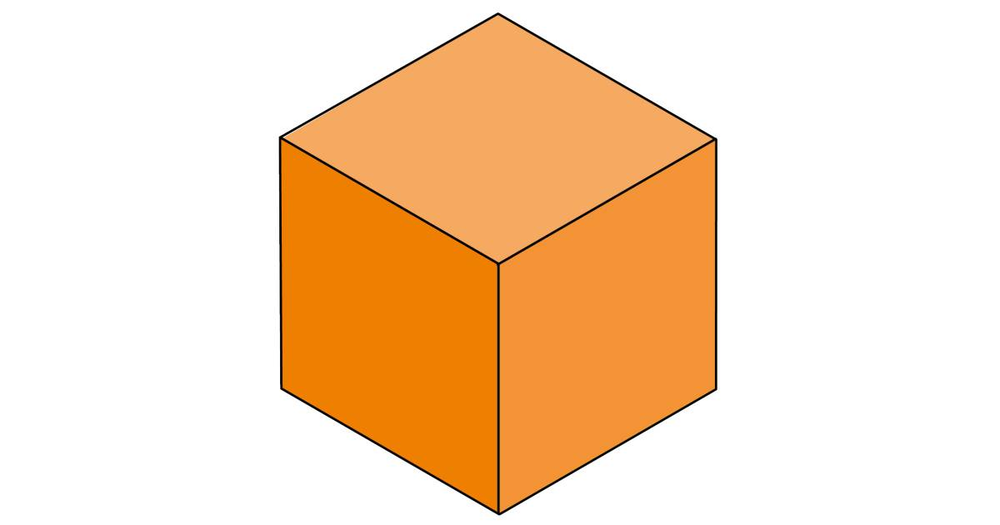
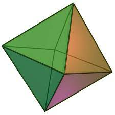
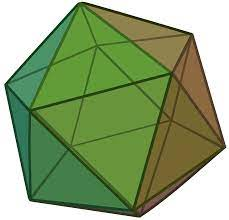
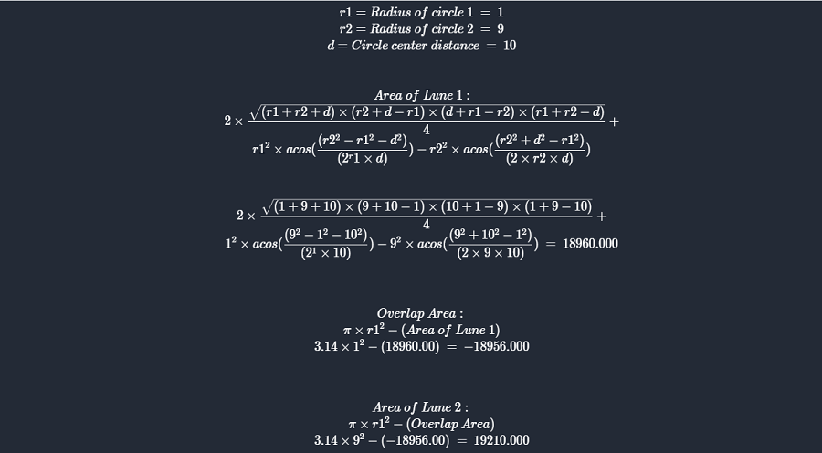
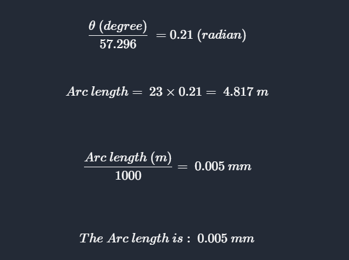
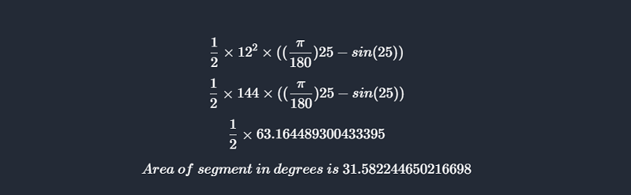
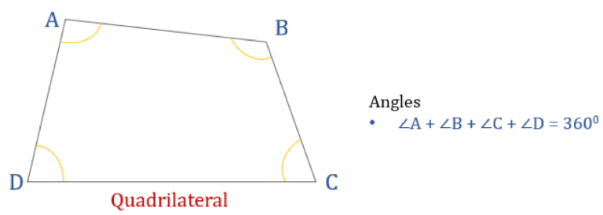
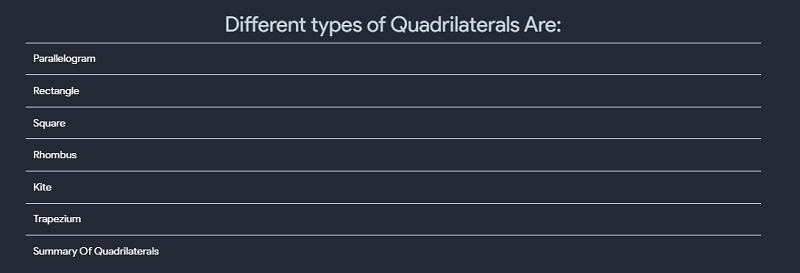
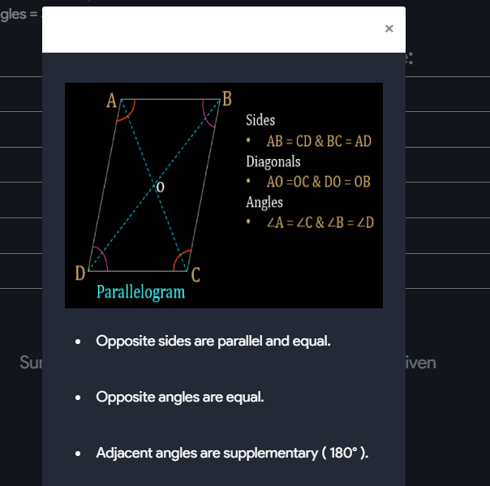
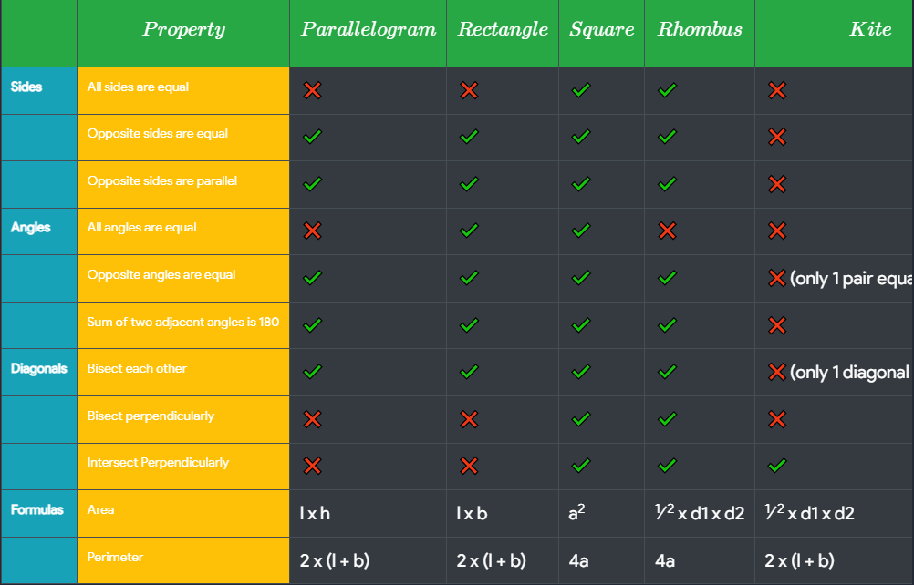

# Graph Plotting
- This tool can be used to plot graphs for logorithmic functions, exponential functions, trignometric functions, inverse trignometric functions, hyperbolic functions and all algebric function containg only single variable x.
- Below is a working demo,kindly try the following functions to understand better.
 
 
  $$ sinh (x) $$
  $$ log (x) $$
  $$ e^x (x) $$
  $$ -x^4+2x^2  $$
  $$ x^3  $$
  $$ x^3  $$
 
 
> Note :  Don't use Capital X and use space between function and the variable.

{:#graphs-edit}

# Shapes Calculator
 

#### Formulas for 2D Shapes

<table style="width:100%" border="2"  bordercolor="white" class="small-2">

  <tr>
    <th>$$SHAPES$$</th>
    <th>$$AREA$$</th>
    <th>$$PERIMETER$$</th>
  </tr>
  <tr>
    <td>$$Square$$</td>
    <td>$$ a^2 $$</td>
    <td>$$ 4a $$</td>
  </tr>
  <tr>
    <td>$$Rectangle$$</td>
    <td>$$ l * b $$</td>
    <td>$$ 2(l + b)$$</td>
  </tr>
    <tr>
    <td>$$Rhombus$$</td>
    <td>$$  \dfrac{1}{2} d1 * d2 $$</td>
    <td>$$ 4 * side $$</td>
  </tr>
  <tr>
    <td>$$Scalene  \enspace Triangle$$</td>
    <td>$$ \sqrt{[s(s−a)(s−b)(s−c)]} $$</td>
    <td>$$ a+b+c $$</td>
    
  </tr>
  <tr>
    <td>$$Isosceles  \enspace Triangle$$</td>
    <td>$$ \dfrac{1}{2} b * h $$</td>
    <td>$$ 2a + b$$</td>
  </tr>
  <tr>
    <td>$$Equalateral  \enspace Triangle$$</td>
    <td>$$ \dfrac{\sqrt{3}}{4}a^2 $$</td>
    <td>$$ 3a $$</td>
  </tr>
  <tr>
    <td>$$Right  \enspace Angle  \enspace Triangle$$</td>
    <td>$$  \dfrac{1}{2} b * h $$</td>
    <td>$$ b + hypotenuse + h $$</td>
  </tr>
  <tr>
    <td>$$Circle$$</td>
    <td>$$ \pi r^2$$</td>
    <td>$$ 2 \pi r $$</td>
  </tr>
  <tr>
    <td>$$Sector  \enspace of  \enspace Circle$$</td>
    <td>$$ \dfrac{r^2 \theta}{2} $$</td>
    <td>$$ - $$</td>
  </tr>
  <tr>
    <td>$$Semi  \enspace Circle$$</td>
    <td>$$ \dfrac{ \pi r^2}{2} $$</td>
    <td>$$ \pi r + 2 r $$</td>
  </tr>
  <tr>
    <td>$$Annulus$$</td>
    <td>$$ \pi r1^2 - \pi r2^2 $$</td>
    <td>$$ 2 \pi r $$</td>
  </tr>
  <tr>
    <td>$$Kite$$</td>
    <td>$$ \dfrac{p q}{2} $$</td>
    <td>$$ 2(a + b) $$</td>
  </tr>
  <tr>
    <td>$$Trapezium$$</td>
    <td>$$ \dfrac{1}{2}h(a+c) $$</td>
    <td>$$ 	a+b+c+d $$</td>
  </tr>
  <tr>
    <td>$$Ellipse$$</td>
    <td>$$ \pi a b $$</td>
    <td>$$ \sqrt{2} \pi \sqrt{ a^2 + b^2 } $$</td>
  </tr>
  <tr>
    <td>$$Parallelogram$$</td>
    <td>$$ b*h $$</td>
    <td>$$ 2(l+b) $$</td>
  </tr>
  <tr>
    <td>$$Pentagon$$</td>
    <td>$$ \frac{1}{4}  \sqrt{5 (5 + 2 \sqrt{5})} a^2 $$</td>
    <td>$$ 5a $$</td>
  </tr>
  <tr>
    <td>$$Hexagon$$</td>
    <td>$$ \frac{3 \sqrt{3}}{2} a^2  $$</td>
    <td>$$ 6a $$</td>
  </tr>
  <tr>
    <td>$$Octagon$$</td>
    <td>$$ 2 (1 + \sqrt{2}) a^2 $$</td>
    <td>$$ 8a $$</td>
  </tr>
    <tr>
    <td>$$Decagon$$</td>
    <td>$$ \frac{5}{2} a^2 \sqrt{5 (5 + 2 \sqrt{5})} $$</td>
    <td>$$ 10a $$</td>
  </tr>
</table>
 

#### Formulas for 3D Shapes

<table style="width:100%" border="2"  bordercolor="white" class="small-2">

  <tr>
    <th>$$SHAPES$$</th>
    <th>$$VOLUME$$</th>
    <th>$$LSA\enspace or \enspace CSA$$</th>
    <th>$$TSA$$</th>
  </tr>
  <tr>
    <td>$$Cube$$</td>
    <td>$$ a^3 $$</td>
    <td>$$ 4a^2 $$</td>
    <td>$$ 6a^2 $$</td>
  </tr>
  <tr>
    <td>$$Cubiod$$</td>
    <td>$$ l * b * h $$</td>
    <td>$$ 2h(l + b)$$</td>
    <td>$$ 2(lb + bh + bh)$$</td>
  </tr>
  <tr>
    <td>$$Cylinder$$</td>
    <td>$$ \pi r^2 h $$</td>
    <td>$$ 2\pi r h$$</td>
    <td>$$ 2\pi r h + 2 \pi r^2 $$</td>
  </tr>
  <tr>
    <td>$$Cone$$</td>
    <td>$$ \dfrac{1}{3}\pi r^2 h $$</td>
    <td>$$ \pi r l $$</td>
    <td>$$ \pi r (r+l) $$</td>
  </tr>
  <tr>
    <td>$$Sphere$$</td>
    <td>$$ \dfrac{4}{3}\pi r^3$$</td>
    <td>$$ 4 \pi r^2 $$</td>
    <td>$$ 4 \pi r^2 $$</td>
  </tr>
  <tr>
    <td>$$Hollow \enspace Cylinder$$</td>
    <td>$$ \pi (r_1^{2}-r_2^{2}) h $$</td>
    <td>$$ 2 \pi (r_1+r_2) h  $$</td>
    <td>$$ 2 \pi (r_1+r_2)(r_1-r_2) + 2 \pi h(r_1+r_2) $$</td>
  </tr>
  <tr>
    <td>$$Hollow \enspace Sphere$$</td>
    <td>$$ 4 \pi (r_1^3-r_2^3) /3 $$</td>
    <td>$$ - $$</td>
    <td>$$ 4 \pi (r_1^2-r_2^2) $$</td>
  </tr>
  <tr>
    <td>$$Hemisphere$$</td>
    <td>$$ \dfrac{2}{3}\pi r^3 $$</td>
    <td>$$ 2 \pi r^2 $$</td>
    <td>$$ 3 \pi r^2 $$</td>
  </tr>
  <tr>
    <td>$$Torus$$</td>
    <td>$$ (\pi r^2)(2  \pi  R) $$</td>
    <td>$$ - $$</td>
    <td>$$ (2 \times \pi \times R)(2 \times \pi  \times r) $$</td>
  </tr>
  <tr>
    <td>$$Conical \enspace Frustum$$</td>
    <td>$$ \frac{1}{3} \times \pi \times h \times (r1^2 \space + r2^2 \space + (r1 \times r2)) $$</td>
    <td>$$ \pi \times ( r1 + r2) \times s $$</td>
    <td>$$ \pi \times (r1^2+r2^2+(r1+r2) \times s) $$</td>
  </tr>
  <tr>
    <td>$$Ellipsoid$$</td>
    <td>$$ \frac{4}{3}\pi a b c $$</td>
    <td>$$ - $$</td>
    <td>$$ 4\pi\Big(\frac{(ab)^{1.6} + (ac)^{1.6} + (bc)^{1.6}}{3}\Big)^{\frac{1}{1.6}} $$</td>
  </tr>
  <tr>
    <td>$$Square \enspace Prism$$</td>
    <td>$$ a^2 h $$</td>
    <td>$$ - $$</td>
    <td>$$ 2 a^2 + 4 a h $$</td>
  </tr>
  <tr>
    <td>$$Triangular \enspace Prism$$</td>
    <td>$$ (l \times b \times h) / 2 $$</td>
    <td>$$ - $$</td>
    <td>$$ b(h+l) \space + \space 2 \times l \times s $$</td>
  </tr>
  <tr>
    <td>$$Pentagonal \enspace Prism$$</td>
    <td>$$ \frac{1}{4}\sqrt{5(5+2\sqrt{5})}a^2h $$</td>
    <td>$$ - $$</td>
    <td>$$ 5ah \space + \space \frac{1}{2}\sqrt{5(5+2\sqrt{5})}a^2 $$</td>
  </tr>
  <tr>
    <td>$$Hexagonal \enspace Prism$$</td>
    <td>$$ \frac{3 \sqrt{3}}{2} \times a^2h $$</td>
    <td>$$ - $$</td>
    <td>$$ 6ah + 3\sqrt{3}a^2$$</td>
  </tr>
  <tr>
    <td>$$Octagonal \enspace Prism$$</td>
    <td>$$ 2 (1 + \sqrt{2}) a^2h $$</td>
    <td>$$ - $$</td>
    <td>$$ 8ah + 4 (1 + \sqrt{2})a^2 $$</td>
  </tr>
  <tr>
    <td>$$Square \enspace Pyramid$$</td>
    <td>$$ \frac{a^2 h}{3} $$</td>
    <td>$$ a\sqrt{4h^2+a^2} $$</td>
    <td>$$ F +a^2 $$</td>
  </tr>
   <tr>
    <td>$$Triangular \enspace Pyramid$$</td>
    <td>$$ \frac{Base Area \times Slant Height}{3} $$</td>
    <td>$$ \frac{1}{2}(Perimeter \times Slant Height) $$</td>
    <td>$$ A+ \frac{1}{2}(Perimeter \times Slant Height) $$</td>
  </tr>
   <tr>
    <td>$$Rectangular \enspace Pyramid$$</td>
    <td>$$ \frac{lwh}{3} $$</td>
    <td>$$ l \sqrt{ (\frac{w}{2})^2 + h^2} + w \sqrt{ (\frac{l}{2})^2 + h^2 } $$</td>
    <td>$$ lw + l \sqrt{ (\frac{w}{2})^2 + h^2} + w \sqrt{ (\frac{l}{2})^2 + h^2 } $$</td>
  </tr>
   <tr>
    <td>$$Pentagonal \enspace Pyramid$$</td>
    <td>$$ \frac{5}{12} \space tan(54 \degree) \space ha^2 $$</td>
    <td>$$ - $$</td>
    <td>$$ \frac{5}{4} \space tan(54 \degree) \space a^2 \space + 5 \frac{a}{2} \sqrt(h^2 \space + \space (\frac{a \times tan(54 \degree)}{2})^2) $$</td>
  </tr>
   <tr>
    <td>$$Hexagonal \enspace Pyramid$$</td>
    <td>$$ abh $$</td>
    <td>$$  \frac{1}{2}(Perimeter \times s) $$</td>
    <td>$$ 3b(a + s) $$</td>
  </tr>
   <tr>
    <td>$$Octagonal \enspace Pyramid$$</td>
    <td>$$ \frac{2}{3} \space hs^2 \space cot(22.5 \degree)  $$</td>
    <td>$$ 2s \sqrt{4h^2 + s^2 \space cot^2(22.5 \degree)} $$</td>
    <td>$$ 2s \space (\sqrt{4h^2 + s^2 \space cot^2(22.5 \degree)} \space + \space cot(22.5 \degree)\space) $$</td>
  </tr>
  <tr>
    <td>$$Octahedron$$</td>
    <td>$$ \frac{\sqrt{2}a^3}{3} $$</td>
    <td>$$ - $$</td>
    <td>$$  2 \sqrt{3} a^2 $$</td>
  </tr>
  <tr>
    <td>$$Tetrahedron$$</td>
    <td>$$ \frac{a^3}{6 \sqrt{2}} $$</td>
    <td>$$ - $$</td>
    <td>$$ \sqrt{3} a^2 $$</td>
  </tr>
  <tr>
    <td>$$Icosahedron$$</td>
    <td>$$ \frac{5}{12} (3 + \sqrt{5}) a^3  $$</td>
    <td>$$ - $$</td>
    <td>$$ 5 \sqrt{3} a^2 $$</td>
  </tr>
  <tr>
    <td>$$Parallelepiped$$</td>
    <td>$$ abc $$</td>
    <td>$$  - $$</td>
    <td>$$ 2(ab + bc + ca) $$</td>
  </tr>
  <tr>
    <td>$$Hyperboloid$$</td>
    <td>$$ \frac{2\pi h a^{2}}{b^{2}}(b^{2}+\frac{h^{2}}{3}) $$</td>
    <td>$$ - $$</td>
    <td>$$ - $$</td>
  </tr>
</table>

- This tool can be used to find all the necessary values of any shape, below is a working demo.

{:#graphs-edit}

# Platonic Solids
- A platonic solid is 3D Shape where:
  - Each Face is the same regular polygon
  - The same number of polygons meet at each vertec(corner)

- There are only 5 platonic solids
  - Tetrahedron
    - 3 Triangles
    - 4 faces
    - 4 vertices
    - 6 edges

# Percentage chaneg in volume calculator 
## Percentage Change In Volume Of A Sphere
- This too can be used to calculate percentage change in the volume of a sphere

  - Cube 
    - 3 squares meet at each vertex
    - 6 faces
    - 8 vertices
    - 12 edges

## Percentage Change In Volume Of A Cube
- This too can be used to calculate percentage change in the volume of a Cube

  - Octahedron
    - 4 triangles meet at each vertex
    - 8 faces
    - 6 vertices
    - 12 edges

## Percentage Change In Volume Of A Cuboid
- This too can be used to calculate percentage change in the volume of a Cuboid

  - Dodecahedron
    - 3 pentagons meet at each vertex
    - 12 faces
    - 20 vertices
    - 30 edges

# Volumetric Weight Calculator
- This tool can be used to calculate volumetric Weight

  - Icosahedron
    - 5 triangles meet at each vertex
    - 20 faces
    - 12 vertices
    - 30 edges

# Area of crescent and lune
## What is a crescent?
- Geometrical regions consisting of two circular arcs separate into two groups:
  - A convex-convex region, in which both arcs curve outwards, is called a lens; and
  - A concave-convex region, in which one arc curves outwards and one arc is curved inwards, is called a lune. You can also understand this geometrical shape as one disk partly covering another disk.
  - So, what is a crescent? A crescent is a lune which does not include the original disk's center. It means that the distance between the disk centers is smaller than the radius of the covering disk.

## What is lune
- In plane geometry, a lune is the concave-convex region bounded by two circular arcs. It has one boundary portion for which the connecting segment of any two nearby points moves outside the region and another boundary portion for which the connecting segment of any two nearby points lies entirely inside the region. 
- A convex-convex region is termed a lens. 
- The word lune derives from luna, the Latin word for "moon".
- Formally, a lune is the relative complement of one disk in another (where they intersect but neither is a subset of the other). Alternatively, if {\displaystyle A}A and {\displaystyle B}B are disks, then it is a lune.

- this tool calculates the area of crescent and lune regions along with solving steps

# Congruence and Similarity of Triangles

## Congruence properties of triangle

- SSS property  (Side- Side - Side) - when all the three corresponding sides of 2 triangles are of equal size then triangles are congruent 

- SAS Property (Side - Angle - Side) - if any two sides and angles included between the sides of one triangle are equivalent to the corresponding two sides and the angle between the sides of the second triangle , then the two triangles are said to be congruent by SAS rule.

- ASA Property (Angle - Side - Angle ) - if any two angles and the side included between the angles of one triangle are equivalent to the corresponding two angles and side included between the angles of the second triangle, then the two triangles are said to be congruent by SAS rule

# Arc Length Calculator
- The length of an arc depends on the radius of a circle and the central angle $$ \theta $$
  

$$  \dfrac{L}{\theata} = \dfrac{c}{2\pi} $$
$$  as \enspace circumference C = 2\pi r $$
$$  \dfrac{L}{\theata} = \dfrac{2\pi r}{2\pi} $$
$$  \dfrac{L}{\theata} = r $$
$$  We \enspace find \enspace out  \enspace the \enspace arc \enspace length \enspace formula \enspace when \enspace \enspace multiplying \enspace the \enspace equation \enspace by \enspace \theta $$
$$  L = r * \theta $$

- This tool calculates the length of an arc

- AAS Property (Angle - Angle - Side) - If any two angles and a non included side of one triangle are equivalent to the corresponding two angles and the non included side of the second triangle, then the two triangles are said to be congruent by AAS rule.

- RHS Property (Right - Angle - Hypotenuse - Side) - If the hypotenuse and a side of a right - angled triangle is equivalent to the hypotenuse and a side of the second right - angled triangle , then the two right triangles are said to be congruent by RHS rule.

# Area of Segment Calculator
- A segment of a circle can be definded as a region bounded by a chord and a corresponding arc lying between the chord's endpoints 
- Area of a segment in radians  :

$$ A = \dfrac{1}{2} * r * r * (\theta - sin \theta) $$

- Area of a segment in degrees : 
  

$$ A = \dfrac{1}{2} * r * r * (\dfrac{\pi}{180} \theta - sin \theta) $$

- this tool calculates arc length along with soloving Steps

## Similarity of triangles with

- AA ( or AAA) Similarity - if any two angles of triangle are equal to any two angles of another triangle, then the two triangles are similar to each other.

- SAS Similarity - If the two sides of a triangle are in the same proportion of the two sides of another triangle, and the angle inscribed by the two sides in the both triangle are equal, then two triangles are said to be similar.

- SSS Similarity - if all the three sides of triangle are in proportion to the three side of another triangle, then the two triangles are similar

# Quadrilaterals

- Every Quadrilateral has 4 vertices , 4 angles, and 4 sides.
- the total of its interior angles  = 360 degrees
- this tool provides properites of following quadlateral
  - Parallelogram
  - Rectangle
  - Square
  - Rhombus
  - Kite
  - Trapezium
  - And all shapes concept table 

## Fundamental Theorem of Proportionality

- If a line parllel to one of the sides of a triangle intersects the other two sides in distinct points, then the segments of the other two sides in one halfplane are proportional to the segments in the other half plane.

- Using the fundamentals theorem on proportionality, we can obtain some results:

- If a line parallel to one side of a triangle intersects the other two sides of the triangle in distinct points, the segments of the other side of the triangle in the same halfplane of the line are proportional to the corresponding sides of the triangle

- if three (or more than three ) parallel lines are intercepted by two transversals, the segmets cut off on the transversals between the same parallel lines are proportional

- Summary Tabel

- In a triangle the bisector of an angle divides the side opposite to the angle in the segments whose lengths are in the ratio of their corresponding sides.

# Faulhaber's Formula
- Faulhabers formula is also called bernoulli's formula.
- Faulhaber did not know the properites of the coefficients discovered by bernoulli.
- rather he knew at least the first 17 cases as well as the existence of the faulhaber polynomials for odd powers.
- Formula :

$$ \sum_{k=1}^{n} k^p  = \dfrac{n^{p+1}}{p+1} + \dfrac{1}{2} n^p + \sum_{k=2}^{p} \dfrac{B_{k}}{k!} p^{k-1} - n^{p-k+1}$$

