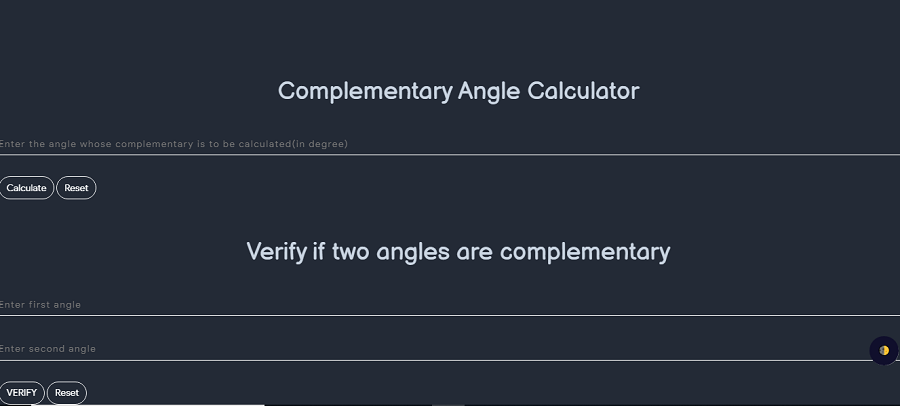

# Supplementary Angle Calculator
- Supplementary angles are those angles that measure up to 180 degrees. For example, angle 130° and angle 50° are supplementary because on adding 130° and 50° we get 180°. 
- Similarly, complementary angles add up to 90 degrees. The two supplementary angles, if joined together, form a straight line and a straight angle.
- But it should be noted that the two angles that are supplementary to each other, do not have to be next to each other. Hence, any two angles can be supplementary, if their sum equal to 180°.

- Geometry is one of the important branches of mathematics that deals with the study of different shapes. It initiates the study of lines and angles. 
- A straight line is a line without curves and it is defined as the shortest distance between two points. An angle is formed when the line segment meets at a point.
- This tool calculates supplimentary angle of any given angle

# Complementary Angle
- When the sum of two angles is 90°, then the angles are known as complementary angles. 
- In other words, if two angles add up to form a right angle, then these angles are referred to as complementary angles. Here we say that the two angles complement each other.
- Suppose if one angle is x then the other angle will be 90o – x. Hence, we use these complementary angles for trigonometry ratios, where on ratio complement another ratio by 90 degrees such as;
  - sin (90°- A) = cos A and cos (90°- A) = sin A
  - tan (90°- A) = cot A and cot (90°- A) = tan A
  - sec (90°- A) = cosec A and cosec (90°- A) = sec A

- This tool calculates complementary angle of any given angle

# Coterminal Angle
- In Mathematics, the coterminal angle is defined as an angle, where two angles are drawn in the standard position. Also both have their terminal sides in the same location. 
- For example, the coterminal angle of 45 is 405 and -315. Here 405 is the positive coterminal angle, -315 is the negative coterminal angle.
- This tool calculates coterminal angle of any given angle

# SSS trianlge's Angle
- "SSS" is when we know three sides of the triangle , and want to find the missing angle 
- TO solve an SSS triangle
  - Use the Law of cosines first to calculate one of the angles
  - Use the law of cosines again to find another angle functionsFinally Use angles of a triangle to add 180 Degree to find the last angle function
- This tool calculates SSS triangle's Angle

# Straight Line
- Centroid with given three coordinates (x1,y1), (x2,y2), (x3,y3):

$$ \dfrac{x1+x2+x3}{3} , \dfrac{y1+y2+y3}{3} $$

- Relation Between two lines

$$ Let \enspace L1 \enspace and \enspace L2 \enspace be \enspace the \enspace two \enspace lines \enspace as:  $$
$$ L1: a1x + b1y + c1 = 0 \enspace L2 : a2x + b2y + c2 = 0 $$
$$ For parallel Lines: $$
$$ \dfrac{a1}{a2} = \dfrac{b1}{b2} = \dfrac{c1}{c2} $$
$$ for \enspace intersection \enspace lines$$
$$ \dfrac{a1}{a2} = \dfrac{b1}{b2} $$
$$ for \enspace coincident lines $$
$$ \dfrac{a1}{a2} = \dfrac{b1}{b2} = \dfrac{c1}{c2} $$

- Angle Between straight line

$$ let \enspace L1 = y = m1x + c1 \enspace and \enspace L2 = y = m2x + c2 $$
$$ angle = \theta  = \tan^{-1} ( \dfrac{m2-m1}{1+m1m2} )  $$
$$ Special \enspace Cases :   $$
$$ 1) \enspace m2=m1 -> lines are parallel  $$
$$ 1) \enspace m2*m1 = -1 -> lines are perpendicular  $$

- Length Of perpendicular from a point on a line

$$ the \enspace length \enspace of \enspace the \enspace perpendicular \enspace from \enspace P(x1,y1) on \enspace ax + by + c = 0 is l = | \dfrac{|ax1+by1+c|}{\sqrt{a^2+b^2}} | $$
$$ B(x,y) is \enspace foot \enspace of \enspace perpendicular \enspace is \enspace given \enspace by :  $$
$$ \dfrac{x-x1}{a} = \dfrac{y-y1}{b} = \dfrac{ax1+by1+c}{a^2 + b^2} $$

- Angular Bisector of Straight Line

$$ an \enspace angle \enspace bisector \enspace has \enspace equal \enspace perpendicular \enspace distance \enspace from \enspace the \enspace two \enspace given \enspace lines $$
$$ the \enspace equation \enspace of \enspace line \enspace L \enspace  can \enspace be \enspace given \enspace as :   $$
$$ \dfrac{a1x + b1y + c1}{ \sqrt{a^2 + b^2} } = \plusmn \dfrac{a2x + b2y + c2}{\sqrt{a^2 + b^2}}  $$

# Coordinate Systems
- Cartesian Coordinate Systems
  - it uses the concept of mutually perpendicular lines to denote the coordinate of a point.
  - To locate the position of a point in  a plane using two perpendicular lines, we use the cartesian coordinates system.
  - Points are represented in the form of coordinates (x,y) in two dimensional with respect to x and y axes.
  - The x - coordinate of a point is its perpendicular distance from the y - axis measured along the x - axis and it is known as Abscissa.
  - The y - coordinate of a point is its perpendicular distance from the x- axis measured along the y-axis and it is known as Ordinate

- Polar coordinate system
  - here a point is chosen as the pole and a ray from this point is taken as the polar axis, basically , we have two parameters namely angle and radius .
  - the andgle with the polar axis has a single line through the pole measured anti - clockwise from the axis to the line
  - The point will have a unique distance from the origin (r), thus a point inpolar coordinate system is represented as a pair of coordinates (r,theta).
  - the pole is represneted by  $$ (0,\theta) $$ for any value of $$ \theta , $$ where r = 0.
  - the distance from the pole is called the radical coordinate, radical distance or simply radius and the angular coordinate, polar angle or azimuth
  - consider the figure below that depicts the relationship betweenpolar and cartesian coordinates 

$$ x = r cos \theta and y = r sin \theta $$
$$ r = \sqrt{x^2  + y^2} and tan\theta = \dfrac{y}{x} $$

# Spherical Coordinate System

- the coordinate p is the distance from P to the origin of theif the point Q is the projection of P to the xy-plane, then $$ \theta  $$ is the angle between the positive x - axis and the line segment from the origin t Q.
- Lastly is the angle between the positive z -axis and the line segmnet from the origin to P

- Cylinderical Coordinate System

$$ x = r cos \theta $$
$$ y = r sin \theta $$

- its just polar coordinates with z as height forming a cylinder

# Manhattan Distance
- The Manhattan distance between two vectors (city blocks) is equal to the one-norm of the distance between the vectors. The distance function (also called a “metric”) involved is also called the “taxi cab” metric.
- The Manhattan distance as the sum of absolute differences

  - ManhattanDistance [{a, b, c}, {x, y, z}]

  - Abs [a − x] + Abs [b − y] + Abs [c − z]

- The one-norm as Manhattan distance between two city blocks

  - block1 = {1, 2, 3, 4}; block2 = {5, 6, 7, 8};

  - Norm[block1 − block2, 1]

  - 16

- The Manhattan length of two blocks

  - block1 = {5, 2, − 3, 4}; block2 = {1, 6, − 7, 8};

  - Norm{Norm[block1, 1], Norm[block2, 1]}

  - {14, 22}

- this tool calculates manhattan distance

# Cartesian Coordinate Calculator
- Cartesian coordinates allow one to specify the location of a point in the plane, or in three-dimensional space. The Cartesian coordinates (also called rectangular coordinates) of a point are a pair of numbers (in two-dimensions) or a triplet of numbers (in three-dimensions) that specified signed distances from the coordinate axis.

- This tool converts cylinderical coordinates to cartesian coordinates

# Spherical Coordinate Calculations
- Spherical coordinates can be a little challenging to understand at first. 
- Spherical coordinates determine the position of a point in three-dimensional space based on the distance ρ from the origin and two angles θ and ϕ. 
- If one is familiar with polar coordinates, then the angle θ isn't too difficult to understand as it is essentially the same as the angle θ from polar coordinates. 

- this tool calculates sphericla coordinates

# Cylindrical Coordinate Calculatior
- Cylindrical coordinates are a generalization of two-dimensional polar coordinates to three dimensions by superposing a height (z) axis. Unfortunately, there are a number of different notations used for the other two coordinates. Either r or rho is used to refer to the radial coordinate and either phi or theta to the azimuthal coordinates. Arfken (1985), for instance, uses (rho,phi,z), while Beyer (1987) uses (r,theta,z). In this work, the notation (r,theta,z) is used.

-  this tool calculates clyn coordinates

# Polar Coordinate Calculation

- this tool calculates polar coordinates

# Graph Plotting
- This tool can be used to plot graphs for logorithmic functions, exponential functions, trignometric functions, inverse trignometric functions, hyperbolic functions and all algebric function containg only single variable x.
- Below is a working demo,kindly try the following functions to understand better.
 
 
  $$ sinh (x) $$
  $$ log (x) $$
  $$ e^x (x) $$
  $$ -x^4+2x^2  $$
  $$ x^3  $$
  $$ x^3  $$
 
 
> Note :  Don't use Capital X and use space between function and the variable.

{:#graphs-edit}

# Shapes Calculator
 

#### Formulas for 2D Shapes

<table style="width:100%" border="2"  bordercolor="white" class="small-2">

  <tr>
    <th>$$SHAPES$$</th>
    <th>$$AREA$$</th>
    <th>$$PERIMETER$$</th>
  </tr>
  <tr>
    <td>$$Square$$</td>
    <td>$$ a^2 $$</td>+
    <td>$$ 4a $$</td>
  </tr>
  <tr>
    <td>$$Rectangle$$</td>
    <td>$$ l * b $$</td>
    <td>$$ 2(l + b)$$</td>
  </tr>
    <tr>
    <td>$$Rhombus$$</td>
    <td>$$  \dfrac{1}{2} d1 * d2 $$</td>
    <td>$$ 4 * side $$</td>
  </tr>
  <tr>
    <td>$$Scalene  \enspace Triangle$$</td>
    <td>$$ \sqrt{[s(s−a)(s−b)(s−c)]} $$</td>
    <td>$$ a+b+c $$</td>
    
  </tr>
  <tr>
    <td>$$Isosceles  \enspace Triangle$$</td>
    <td>$$ \dfrac{1}{2} b * h $$</td>
    <td>$$ 2a + b$$</td>
  </tr>
  <tr>
    <td>$$Equalateral  \enspace Triangle$$</td>
    <td>$$ \dfrac{\sqrt{3}}{4}a^2 $$</td>
    <td>$$ 3a $$</td>
  </tr>
  <tr>
    <td>$$Right  \enspace Angle  \enspace Triangle$$</td>
    <td>$$  \dfrac{1}{2} b * h $$</td>
    <td>$$ b + hypotenuse + h $$</td>
  </tr>
  <tr>
    <td>$$Circle$$</td>
    <td>$$ \pi r^2$$</td>
    <td>$$ 2 \pi r $$</td>
  </tr>
  <tr>
    <td>$$Sector  \enspace of  \enspace Circle$$</td>
    <td>$$ \dfrac{r^2 \theta}{2} $$</td>
    <td>$$ - $$</td>
  </tr>
  <tr>
    <td>$$Semi  \enspace Circle$$</td>
    <td>$$ \dfrac{ \pi r^2}{2} $$</td>
    <td>$$ \pi r + 2 r $$</td>
  </tr>
  <tr>
    <td>$$Annulus$$</td>
    <td>$$ \pi r1^2 - \pi r2^2 $$</td>
    <td>$$ 2 \pi r $$</td>
  </tr>
  <tr>
    <td>$$Kite$$</td>
    <td>$$ \dfrac{p q}{2} $$</td>
    <td>$$ 2(a + b) $$</td>
  </tr>
  <tr>
    <td>$$Trapezium$$</td>
    <td>$$ \dfrac{1}{2}h(a+c) $$</td>
    <td>$$ 	a+b+c+d $$</td>
  </tr>
  <tr>
    <td>$$Ellipse$$</td>
    <td>$$ \pi a b $$</td>
    <td>$$ \sqrt{2} \pi \sqrt{ a^2 + b^2 } $$</td>
  </tr>
  <tr>
    <td>$$Parallelogram$$</td>
    <td>$$ b*h $$</td>
    <td>$$ 2(l+b) $$</td>
  </tr>
  <tr>
    <td>$$Pentagon$$</td>
    <td>$$ \frac{1}{4}  \sqrt{5 (5 + 2 \sqrt{5})} a^2 $$</td>
    <td>$$ 5a $$</td>
  </tr>
  <tr>
    <td>$$Hexagon$$</td>
    <td>$$ \frac{3 \sqrt{3}}{2} a^2  $$</td>
    <td>$$ 6a $$</td>
  </tr>
  <tr>
    <td>$$Octagon$$</td>
    <td>$$ 2 (1 + \sqrt{2}) a^2 $$</td>
    <td>$$ 8a $$</td>
  </tr>
    <tr>
    <td>$$Decagon$$</td>
    <td>$$ \frac{5}{2} a^2 \sqrt{5 (5 + 2 \sqrt{5})} $$</td>
    <td>$$ 10a $$</td>
  </tr>
</table>
 

#### Formulas for 3D Shapes

<table style="width:100%" border="2"  bordercolor="white" class="small-2">

  <tr>
    <th>$$SHAPES$$</th>
    <th>$$VOLUME$$</th>
    <th>$$LSA\enspace or \enspace CSA$$</th>
    <th>$$TSA$$</th>
  </tr>
  <tr>
    <td>$$Cube$$</td>
    <td>$$ a^3 $$</td>
    <td>$$ 4a^2 $$</td>
    <td>$$ 6a^2 $$</td>
  </tr>
  <tr>
    <td>$$Cubiod$$</td>
    <td>$$ l * b * h $$</td>
    <td>$$ 2h(l + b)$$</td>
    <td>$$ 2(lb + bh + bh)$$</td>
  </tr>
  <tr>
    <td>$$Cylinder$$</td>
    <td>$$ \pi r^2 h $$</td>
    <td>$$ 2\pi r h$$</td>
    <td>$$ 2\pi r h + 2 \pi r^2 $$</td>
  </tr>
  <tr>
    <td>$$Cone$$</td>
    <td>$$ \dfrac{1}{3}\pi r^2 h $$</td>
    <td>$$ \pi r l $$</td>
    <td>$$ \pi r (r+l) $$</td>
  </tr>
  <tr>
    <td>$$Sphere$$</td>
    <td>$$ \dfrac{4}{3}\pi r^3$$</td>
    <td>$$ 4 \pi r^2 $$</td>
    <td>$$ 4 \pi r^2 $$</td>
  </tr>
  <tr>
    <td>$$Hollow \enspace Cylinder$$</td>
    <td>$$ \pi (r_1^{2}-r_2^{2}) h $$</td>
    <td>$$ 2 \pi (r_1+r_2) h  $$</td>
    <td>$$ 2 \pi (r_1+r_2)(r_1-r_2) + 2 \pi h(r_1+r_2) $$</td>
  </tr>
  <tr>
    <td>$$Hollow \enspace Sphere$$</td>
    <td>$$ 4 \pi (r_1^3-r_2^3) /3 $$</td>
    <td>$$ - $$</td>
    <td>$$ 4 \pi (r_1^2-r_2^2) $$</td>
  </tr>
  <tr>
    <td>$$Hemisphere$$</td>
    <td>$$ \dfrac{2}{3}\pi r^3 $$</td>
    <td>$$ 2 \pi r^2 $$</td>
    <td>$$ 3 \pi r^2 $$</td>
  </tr>
  <tr>
    <td>$$Torus$$</td>
    <td>$$ (\pi r^2)(2  \pi  R) $$</td>
    <td>$$ - $$</td>
    <td>$$ (2 \times \pi \times R)(2 \times \pi  \times r) $$</td>
  </tr>
  <tr>
    <td>$$Conical \enspace Frustum$$</td>
    <td>$$ \frac{1}{3} \times \pi \times h \times (r1^2 \space + r2^2 \space + (r1 \times r2)) $$</td>
    <td>$$ \pi \times ( r1 + r2) \times s $$</td>
    <td>$$ \pi \times (r1^2+r2^2+(r1+r2) \times s) $$</td>
  </tr>
  <tr>
    <td>$$Ellipsoid$$</td>
    <td>$$ \frac{4}{3}\pi a b c $$</td>
    <td>$$ - $$</td>
    <td>$$ 4\pi\Big(\frac{(ab)^{1.6} + (ac)^{1.6} + (bc)^{1.6}}{3}\Big)^{\frac{1}{1.6}} $$</td>
  </tr>
  <tr>
    <td>$$Square \enspace Prism$$</td>
    <td>$$ a^2 h $$</td>
    <td>$$ - $$</td>
    <td>$$ 2 a^2 + 4 a h $$</td>
  </tr>
  <tr>
    <td>$$Triangular \enspace Prism$$</td>
    <td>$$ (l \times b \times h) / 2 $$</td>
    <td>$$ - $$</td>
    <td>$$ b(h+l) \space + \space 2 \times l \times s $$</td>
  </tr>
  <tr>
    <td>$$Pentagonal \enspace Prism$$</td>
    <td>$$ \frac{1}{4}\sqrt{5(5+2\sqrt{5})}a^2h $$</td>
    <td>$$ - $$</td>
    <td>$$ 5ah \space + \space \frac{1}{2}\sqrt{5(5+2\sqrt{5})}a^2 $$</td>
  </tr>
  <tr>
    <td>$$Hexagonal \enspace Prism$$</td>
    <td>$$ \frac{3 \sqrt{3}}{2} \times a^2h $$</td>
    <td>$$ - $$</td>
    <td>$$ 6ah + 3\sqrt{3}a^2$$</td>
  </tr>
  <tr>
    <td>$$Octagonal \enspace Prism$$</td>
    <td>$$ 2 (1 + \sqrt{2}) a^2h $$</td>
    <td>$$ - $$</td>
    <td>$$ 8ah + 4 (1 + \sqrt{2})a^2 $$</td>
  </tr>
  <tr>
    <td>$$Square \enspace Pyramid$$</td>
    <td>$$ \frac{a^2 h}{3} $$</td>
    <td>$$ a\sqrt{4h^2+a^2} $$</td>
    <td>$$ F +a^2 $$</td>
  </tr>
   <tr>
    <td>$$Triangular \enspace Pyramid$$</td>
    <td>$$ \frac{Base Area \times Slant Height}{3} $$</td>
    <td>$$ \frac{1}{2}(Perimeter \times Slant Height) $$</td>
    <td>$$ A+ \frac{1}{2}(Perimeter \times Slant Height) $$</td>
  </tr>
   <tr>
    <td>$$Rectangular \enspace Pyramid$$</td>
    <td>$$ \frac{lwh}{3} $$</td>
    <td>$$ l \sqrt{ (\frac{w}{2})^2 + h^2} + w \sqrt{ (\frac{l}{2})^2 + h^2 } $$</td>
    <td>$$ lw + l \sqrt{ (\frac{w}{2})^2 + h^2} + w \sqrt{ (\frac{l}{2})^2 + h^2 } $$</td>
  </tr>
   <tr>
    <td>$$Pentagonal \enspace Pyramid$$</td>
    <td>$$ \frac{5}{12} \space tan(54 \degree) \space ha^2 $$</td>
    <td>$$ - $$</td>
    <td>$$ \frac{5}{4} \space tan(54 \degree) \space a^2 \space + 5 \frac{a}{2} \sqrt(h^2 \space + \space (\frac{a \times tan(54 \degree)}{2})^2) $$</td>
  </tr>
   <tr>
    <td>$$Hexagonal \enspace Pyramid$$</td>
    <td>$$ abh $$</td>
    <td>$$  \frac{1}{2}(Perimeter \times s) $$</td>
    <td>$$ 3b(a + s) $$</td>
  </tr>
   <tr>
    <td>$$Octagonal \enspace Pyramid$$</td>
    <td>$$ \frac{2}{3} \space hs^2 \space cot(22.5 \degree)  $$</td>
    <td>$$ 2s \sqrt{4h^2 + s^2 \space cot^2(22.5 \degree)} $$</td>
    <td>$$ 2s \space (\sqrt{4h^2 + s^2 \space cot^2(22.5 \degree)} \space + \space cot(22.5 \degree)\space) $$</td>
  </tr>
  <tr>
    <td>$$Octahedron$$</td>
    <td>$$ \frac{\sqrt{2}a^3}{3} $$</td>
    <td>$$ - $$</td>
    <td>$$  2 \sqrt{3} a^2 $$</td>
  </tr>
  <tr>
    <td>$$Tetrahedron$$</td>
    <td>$$ \frac{a^3}{6 \sqrt{2}} $$</td>
    <td>$$ - $$</td>
    <td>$$ \sqrt{3} a^2 $$</td>
  </tr>
  <tr>
    <td>$$Icosahedron$$</td>
    <td>$$ \frac{5}{12} (3 + \sqrt{5}) a^3  $$</td>
    <td>$$ - $$</td>
    <td>$$ 5 \sqrt{3} a^2 $$</td>
  </tr>
  <tr>
    <td>$$Parallelepiped$$</td>
    <td>$$ abc $$</td>
    <td>$$  - $$</td>
    <td>$$ 2(ab + bc + ca) $$</td>
  </tr>
  <tr>
    <td>$$Hyperboloid$$</td>
    <td>$$ \frac{2\pi h a^{2}}{b^{2}}(b^{2}+\frac{h^{2}}{3}) $$</td>
    <td>$$ - $$</td>
    <td>$$ - $$</td>
  </tr>
</table>

- This tool can be used to find all the necessary values of any shape, below is a working demo.

{:#graphs-edit}

# Platonic Solids
- A platonic solid is 3D Shape where:
  - Each Face is the same regular polygon
  - The same number of polygons meet at each vertec(corner)

- There are only 5 platonic solids
  - Tetrahedron
    - 3 Triangles
    - 4 faces
    - 4 vertices
    - 6 edges

# 3D Geometry
- 3D geometry involves the mathematics of shapes in 3D space and involving 3 coordinates which are x-coordinate, y-coordinate and z-coordinate. In a 3d space, three parameters are required to find the exact location of a point
- In mathematics, we generally come across Cartesian geometry,where we basically deal with location of a point in x-y plane.This is called 2-D geometry. 
- Hence,3-D Geometry is nothing but an extension of this 2-D geometry taking into consideration three orthogonal axes,viz., x,y and z axes in Cartesian geometry, for example.For a practical example,we can consider a circle,which can be drawn on a piece of paper,i.e.,plane but cannot be realized in practical world.
- Likewise, we can have a ball in our hand,which is a sphere, the 3-D analogue of circle,but we can't draw it on paper.As many number of axes included,as many number of dimensions : this is the firsthand general rule that is followed.The 3-D geometry is sometimes also called Solid Geometry, since it deals with solid or 3-D objects that we encounter in our daily life.
- Further extensions of this geometry lead to tensors and manifolds,which were included in Einstein's Theory of Relativity.

## Some Usefull Formulas and Properties

$$  Distance \enspace of \enspace P(x,y,z) \enspace from \enspace origin (0,0,0) = \sqrt{(x^2+y^2+z^2)}  $$
$$  Distance \enspace between \enspace two \enspace points \enspace P(x1,y1,z1) \enspace and \enspace Q(x2,y2,z2) = \sqrt{(x2-x1)^2 + (y2-y1)^2 + (z2-z1)^2}  $$
$$  Let P (x1,y1,z1) and Q(x2,y2,z2) \enspace be two \enspace points \enspace R \enspace divides \enspace the \enspace line \enspace segment \enspace PQ \enspace in \enspace ration \enspace internally \enspace. Then \enspace R \enspace has \enspace coordinate: (\dfrac{mx2+nx1}{m+n} , \dfrac{my2+ny1}{m+n} , \dfrac{mz2+nz1}{m+n})  $$
$$  Direction \enspace cosines \enspace and \enspace direction \enspace ratios \enspace of \enspace a \enspace line \enspace in \enspace cartesian \enspace plane \enspace cosines \enspace of \enspace the \enspace angles \enspace a \enspace line \enspace makes \enspace with \enspace the \enspace positive x,y and z \enspace axis \enspace respectively, \enspace are \enspace called \enspace cosines \enspace of \enspace that \enspace line    $$
$$  so \enspace if \enspace those \enspace are \alpha, \beta, \gamma \enspace then cos\alpha , cos\beta, cos\gamma  are \enspace the \enspace direction \enspace cosines \enspace of \enspace the \enspace line \enspace they \enspace are \enspace denoted \enspace by \enspace l,m,n \enspace which is l^2 + m^2 + n^2 = 1      $$
$$  Any \enspace 3 \enspace number a,b,c \enspace which \enspace are \enspace proportional \enspace to \enspace direction \enspace cosines \enspace are \enspace called \enspace direction \enspace ratios hence = \dfrac{l}{a} = \dfrac{m}{b} = \dfrac{n}{c} = \dfrac{\sqrt{l^2+m^2+n^2}}{\sqrt{a^2+b^2+c^2}} = \dfrac{1}{\sqrt{a^2+b^2+c^2}}      $$
$$  Let \enspace P(x,y,z) and \enspace Q(x2,y2,z2) be 2 points \enspace then \enspace direction \enspace cosines \enspace will \enspace be \enspace l = \dfrac{x2-x1}{|PQ|} , m = \dfrac{y2-y1}{|PQ|}, n = \dfrac{z2-z1}{|PQ|}     $$
$$ Projections \enspace of \enspace PQ \enspace , P(x1,y1,z1), Q(x2,y1,z1) \enspace on a line \enspace whose \enspace direction \enspace cosines \enspace are l,m,n \enspace is l(x2-x1) + m(y2-y1) + n(z2-z1)  $$

## 3D Geometry Calcuator 
### Equation Of a Plane
- This tool can be used to find the equation of a plane based on the coordinates

# Percentage chaneg in volume calculator 
## Percentage Change In Volume Of A Sphere
- This too can be used to calculate percentage change in the volume of a sphere

  - Cube 
    - 3 squares meet at each vertex
    - 6 faces
    - 8 vertices
    - 12 edges

## Percentage Change In Volume Of A Cube
- This too can be used to calculate percentage change in the volume of a Cube

  - Octahedron
    - 4 triangles meet at each vertex
    - 8 faces
    - 6 vertices
    - 12 edges

## Percentage Change In Volume Of A Cuboid
- This too can be used to calculate percentage change in the volume of a Cuboid

  - Dodecahedron
    - 3 pentagons meet at each vertex
    - 12 faces
    - 20 vertices
    - 30 edges

### Distance Between two points 
- This tool can be used to find distance between two points along with solving steps

# Volumetric Weight Calculator
- This tool can be used to calculate volumetric Weight

  - Icosahedron
    - 5 triangles meet at each vertex
    - 20 faces
    - 12 vertices
    - 30 edges

### Distance from point to plane
- this tool can be used to find distance of a point from  a plane along with solving steps

# Area of crescent and lune
## What is a crescent?
- Geometrical regions consisting of two circular arcs separate into two groups:
  - A convex-convex region, in which both arcs curve outwards, is called a lens; and
  - A concave-convex region, in which one arc curves outwards and one arc is curved inwards, is called a lune. You can also understand this geometrical shape as one disk partly covering another disk.
  - So, what is a crescent? A crescent is a lune which does not include the original disk's center. It means that the distance between the disk centers is smaller than the radius of the covering disk.

## What is lune
- In plane geometry, a lune is the concave-convex region bounded by two circular arcs. It has one boundary portion for which the connecting segment of any two nearby points moves outside the region and another boundary portion for which the connecting segment of any two nearby points lies entirely inside the region. 
- A convex-convex region is termed a lens. 
- The word lune derives from luna, the Latin word for "moon".
- Formally, a lune is the relative complement of one disk in another (where they intersect but neither is a subset of the other). Alternatively, if {\displaystyle A}A and {\displaystyle B}B are disks, then it is a lune.

- this tool calculates the area of crescent and lune regions along with solving steps

# Congruence and Similarity of Triangles

## Congruence properties of triangle

- SSS property  (Side- Side - Side) - when all the three corresponding sides of 2 triangles are of equal size then triangles are congruent 

### Distance between perpendicular line and plane and section formula
- this tool calculates the distance between perpendicular lines and a plane and

- SAS Property (Side - Angle - Side) - if any two sides and angles included between the sides of one triangle are equivalent to the corresponding two sides and the angle between the sides of the second triangle , then the two triangles are said to be congruent by SAS rule.

- ASA Property (Angle - Side - Angle ) - if any two angles and the side included between the angles of one triangle are equivalent to the corresponding two angles and side included between the angles of the second triangle, then the two triangles are said to be congruent by SAS rule

# Arc Length Calculator
- The length of an arc depends on the radius of a circle and the central angle $$ \theta $$
  

$$  \dfrac{L}{\theata} = \dfrac{c}{2\pi} $$
$$  as \enspace circumference C = 2\pi r $$
$$  \dfrac{L}{\theata} = \dfrac{2\pi r}{2\pi} $$
$$  \dfrac{L}{\theata} = r $$
$$  We \enspace find \enspace out  \enspace the \enspace arc \enspace length \enspace formula \enspace when \enspace \enspace multiplying \enspace the \enspace equation \enspace by \enspace \theta $$
$$  L = r * \theta $$

- This tool calculates the length of an arc

### Distance between two planes and angle between two planes
- this tool calculates the distance between two planes and angle between two planes
  

- AAS Property (Angle - Angle - Side) - If any two angles and a non included side of one triangle are equivalent to the corresponding two angles and the non included side of the second triangle, then the two triangles are said to be congruent by AAS rule.

### Centroid Of A tetrahedron
- this tool calculates the centroid of a tetrahedron

- RHS Property (Right - Angle - Hypotenuse - Side) - If the hypotenuse and a side of a right - angled triangle is equivalent to the hypotenuse and a side of the second right - angled triangle , then the two right triangles are said to be congruent by RHS rule.

# Area of Segment Calculator
- A segment of a circle can be definded as a region bounded by a chord and a corresponding arc lying between the chord's endpoints 
- Area of a segment in radians  :

$$ A = \dfrac{1}{2} * r * r * (\theta - sin \theta) $$

- Area of a segment in degrees : 
  

$$ A = \dfrac{1}{2} * r * r * (\dfrac{\pi}{180} \theta - sin \theta) $$

- this tool calculates arc length along with soloving Steps

### 3-D Distance
- this tool calculates 3d distane between two line

## Similarity of triangles with

- AA ( or AAA) Similarity - if any two angles of triangle are equal to any two angles of another triangle, then the two triangles are similar to each other.

# 4-D Shapes Calculator

- This tool can find volumes, area, size, length etc of any 4-D Shape.
- This tool have following shapes
  - Glame
  - Tesseract
  - Hypersphere

- SAS Similarity - If the two sides of a triangle are in the same proportion of the two sides of another triangle, and the angle inscribed by the two sides in the both triangle are equal, then two triangles are said to be similar.

# 3D Shapes_cal
- This tool can find volumes, area, size, length etc of any 3-D Shape.
- This tool have following shapes
  - Antipodal Diagon
  - Barrel
  - Cap
  - Capsule
  - Cone
  - Cube
  - Cuboid
  - Cylinder
  - Disphenoid
  - Ellipsoid
  - Hyperboloid
  - Obelisk
  - Oloid
  - Parallelpiped
  - Polyhedrons
  - Prisms
  - Pyramids
  - Sphere
  - Wedge
  - Reuleaux triangle
  - Shell
  - Tourus
  - Trapezoid
  - Triquetra

- SSS Similarity - if all the three sides of triangle are in proportion to the three side of another triangle, then the two triangles are similar

# Quadrilaterals

- Every Quadrilateral has 4 vertices , 4 angles, and 4 sides.
- the total of its interior angles  = 360 degrees
- this tool provides properites of following quadlateral
  - Parallelogram
  - Rectangle
  - Square
  - Rhombus
  - Kite
  - Trapezium
  - And all shapes concept table 

## 3-D SHapes Inscribed
- In geometry, an inscribed planar shape or solid is one that is enclosed by and "fits snugly" inside another geometric shape or solid. To say that "figure F is inscribed in figure G" means precisely the same thing as "figure G is circumscribed about figure F". 
- A circle or ellipse inscribed in a convex polygon (or a sphere or ellipsoid inscribed in a convex polyhedron) is tangent to every side or face of the outer figure (but see Inscribed sphere for semantic variants). A polygon inscribed in a circle, ellipse, or polygon (or a polyhedron inscribed in a sphere, ellipsoid, or polyhedron) has each vertex on the outer figure; if the outer figure is a polygon or polyhedron, there must be a vertex of the inscribed polygon or polyhedron on each side of the outer figure. 
- An inscribed figure is not necessarily unique in orientation; this can easily be seen, for example, when the given outer figure is a circle, in which case a rotation of an inscribed figure gives another inscribed figure that is congruent to the original one.
- Familiar examples of inscribed figures include circles inscribed in triangles or regular polygons, and triangles or regular polygons inscribed in circles. 
- A circle inscribed in any polygon is called its incircle, in which case the polygon is said to be a tangential polygon. 
- 
- A polygon inscribed in a circle is said to be a cyclic polygon, and the circle is said to be its circumscribed circle or circumcircle.
- The inradius or filling radius of a given outer figure is the radius of the inscribed circle or sphere, if it exists.
- 
- The definition given above assumes that the objects concerned are embedded in two- or three-dimensional Euclidean space, but can easily be generalized to higher dimensions and other metric spaces.
- For an alternative usage of the term "inscribed", see the inscribed square problem, in which a square is considered to be inscribed in another figure (even a non-convex one) if all four of its vertices are on that figure.

- this tool can be used to find shapes that can perfectly inscribe in another 3d shape
- Following are some screen shots of this tool

## Fundamental Theorem of Proportionality

- If a line parllel to one of the sides of a triangle intersects the other two sides in distinct points, then the segments of the other two sides in one halfplane are proportional to the segments in the other half plane.

# 2D Shapes
- This tool can find volumes, area, size, length etc of any 2-D Shape.
- This tool have following shapes
  - Annulus 
  - Astroid
  - Arbelos
  - Bulge
  - Cardiod
  - Circle
  - Cla
  - Cross
  - Cycloid
  - Ellipse
  - Half Yin-yang
  - Heart
  - H - Shape 
  - Hypocycloid
  - Interior Angle Calculator
  - Kite
  - Lemniscate
  - Line
  - Parabolic Arch
  - Parallelogram
  - Polygons
  - Rectangle
  - Rhombus
  - Salinon
  - Stadium
  - Star polygon
  - Squircle
  - Triangle
  - Tricorn
  - Trapezium
  - T - Shape
  - Cyclic Quadrilateral

- Using the fundamentals theorem on proportionality, we can obtain some results:

- If a line parallel to one side of a triangle intersects the other two sides of the triangle in distinct points, the segments of the other side of the triangle in the same halfplane of the line are proportional to the corresponding sides of the triangle

- if three (or more than three ) parallel lines are intercepted by two transversals, the segmets cut off on the transversals between the same parallel lines are proportional

- Summary Tabel

- In a triangle the bisector of an angle divides the side opposite to the angle in the segments whose lengths are in the ratio of their corresponding sides.

## 2-D SHapes Inscribed
- In geometry, an inscribed planar shape or solid is one that is enclosed by and "fits snugly" inside another geometric shape or solid. To say that "figure F is inscribed in figure G" means precisely the same thing as "figure G is circumscribed about figure F". 
- A circle or ellipse inscribed in a convex polygon (or a sphere or ellipsoid inscribed in a convex polyhedron) is tangent to every side or face of the outer figure (but see Inscribed sphere for semantic variants). A polygon inscribed in a circle, ellipse, or polygon (or a polyhedron inscribed in a sphere, ellipsoid, or polyhedron) has each vertex on the outer figure; if the outer figure is a polygon or polyhedron, there must be a vertex of the inscribed polygon or polyhedron on each side of the outer figure. 
- An inscribed figure is not necessarily unique in orientation; this can easily be seen, for example, when the given outer figure is a circle, in which case a rotation of an inscribed figure gives another inscribed figure that is congruent to the original one.
- Familiar examples of inscribed figures include circles inscribed in triangles or regular polygons, and triangles or regular polygons inscribed in circles. 
- A circle inscribed in any polygon is called its incircle, in which case the polygon is said to be a tangential polygon. 
- A polygon inscribed in a circle is said to be a cyclic polygon, and the circle is said to be its circumscribed circle or circumcircle.
- The inradius or filling radius of a given outer figure is the radius of the inscribed circle or sphere, if it exists.
- The definition given above assumes that the objects concerned are embedded in two- or three-dimensional Euclidean space, but can easily be generalized to higher dimensions and other metric spaces.
- For an alternative usage of the term "inscribed", see the inscribed square problem, in which a square is considered to be inscribed in another figure (even a non-convex one) if all four of its vertices are on that figure.

- this tool can be used to find shapes that can perfectly inscribe in another 2d shape
- Following are some screen shots of this tool

# Faulhaber's Formula
- Faulhabers formula is also called bernoulli's formula.
- Faulhaber did not know the properites of the coefficients discovered by bernoulli.
- rather he knew at least the first 17 cases as well as the existence of the faulhaber polynomials for odd powers.
- Formula :

$$ \sum_{k=1}^{n} k^p  = \dfrac{n^{p+1}}{p+1} + \dfrac{1}{2} n^p + \sum_{k=2}^{p} \dfrac{B_{k}}{k!} p^{k-1} - n^{p-k+1}$$

# Bilinear Interpolation 
- In mathematics, bilinear interpolation is an extension of linear interpolation for interpolating functions of two variables (e.g., x and y) on a rectilinear 2D grid.
- Bilinear interpolation is performed using linear interpolation first in one direction, and then again in the other direction. 
- Although each step is linear in the sampled values and in the position, the interpolation as a whole is not linear but rather quadratic in the sample location.
- Bilinear interpolation is one of the basic resampling techniques in computer vision and image processing, where it is also called bilinear filtering or bilinear texture mapping.

# Coordinate Geometry
- Distance Formula : To calculate distance between two points
  - Let the two points be A and B, having coordinates to be (x1,y1) and (x2,y2) respectively
  - thus the distance between two points is given as $$ d = \sqrt{(x2-x1)^2 + (y2-y1)^2} $$

  

- Mid Point Theorem : To find mid-point of a line connecting two points
  - consider the same points A and B , having coordinates to be (x1,y1) and (x2,y2) respectively
  - Let m(x,y) be the mid point of lying on the line connecting these two point A and B.
  - The coordinates of the point M is given as 
  - $$ M(x,y) = (\dfrac{x1+x2}{2},\dfrac{y1+y2}{2}) $$

- Angle Formula : To find the angle between two lines
  - consider two lines A and B,having their slopes to be m1 and 2m respectively
  - let theta be the angle between these two lines , then the angle betwen them can be represented as 
  - $$ tan \theta = \dfrac{m1-m2}{1+m1m2} $$

- Section Formula : To find a point which divides a line into m:n ratio
  - consider a Line A and B having coordinates (x1,y1) and (x2,y2) respectively
  - let p be a point that which divides the line in the ratio m:n
  - then the coordinates of the point P is given as
  - when the ratio m:n is internal
  - $$ \dfrac{mx2+nx1}{m+n}, \dfrac{my2+ny1}{m+n} $$
  - when the ratio m:n is external
  - $$ \dfrac{mx2-nx1}{m-n}, \dfrac{my2-ny1}{m-n} $$

# Curve Tracing
- For Cartesian curves
  - Symmetry
    - If even powers of x, then symmetrical about y axis
    - if even power of y, then symmetrical about x axis
    - if replacing y by x no change in curve, symmetrical about y = x

  - Origin
    - If curve has no constant term, equate to 0 the lowest degree term to get equation of tangent at origin

  - Asymptotes
    - for asymptotes parallel to x axis, equate highest degree's coefficient of x to 0
    - for asympototes parallel to y axis, equate highest degrees coefficient y to 0

  - Region
    - Using logic find regions in which the corve will lie 
    - Use wavy curve method to find the region 

  - Point Of intersection
    - Putrtain values of x to get corresponding values of y and plot them to get final answer
- For Polar Curves
  - Symmetry
    - to check for any angle theta for symmetry for $$ (2\alpha-\theta) $$ , if curve remains same then symmetrical
  - Pole
    -   Put r = 0 to get equation of tangent at pole
  - Asymptotes
    - put r = infinity to get asyptotes
  - Region
    - Put xtreme values of cosine/sine to get region in which curve lie
  - Point of intersection
    - point of values of theta to get specific value of r, then plot

# Civa and Thales Theorem
## Civa's theorem
- Ceva’s theorem, in geometry, theorem concerning the vertices and sides of a triangle. 
- In particular, the theorem asserts that for a given triangle ABC and points L, M, and N that lie on the sides AB, BC, and CA, respectively, a necessary and sufficient condition for the three lines from vertex to point opposite (AM, BN, CL) to intersect at a common point (be concurrent) is that the following relation hold between the line segments formed on the triangle:
BM∙CN∙AL = MC∙NA∙LB.

- Civa's theorem is a theorem about triangles in plane geometry
- Another form of the theorem is that three concurrent lines from the polygon vertices of a triangle divide the opposite sides in such fashion that the product of three non adjacent segments equals the product of the other three
  

 ## Thales Theorem
- If three points A, B, and C lie on the circumference of a circle, whereby the line AC is the diameter of the circle, then the angle ∠ABC is a right angle (90°).
- The diameter of a circle always subtends a right angle to any point on the circle.

- You noticed that the Thales theorem is a special case of the inscribed angle theorem (the central angle = twice the inscribed angle).

- Thales theorem is attributed to Thales, a Greek mathematician and philosopher who was based in Miletus. Thales first initiated and formulated the Theoretical Study of Geometry to make astronomy a more exact science. 

# Circles
- The circle are said to be congruent if they have equal radii

- The Diameter of a circle is the longest chord of a circle

- Equal Chords subtend equal angles at the circumference

- The radius drawn perpendicular to the chord bisects the chord

- Circles having different radius are similar

- A circle can circumscribe a rectangle, traperzium, triangle, square, kite

- A circle can be inscribed inside a rectangle,triangle, square, kite

- the chords that are equidistant from the center are equal in length

- the distance from the center of the circle to the longest chord (diameter) is zero

- the perpendicular distance from the center of the circle decreases when the length of the chord increases

- if the tangents are drawn at the end of the diameter they are parallel to each other

- an isosceles triangle is formed when the radii joining the ends of a chord to the center of a circle

