# Boolean Algebra
 

### All the Boolean Algebra laws:

{:#calc-edit}

# Conversions
 

### 1. Binary-decimal convertor

This tool converts any decimal number into binary and any binary number into its decimal form.

{:#calc-edit}

### 2. Binary-Hexadecimal convertor

This tool converts any binary number into its hexadecimal form and any hexadecimal number into its binary form.

{:#calc-edit}

### 3. Excess-3 code convertor

This tool converts any excess-3 code into its  binary form and vice-versa. Also it can convert any excess-3 code into its decimal form and vice-versa.

{:#calc-edit}

### 4. Grey-code convertor

This tool converts any grey-code code into its  binary form and vice-versa. Also it can convert any grey-code into its decimal form and vice-versa.

{:#calc-edit}

# Bitwise Calculator
 

This is used to do bitwise operations among any number systems of your choices

{:#calc-edit}

# Addition , Subtraction, Multiplication and Division Of Any Number System

## Addition
- This tool can be used to add two number of any number system like Binary, octal, Decimal and Hexdecimal
- But Remember You cannot add two number of different number system like you cannot add  one number of decimal system and one number of binary system.
- This tool also provides solving steps 

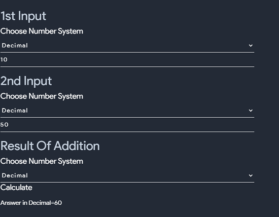

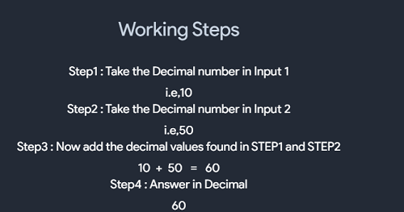

# Humming Distance
- Hamming distance is a metric for comparing two binary data strings. 
- While comparing two binary strings of equal length, Hamming distance is the number of bit positions in which the two bits are different.
- The Hamming distance between two strings, a and b is denoted as d(a,b).
- It is used for error detection or error correction when data is transmitted over computer networks. It is also using in coding theory for comparing equal length data words
- Use following tool to calculate humming distance

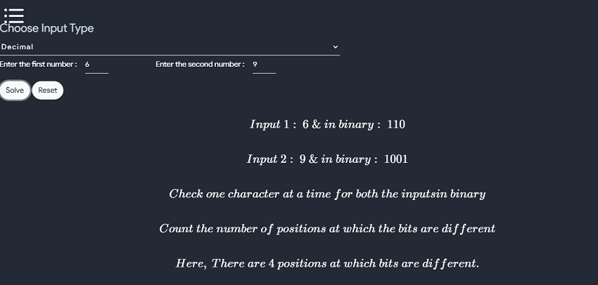

## Subtraction
- This tool can be used to subtract two number of any number system like Binary, octal, Decimal and Hexdecimal
- But Remember You cannot subtract two number of different number system like you cannot subtract one number of decimal system and one number of binary system.
- This tool also provides solving steps 

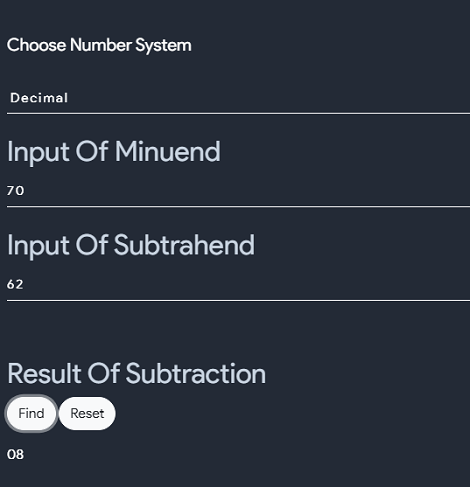

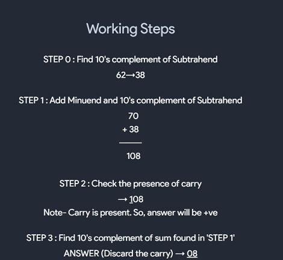

# Humming Code
- Hamming code is a block code that is capable of detecting up to two simultaneous bit errors and correcting single-bit errors. It was developed by R.W. Hamming for error correction.
- In this coding method, the source encodes the message by inserting redundant bits within the message. 
- These redundant bits are extra bits that are generated and inserted at specific positions in the message itself to enable error detection and correction. 
- When the destination receives this message, it performs recalculations to detect errors and find the bit position that has error.

- this tool can be used to encode or decode a message by humming code method and can also be  used for detection of error and correction of error

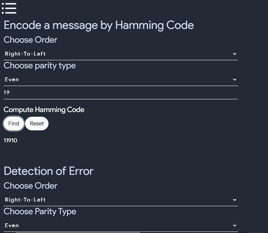

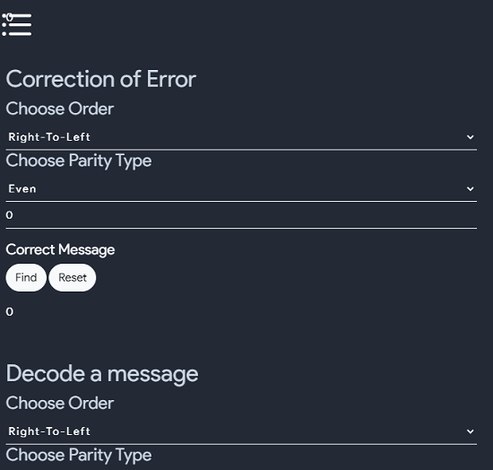

## Multiplication
- This tool can be used to multiply two number of any number system like Binary, octal, Decimal and Hexdecimal
- But Remember You cannot multiply two number of different number system like you cannot multiply  one number of decimal system and one number of binary system.
- This tool also provides solving steps 

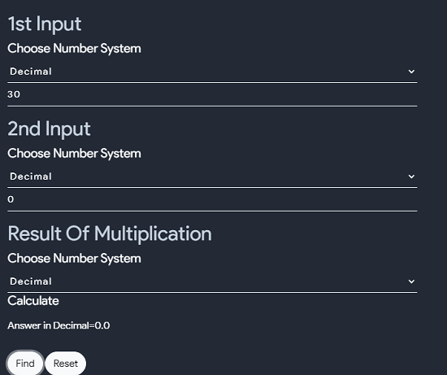

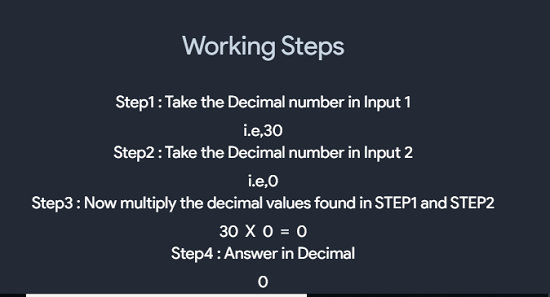

# (R-1)'s and R's Compliments
- For a number system having its base/radix as r, we can define two types of complement for the corresponding number system which are as follows:
- (r-1)'s complement
  - The (r-1)'s complement of a number in any number system with base r can be found out by subtracting every single digit of a number by r-1.

  - For Example: In the binary number system, the base is 2. Hence, its (r-1)'s i.e., (2-1 =1)'s complement can be obtained by subtracting each bit from 1, i.e., 1's complement for 001 can also be calculated by subtracting 001 from 111 which will be $$ (111-001) = (110)_{2} $$.

  - Similarly, in the octal number system, the base is 8 so its 7's complement can be calculated by subtracting each bit by 7, i.e., 7's complement for 347 in octal number system can be calculated by subtracting 347 from 777 which will yield $$ (777 – 347) = (430)_{8} $$.

- r's complement
  - The r's complement of a non-zero number in any number system with base r can be calculated by adding 1 to the LSB of its (r-1)'s complement.

  - For Example: In binary number system, 2's complement of 001 can be calculated by adding 1 to the LSB of its 1'complement $$ (i.e., 110 + 1) = (111)_{2} $$.

  - Similarly, in octal number system, 8's complement of 347 can be calculated by adding 1 to the LSB of its 7'complement $$ (i.e., 430 + 1) = (431)_{8} $$.

- You can use the following tool to find One's, Two's, Seven's, Eight's, Nine's, Ten's, Fifteen's and Sixteen's Compliment

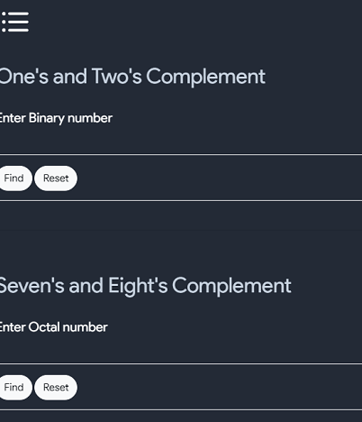

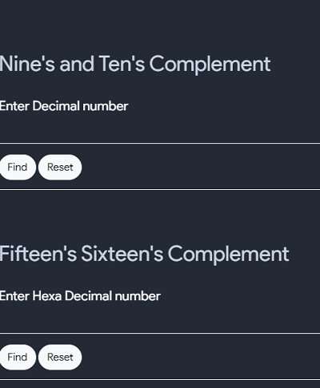

## Divide
- This tool can be used to divide two number of any number system like Binary, octal, Decimal and Hexdecimal
- But Remember You cannot divide two number of different number system like you cannot divide  one number of decimal system and one number of binary system.
- This tool also provides solving steps 

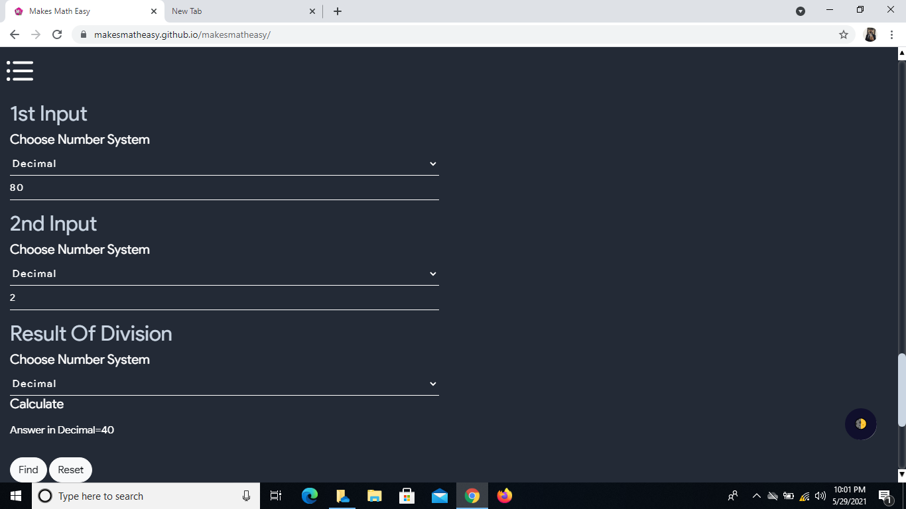

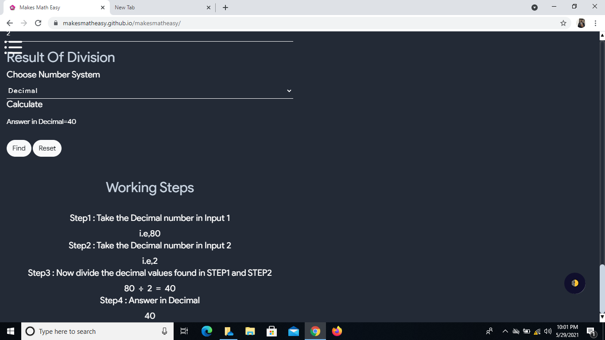

# 2421 Converter
- This tool can be used to convert Binary,Decimal,Octal and hexadecimal number to 2421

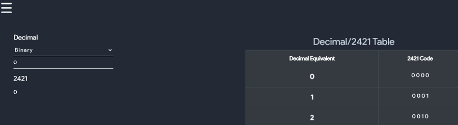

# BCD Converter
- This tool can be used to convert Binary,Decimal,Octal and hexadecimal number to BCD and can also be used to, to add two BCD code

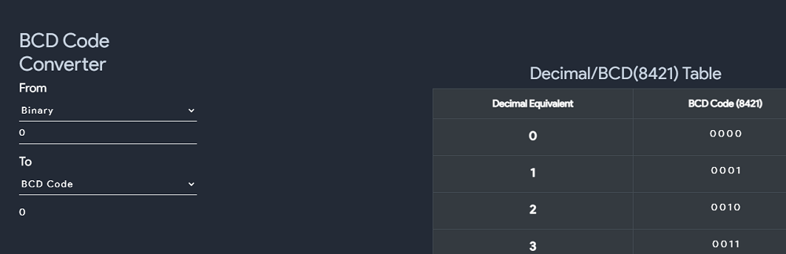

