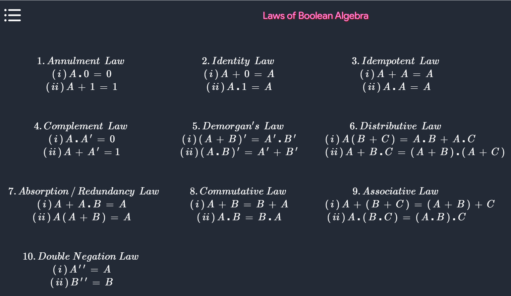
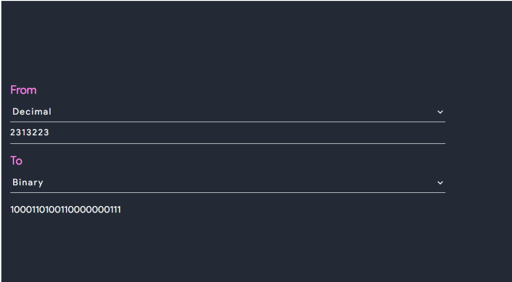
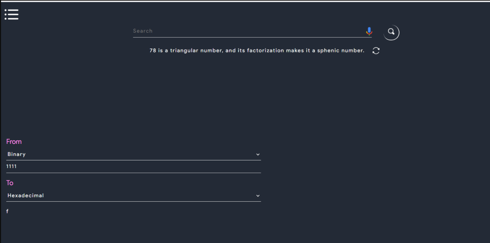
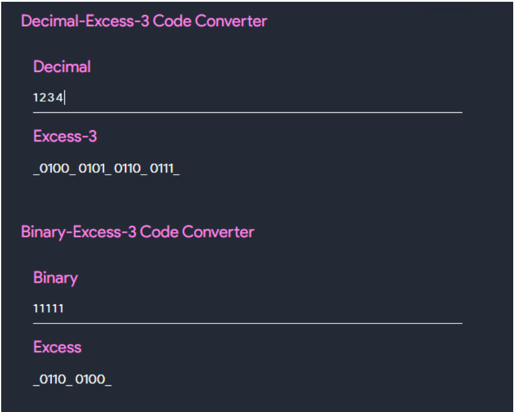
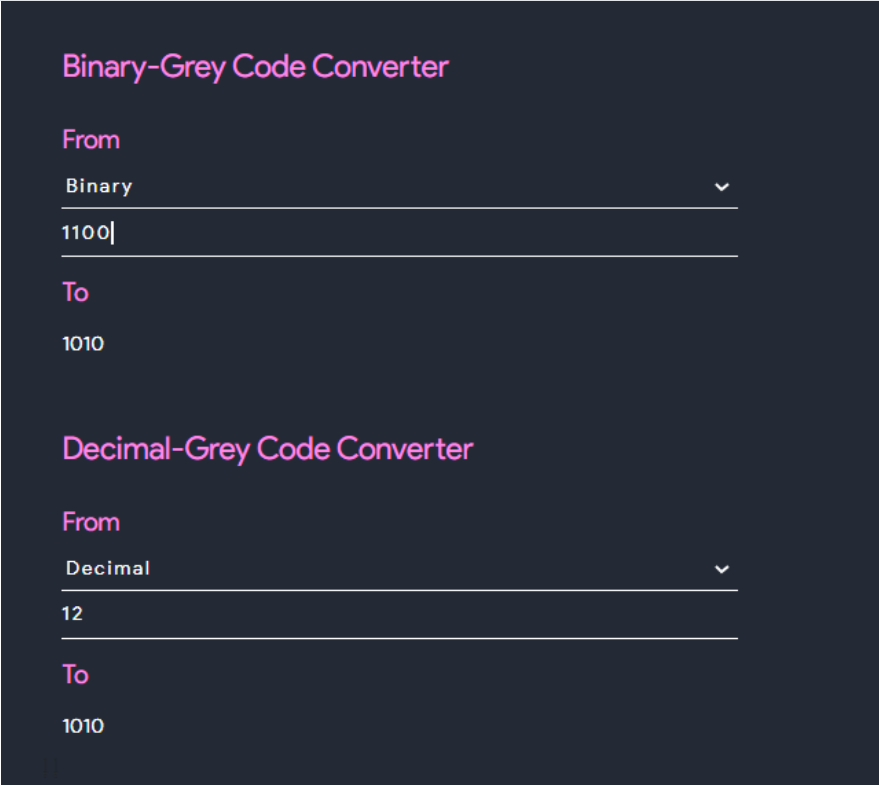
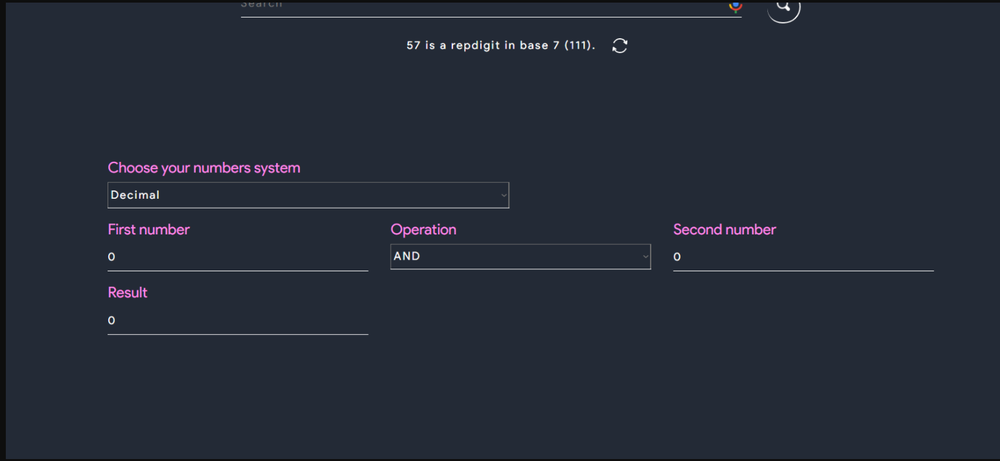

# Boolean Algebra
 

### All the Boolean Algebra laws:

{:#calc-edit}

# Conversions
 

### 1. Binary-decimal convertor

This tool converts any decimal number into binary and any binary number into its decimal form.

{:#calc-edit}

### 2. Binary-Hexadecimal convertor

This tool converts any binary number into its hexadecimal form and any hexadecimal number into its binary form.

{:#calc-edit}

### 3. Excess-3 code convertor

This tool converts any excess-3 code into its  binary form and vice-versa. Also it can convert any excess-3 code into its decimal form and vice-versa.

{:#calc-edit}

### 4. Grey-code convertor

This tool converts any grey-code code into its  binary form and vice-versa. Also it can convert any grey-code into its decimal form and vice-versa.

{:#calc-edit}

# Bitwise Calculator
 

This is used to do bitwise operations among any number systems of your choices

{:#calc-edit}
