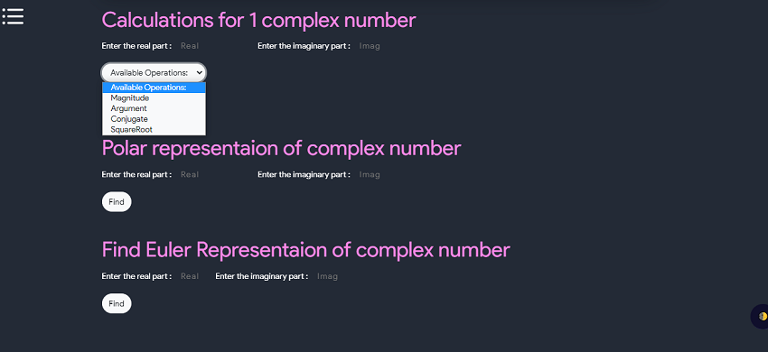
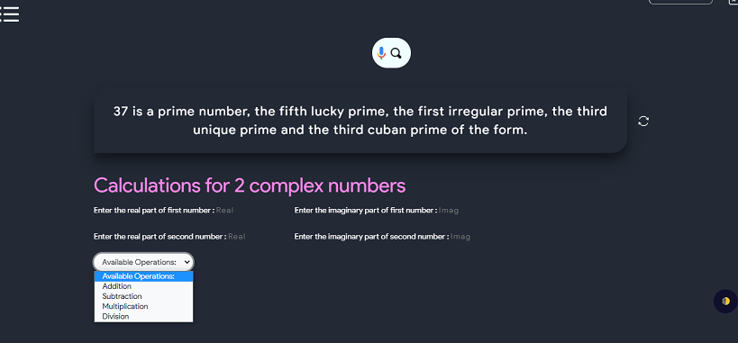

# What is Complex Number
Complex numbers are those that are expressed as a+ib, where a,b are real numbers and I is an imaginary number known as a “iota.” ( $$ \sqrt{-1} $$ ) is the value of i. 2+3i is a complex number, for example, where 2 is a real number (Re) and 3i is an imaginary number (Im).

## What are Real Numbers?
Real numbers are any numbers that exist in a number system, such as positive, negative, zero, integer, rational, irrational, fractions, and so on. It is represented by the symbol Re (). 12, -45, 0, 1/7, 2.8, 5, and so on are all real numbers.

## What are Imaginary Numbers
Numbers that are not real are called imaginary numbers. When we square an imaginary number, the result is negative. It is written as Im (). For example, the numbers $$ √-2, √-7, √-11 $$ are all imaginary.

To solve the equation $$ x^2+1 = 0 $$ , complex numbers were introduced. The equation's roots are of the form  $$ x = ±√-1 $$, and there are no real roots. As a result of the introduction of complex numbers,, we have Imaginary roots, We denote $$ √-1 $$ with the symbol $$ ‘i’ $$ , which denotes Iota (Imaginary number).

- Complex number examples:

$$ 1 + j $$
$$ -13 – 3i$$ 
$$ 0.89 + 1.2 i$$ 
$$ √5 + √2i$$ 

- An imaginary number is usually represented by the letters I or ‘j,' which are both equal to -1. As a result, the square of the imaginary number is negative.

## Notation
An equation of the form z= a+ib, where a and b are real numbers, is defined to be a complex number. The real part is denoted by Re z = a and the imaginary part is denoted by Im z = ib.

$$ Z = a + i b $$

- Through the Euler formula, a complex number $$ z=x+iy $$ 	
- may be written in "phasor" form 

$$ z=|z|(cost\theta+isin\theta)=|z|e^({i\theta}) $$. 

- Here, |z| is known as the complex modulus (or sometimes the complex norm) and theta is known as the complex argument or phase. The plot above shows what is known as an Argand diagram of the point z, where the dashed circle represents the complex modulus |z| of z and the angle theta represents its complex argument.
-  The geometric representation of a complex number as simply a point in the plane was historically significant because it made the concept of a complex number more acceptable. "Imaginary" numbers, in particular, gained acceptance in part due to their visualisation.
-  Because complex numbers, unlike real numbers, do not have a natural ordering, there is no analogue of complex-valued inequalities. This property is not surprising when viewed as elements in the complex plane, because points in a plane also lack natural ordering.
-  The absolute square of z is defined by 

$$ |z|^2= z \bar{z} with \bar{z}  $$ 

- the complex conjugate, and the argument may be computed from

 $$ arg(z)=\theta=tan^({-1})\dfrac{x}{y}$$ 	

- The real R(z) and imaginary parts I(z) are given by

$$ R(z)	=	1/2(z+\bar{z}) $$	

$$ I(z)	=	(z-\bar{z})/(2i) $$	

$$	=	-1/2i(z-\bar{z}) $$	

$$	=	1/2i(\bar{z}-z) $$	

- de Moivre's identity relates powers of complex numbers for real n by

$$ z^n=|z|^n[cos(n\theta)+isin(n\theta)] $$ 	

- A power of complex number z to a positive integer exponent n can be written in closed form as

$$ z^n=[x^n-(\dfrac{n}{2})x^(n-2)y^2+(\dfrac{n}{4})x^(n-4)y^4-...] $$
$$ +i[(\dfrac{n}{1})x^(n-1)y-(\dfrac{n}{3})x^(n-3)y^3+...] $$  	

- The first few are explicitly

$$ z^2	=	(x^2-y^2)+i(2xy) $$	

$$ z^3	=	(x^3-3xy^2)+i(3x^2y-y^3) $$	

$$ z^4	=	(x^4-6x^2y^2+y^4)+i(4x^3y-4xy^3) $$	

$$ z^5	=	(x^5-10x^3y^2+5xy^4)+i(5x^4y-10x^2y^3+y^5) $$

### Some useful identities

 $$ (z1 + z2)2 = (z1)2 + (z2)2 + 2 z1 × z2 $$ 
 $$ (z1 – z2)2 = (z1)2 + (z2)2 – 2 z1 × z2 $$ 
 $$ (z1)2 – (z2)2 =  (z1 + z2)(z1 – z2) $$ 
 $$ (z1 + z2)3 = (z1)3 + 3(z1)2 z2  +3(z2)2 z1 + (z2)3 $$ 
 $$ (z1 – z2)3 = (z1)3 – 3(z1)2 z2  +3(z2)2 z1 – (z2)3 $$ 

### Properties
- The addition of two conjugate complex numbers will result in a real number
- The multiplication of two conjugate complex number will also result in a real number
- If x and y are the real numbers and x+yi =0, then x =0 and y =0
- If p, q, r, and s are the real numbers and p+qi = r+si, then p = r, and q=s
- The complex number obeys the commutative law of addition and multiplication.

          
$$ z1+z2  = z2+z1 $$
$$ z1. z2  = z2. z1 $$

          

- The complex number obeys the associative law of addition and multiplication.

         
$$ (z1+z2) +z3 = z1 + (z2+z3) $$
$$ (z1.z2).z3 = z1.(z2.z3) $$

          

- The complex number obeys the distributive law
 
    
 $$      z1.(z2+z3) = z1.z2 + z1.z3 $$
 

- If the sum of two complex number is real, and also the product of two complex number is also real, then these complex numbers are conjugate to each other.
- For any two complex numbers, say z1 and z2, then 

 
$$ |z1+z2| ≤ |z1|+|z2| $$

- The result of the multiplication of two complex numbers and its conjugate value should result in a complex number and it should be a positive value.
- Modulus and Conjugate

 $$ Let \enspace z = a+ib \enspace be \enspace a \enspace complex \enspace number. $$ 
 $$ The \enspace Modulus of \enspace z \enspace is \enspace represented \enspace by |z|. $$ 
 $$ Mathematically\enspace , |z|=\sqrt{a^2+b^2} $$ 
 $$ The \enspace conjugate \enspace of \enspace “z” \enspace is \enspace denoted \enspace by \bar{z}. $$ 
 $$ Mathematically\enspace , \bar{z}= a – ib $$ 

-  following tool can be used on one complex number only to find conjugate, square root, magnitude and argument of any complex number

-  following tool can be used on two complex number only to find multiplication, addition, subtraction and division.

