# Conic Sections
One of the most important subjects of Geometry is conic parts. In mathematics, there are various types of conic sections that can be specified based on the angle created between the plane and the intersection of the right circular cone with it.

## What are Conic Sections
- A curve that creates a right circular cone intersection with the plane is called "conic." The Euclidean geometry has distinctive characteristics. It is divided into two nappies called the upper and lower nappes by the vertex of the cone.
- The cone is intersected by a plane in the following figures, and the resulting segment is known as a conic section. Different forms of conic sections are obtained depending on the location of the plane that intersects the cone and the angle of intersection. Specifically,
    - Circle
    - Ellipse
    - Parabola
    - Hyperbola

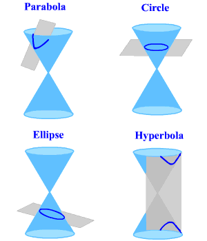

 
- 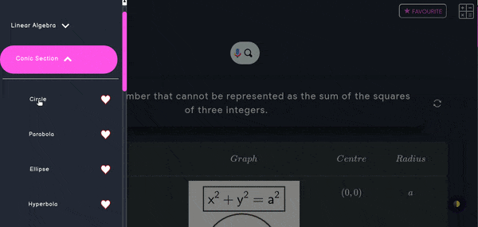

## Focus, Eccentricity and Directrix of Conic
- A conic section is also defined as the locus of a point P moving in the plane of a fixed point F known as focus (F) and a fixed line d known as directrix (with the focus not on d) such that the ratio of point P's distance from focus F to its distance from d is a constant e known as eccentricity. Right now,
  - If eccentricity, e = 0, the conic is a circle
  - If 0 < e < 1, the conic is an ellipse
  - If e=1, the conic is a parabola
  - And if e>1, it is a hyperbola
- So eccentricity is a measure of the ellipse's deviation from being circular. If the angle formed by the cone's surface and its axis is and the angle formed by the cutting plane and the axis is, the eccentricity is;

$$ e = \dfrac{ cos α}{cos β} $$

## Parameters of Conic
- Aside from focus, eccentricity, and directrix, conic sections define a few more parameters.
  - __Principal Axis__ : The line connecting the two focal points or foci of an ellipse or hyperbola is known as the principal axis. Its midpoint is the curve's centre.
  - __Linear Eccentricity__: Distance between the focus and centre of a section.
  - __Latus Rectum__: A chord of section parallel to directrix, which passes through a focus.
  - __Focal Parameter__: Distance from focus to the corresponding directrix.
  - __Major axis__: Chord joining the two vertices. It is the longest chord of an ellipse.
  - __Minor axis__: Shortest chord of an ellipse.

### Conic Section Circle
If $$ β= 90\deg $$ , the conic section formed is a circle as shown below.

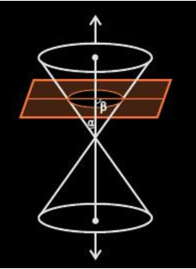

- Some useful properties related to circle

#### Different type of equations for circle

<table style="width:100%" border="2"  bordercolor="white"  class="small-2">

<table style="width:100%"  class="small-2">

  <tr>
    <th>Equation </th>
    <th>Graph</th>
    <th>Center</th>
    <th>Radius</th>
  </tr>
  <tr>
    <td>$$ x^2 + y^2 = a^2 $$</td>
    <td>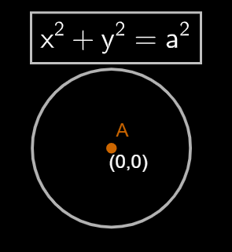</td>
    <td>$$ (0,0) $$</td>
    <td>$$ a $$</td>
  </tr>
  <tr>
    <td>$$ (x-h)^2 + (y-k)^2 = a^2 $$</td>
    <td>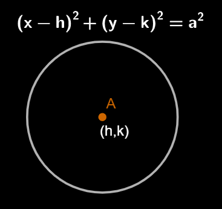</td>
    <td>$$ (h,k) $$</td>
    <td>$$ a $$</td>
  </tr>
  <tr>
    <td>$$ x^2 + y^2 + 2gx + 2fy = 0 $$</td>
    <td>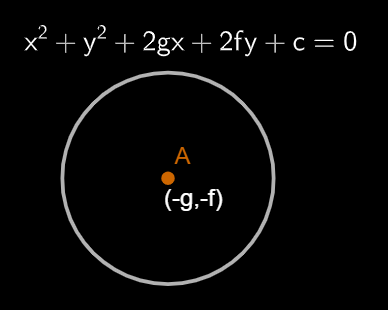</td>
    <td>$$ (-g,-f) $$</td>
    <td>$$ \sqrt{g^+f^2-c} $$</td>
  </tr>
</table>

#### Equations of tangent of all the circles

<table style="width:100%" border="2"  bordercolor="white"  class="small-2">

<table style="width:100%"  class="small-2">

  <tr>
    <th>Equation of Circle </th>
    <th>Pont/Line of contact </th>
    <th>Equation of tangent</th>
  </tr>
  <tr>
    <td>$$ x^2 + y^2 = a^2 $$</td>
    <td>$$ (x1,y1) $$</td>
    <td>$$ xx1 + yy1 = a^2 $$</td>
  </tr>
  <tr>
    <td>$$ x^2 + y^2 = a^2 $$</td>
    <td>$$ (acos\theta,b sine\theta) $$</td>
    <td>$$ x cos\theta + y sine\theta = a $$</td>
  </tr>
  <tr>
    <td>$$ x^2 + y^2 = a^2 $$</td>
    <td>$$ y = mx+c $$</td>
    <td>$$ y = mx\plusmn a\sqrt{1+m^2} $$</td>
  </tr>
  <tr>
    <td>$$ x^2 + y^2 + 2gx + 2fy +c = 0 $$</td>
    <td>$$ (x1,y1) $$</td>
    <td>$$ xx1 + yy1 + g(x+x1) + f(y+y1) + c = 0 $$</td>
  </tr>
</table>

#### Equations of Normal of all the circles

<table style="width:100%" border="2"  bordercolor="white" class="small-2">

<table style="width:100%"  class="small-2">

  <tr>
    <th>Equation of Circle </th>
    <th>Pont/Line of contact </th>
    <th>Equation of normal</th>
  </tr>
  <tr>
    <td>$$ x^2 + y^2 = a^2 $$</td>
    <td>$$ (x1,y1) $$</td>
    <td>$$ \dfrac{x}{x1} = \dfrac{y}{y1} $$</td>
  </tr>
  <tr>
    <td>$$ x^2 + y^2 = a^2 $$</td>
    <td>$$ (acos\theta,b sine\theta) $$</td>
    <td>$$ y = x tan\theta $$</td>
  </tr>
  <tr>
    <td>$$ x^2 + y^2 = a^2 $$</td>
    <td>$$ y = mx+c $$</td>
    <td>$$ x+my = \plusmn a\sqrt{1+m^2} $$</td>
  </tr>
  <tr>
    <td>$$ x^2 + y^2 + 2gx + 2fy +c = 0 $$</td>
    <td>$$ (x1,y1) $$</td>
    <td>$$ \dfrac{y-y1}{x-x1} = \dfrac{y1+f}{x1+g} $$</td>
  </tr>
</table>

#### Director circle of all circles

<table style="width:100%" border="2"  bordercolor="white"  class="small-2">

<table style="width:100%"  class="small-2">

  <tr>
    <th>Equation of Circle </th>
    <th>Equation of director circle </th>
  </tr>
  <tr>
    <td>$$ x^2 + y^2 = a^2 $$</td>
    <td>$$ x^2 + y^2 = 2a^2 $$</td>
  </tr>
  <tr>
    <td>$$ (x-h)^2 + (y-k)^2 = a^2 $$</td>
    <td>$$ (x-h)^2 + (y-k)^2 = 2a^2 $$</td>
  </tr>
  <tr>
    <td>$$ x^2 + y^2 + 2gx + 2fy +c = 0 $$</td>
    <td>$$ (x+g)^2 + (y+f)^2 = 2(g^2+f^2-c) $$</td>
  </tr>
</table>

 
 
 

### Conic Section Ellipse
If $$ α<β<90^o $$, the conic section so formed is an ellipse as shown in the figure below.  

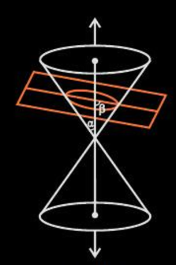

- Use ellipse tool to find all the parameters of the ellipse after entering the values of a and b. You can find this tol under conic section tab

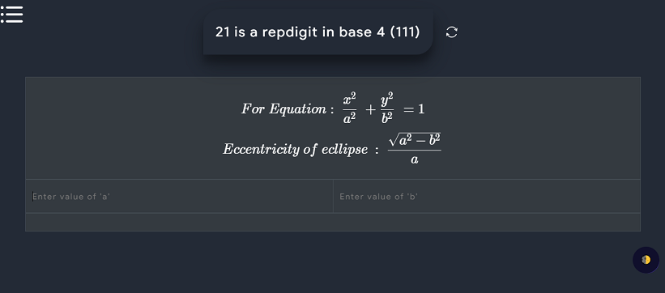

- Some usefull properties and formulas of ellipse
- 
#### Ellipse parameters formula

<table style="width:100%" border="2"  bordercolor="white" class="small-2">

<table style="width:100%"  class="small-2">

  <tr>
    <th>Equation</th>
    <th>Graph </th>
    <th>Focus </th>
    <th>Length of LR </th>
    <th>Diretrix </th>
    <th>Length of major axis </th>
  </tr>
  <tr>
    <th> $$ \dfrac{x^2}{a^2} + \dfrac{y^2}{b^2} = 1  $$ where a>b </th>
    <th>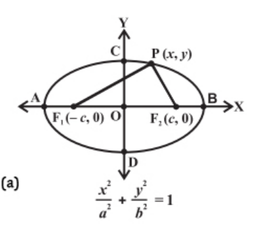 </th>
    <th>$$ (\plusmn ae,0) $$ </th>
    <th> $$ \dfrac{2b^2}{a} $$ </th>
    <th> $$ x = \plusmn \dfrac{a}{e} $$ </th>
    <th> $$ 2a $$ </th>
  </tr>
  <tr>
    <th> $$ \dfrac{x^2}{a^2} + \dfrac{y^2}{b^2} = 1  $$ where a < b </th>
    <th>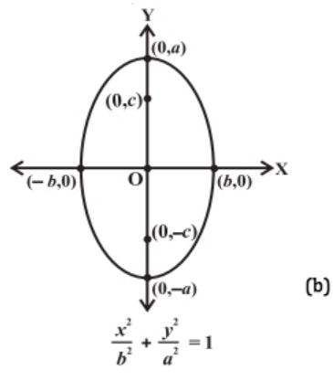 </th>
    <th>$$ (0,\plusmn be) $$ </th>
    <th> $$ \dfrac{2a^2}{b} $$ </th>
    <th> $$ x = \plusmn \dfrac{b}{e} $$ </th>
    <th> $$ 2b $$ </th>
  </tr>
</table>
 
 
 
#### Equation of tangent of ellipse

<table style="width:100%" border="2"  bordercolor="white" class="small-2">

<table style="width:100%"  class="small-2">

  <tr>
    <th>Equation</th>
    <th>Parametric Coordinate </th>
    <th>Equation Of tangent </th>
    <th>Condition of tangency </th>
  </tr>
  <tr>
    <th> $$ \dfrac{x^2}{a^2} + \dfrac{y^2}{b^2} = 1  $$ where a>b </th>
    <th>$$ (acos\theta,bsin\theta) $$ </th>
    <th> $$ y = mx \plusmn \sqrt{am^2+b^2} $$   $$ \dfrac{xcos\theta}{a} + \dfrac{ysin\theta}{b}= 1 $$ </th>
    <th> $$ c =  \plusmn \sqrt{am^2+b^2} $$ </th>
  </tr>
  <tr>
    <th> $$ \dfrac{x^2}{a^2} + \dfrac{y^2}{b^2} = 1  $$ where a>b </th>
    <th>$$ (bcos\theta,asin\theta) $$ </th>
    <th> $$ y = mx \plusmn \sqrt{bm^2+a^2} $$   $$ \dfrac{xcos\theta}{b} + \dfrac{ysin\theta}{a}= 1 $$ </th>
    <th> $$ c =  \plusmn \sqrt{bm^2+a^2} $$  </th>
  </tr>
</table>
 
 
 

#### Equations of normal of ellipse

<table style="width:100%" border="2"  bordercolor="white"  class="small-2">

<table style="width:100%"  class="small-2">

  <tr>
    <th>Equation</th>
    <th>Parametric Coordinate </th>
    <th>Equation Of normal </th>
    <th>Condition of tangency </th>
  </tr>
  <tr>
    <th> $$ \dfrac{x^2}{a^2} + \dfrac{y^2}{b^2} = 1  $$ where a>b </th>
    <th>$$ (acos\theta,bsin\theta) $$ </th>
    <th> $$ \dfrac{ax}{cos\theta} - \dfrac{by}{sin\theta}= a^2-b^2 $$ </th>
    <th> $$c =  \plusmn \dfrac{m(a^2-b^2)}{\sqrt{a^2+b^2m^2}} $$ </th>
  </tr>
  <tr>
    <th> $$ \dfrac{x^2}{a^2} + \dfrac{y^2}{b^2} = 1  $$ where a>b </th>
    <th>$$ (bcos\theta,asin\theta) $$ </th>
    <th> $$ \dfrac{bx}{cos\theta} - \dfrac{ay}{sin\theta}= b^2-a^2 $$ </th>
    <th> $$ c =  \plusmn \dfrac{m(b^2-a^2)}{\sqrt{b^2+a^2m^2}} $$  </th>
  </tr>
</table>

 
 
 

#### Equation of director circle of ellipse

<table style="width:100%" border="2"  bordercolor="white"  class="small-2">

<table style="width:100%"  class="small-2">

  <tr>
    <th>Equation</th>
    <th>Equation of director circle </th>
  </tr>
  <tr>
    <th> $$ \dfrac{x^2}{a^2} + \dfrac{y^2}{b^2} = 1  $$ where a>b </th>
    <th>$$ x^2+y^2=a^2+b^2 $$ </th>
  </tr>
  <tr>
    <th> $$ \dfrac{x^2}{a^2} + \dfrac{y^2}{b^2} = 1  $$ where a>b </th>
    <th>$$ x^2+y^2=a^2+b^2 $$ </th>
  </tr>
</table>
 
 
 

### Conic Section Parabola
If $$ α=β $$, the conic section formed is a parabola (represented by the orange curve) as shown below.

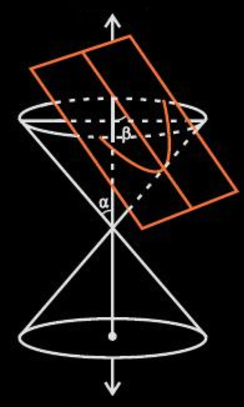

- Use this tool to find all the parameters of the parabola accoding to your equation type. You can find this tol under conic section tab

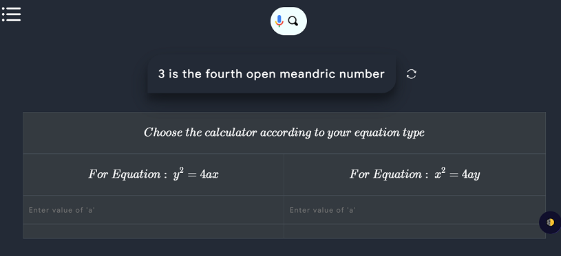

- Some Usefull Properties and Formulas
#### Parabola Parameters

<table style="width:100%" border="2"  bordercolor="white"  class="small-2">

<table style="width:100%"  class="small-2">

  <tr>
    <th>Equation</th>
    <th>Graph </th>
    <th>Focus </th>
    <th>Length of LR </th>
    <th>Diretrix </th>
    <th>Length of major axis </th>
  </tr>
  <tr>
    <th> $$ y^2 = 4ax $$</th>
    <th>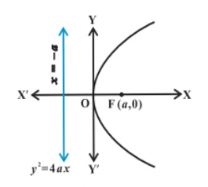 </th>
    <th>$$ (a,0) $$ </th>
    <th> $$ 4a $$ </th>
    <th> $$ x = -a $$ </th>
    <th> $$ y=0 $$ </th>
  </tr>
  <tr>
    <th> $$ y^2 = -4ax $$</th>
    <th>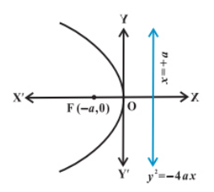 </th>
    <th>$$ (-a,0) $$ </th>
    <th> $$ 4a $$ </th>
    <th> $$ x = a $$ </th>
    <th> $$ y=0 $$ </th>
  </tr>
  <tr>
    <th> $$ x^2 = 4ay $$</th>
    <th>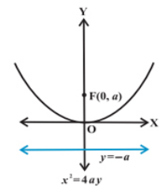 </th>
    <th>$$ (0,a) $$ </th>
    <th> $$ 4a $$ </th>
    <th> $$ y = -a $$ </th>
    <th> $$ x=0 $$ </th>
  </tr>
  <tr>
    <th> $$ x^2 = -4ay $$</th>
    <th>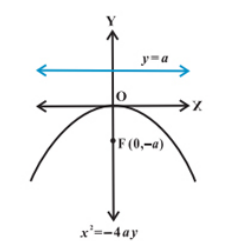 </th>
    <th>$$ (0,-a) $$ </th>
    <th> $$ 4a $$ </th>
    <th> $$ y = a $$ </th>
    <th> $$ x=0 $$ </th>
  </tr>
</table>
 
 
 

#### Equations of tangents of all parabolas in slope form

<table style="width:100%" border="2"  bordercolor="white" class="small-2">

<table style="width:100%"  class="small-2">

  <tr>
    <th>Equation of parabola</th>
    <th>Point of contact in terms of slope </th>
    <th>Equation of tangent in terms of slope(m) </th>
    <th>Condition of tangency </th>
  </tr>
  <tr>
    <th> $$ y^2 = 4ax $$</th>
    <th> $$ (\dfrac{a}{m^2},\dfrac{2a}{m}) $$ </th>
    <th> $$ y = mx+\dfrac{a}{m} $$ </th>
    <th> $$ c=\dfrac{a}{m} $$ </th>
  </tr>
  <tr>
    <th> $$ y^2 = -4ax $$</th>
   <th> $$ (-\dfrac{a}{m^2},-\dfrac{2a}{m}) $$ </th>
    <th> $$ y = mx-\dfrac{a}{m} $$ </th>
    <th> $$ c=-\dfrac{a}{m} $$ </th>
  </tr>
  <tr>
    <th> $$ x^2 = 4ay $$</th>
    <th> $$ (2am,am^2) $$ </th>
    <th> $$ y = mx - am^2 $$ </th>
    <th> $$ c = -am^2 $$ </th>
  </tr>
  <tr>
    <th> $$ x^2 = -4ay $$</th>
    <th> $$ (2am,am^2) $$ </th>
    <th> $$ y = mx - am^2 $$ </th>
    <th> $$ c = -am^2 $$ </th>
  </tr>
</table>

 
 
 

#### Equatons of normal of all parabolas in slope form

<table style="width:100%" border="2"  bordercolor="white" class="small-2">

<table style="width:100%"  class="small-2">

  <tr>
    <th>Equation of parabola</th>
    <th>Point of contact in terms of slope </th>
    <th>Equation of normal in terms of slope(m) </th>
    <th>Condition of normality </th>
  </tr>
  <tr>
    <th> $$ y^2 = 4ax $$</th>
    <th> $$ (am^2,-2am) $$ </th>
    <th> $$ y = mx-2am-am^3 $$ </th>
    <th> $$ c=-2am-am^3 $$ </th>
  </tr>
  <tr>
    <th> $$ y^2 = -4ax $$</th>
    <th> $$ (am^2,2am) $$ </th>
    <th> $$ y = mx+2am+am^3 $$ </th>
    <th> $$ c=2am+am^3 $$ </th>
  </tr>
  <tr>
    <th> $$ x^2 = 4ay $$</th>
    <th> $$ (-\dfrac{2a}{m},\dfrac{a}{m^2}) $$ </th>
    <th> $$ y = mx + 2a +\dfrac{a}{m^2} $$ </th>
    <th> $$ c = 2a+\dfrac{a}{m^2} $$ </th>
  </tr>
  <tr>
    <th> $$ x^2 = -4ay $$</th>
    <th> $$ (\dfrac{2a}{m},-\dfrac{a}{m^2}) $$ </th>
    <th> $$ y = mx - 2a -\dfrac{a}{m^2} $$ </th>
    <th> $$ c = -2a-\dfrac{a}{m^2} $$ </th>
  </tr>
</table>

 
 
 

#### Director cirles of all parabolas

<table style="width:100%" border="2"  bordercolor="white" class="small-2">

<table style="width:100%" class="small-2">

  <tr>
    <th>Equation of parabola</th>
    <th>Equation of director circle </th>
  </tr>
  <tr>
    <th> $$ y^2 = 4ax $$</th>
    <th> $$ x+a=0 $$ </th>
  </tr>
  <tr>
    <th> $$ y^2 = -4ax $$</th>
    <th> $$ x-a=0 $$ </th>
  </tr>
  <tr>
    <th> $$ x^2 = 4ay $$</th>
    <th> $$ y+a=0 $$ </th>
  </tr>
  <tr>
    <th> $$ x^2 = -4ay $$</th>
    <th> $$ y-a=0 $$ </th>
  </tr>
</table>
 
 
 

### Conic Section Hyperbola
If $$ 0≤β<α $$, then the plane intersects both nappes and the conic section so formed is known as a hyperbola

- Use this tool to find all the parameters of the parabola according to your equation type. You can find this tol under conic section tab

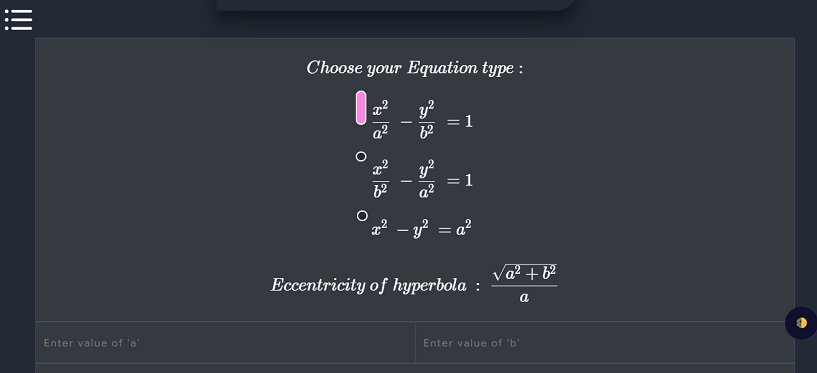

- Some usefull properties and formulas
#### Hyperbola Parameters

<table style="width:100%" border="2"  bordercolor="white" class="small-2">

<table style="width:100%" class="small-2">

  <tr>
    <th>Equation</th>
    <th>Graph </th>
    <th>Focus </th>
    <th>Length of LR </th>
    <th>Diretrix </th>
    <th>Length of major axis </th>
  </tr>
  <tr>
    <th> $$ \dfrac{x^2}{a^2} - \dfrac{y^2}{b^2} = 1 $$</th>
    <th>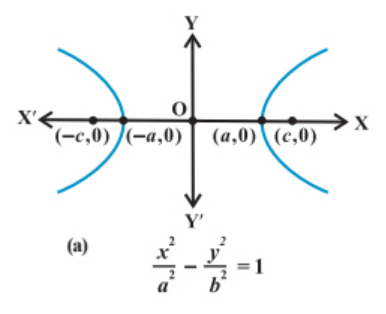 </th>
    <th>$$ (\plusmn ae,0) $$ </th>
    <th> $$ \dfrac{2b^2}{a} $$ </th>
    <th> $$ x = \plusmn \dfrac{a}{e} $$ </th>
    <th> $$ 2a $$ </th>
  </tr>
  <tr>
    <th> $$ \dfrac{y^2}{b^2} - \dfrac{x^2}{a^2} = 1 $$</th>
    <th>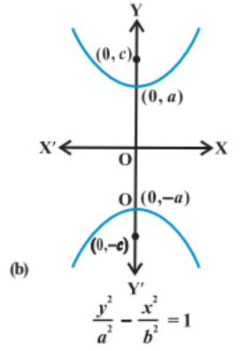 </th>
    <th>$$ (0,\plusmn be) $$ </th>
    <th> $$ \dfrac{2a^2}{b} $$ </th>
    <th> $$ y = \plusmn \dfrac{b}{e} $$ </th>
    <th> $$ 2b $$ </th>
  </tr>
  <tr>
    <th> $$ x^2 - y^2 = a^2 $$</th>
    <th>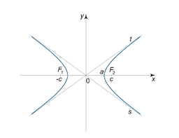 </th>
    <th>$$ (0,\plusmn a\sqrt{2}) $$ </th>
    <th> $$ 2a $$ </th>
    <th> $$ x = \plusmn \dfrac{a}{\sqrt{2}} $$ </th>
    <th> $$ 2a $$ </th>
  </tr>
</table>
 
 
 

#### Equations of tangent of hyperbola

<table style="width:100%" border="2"  bordercolor="white" class="small-2">

<table style="width:100%"  class="small-2">

  <tr>
    <th>Equation</th>
    <th>Parametric Co-ordinate </th>
    <th>Equation of tangent </th>
    <th>Condition of tangency </th>
  </tr>
  <tr>
    <th> $$ \dfrac{x^2}{a^2} - \dfrac{y^2}{b^2} = 1 $$</th>
    <th>$$ (asec\theta,btan\theta) $$ </th>
    <th> $$ y = mx\plusmn \sqrt{am^2-b^2} $$ </th>
    <th> $$ c = \plusmn \sqrt{am^2-b^2} $$ </th>
  </tr>
  <tr>
    <th> $$ \dfrac{y^2}{b^2} - \dfrac{x^2}{a^2} = 1 $$</th>
    <th>$$ (bsec\theta,atan\theta) $$ </th>
    <th> $$ y = mx\plusmn \sqrt{-bm^2+a^2} $$ </th>
    <th> $$ c = \plusmn \sqrt{-bm^2+a^2} $$ </th>
  </tr>
  <tr>
    <th> $$ x^2 - y^2 = a^2 $$</th>
    <th>$$ (asec\theta,atan\theta) $$ </th>
    <th> $$ y = mx\plusmn \sqrt{am^2-a^2} $$ </th>
    <th> $$ c = \plusmn \sqrt{am^2-a^2} $$ </th>
  </tr>
</table>
 
 
 

#### Equations of normal of hyperbola 

<table style="width:100%" border="2"  bordercolor="white" class="small-2">

<table style="width:100%"  class="small-2">

  <tr>
    <th>Equation</th>
    <th>Parametric Co-ordinate </th>
    <th>Equation of normal </th>
    <th>Condition of Normality </th>
  </tr>
  <tr>
    <th> $$ \dfrac{x^2}{a^2} - \dfrac{y^2}{b^2} = 1 $$</th>
    <th>$$ (asec\theta,btan\theta) $$ </th>
    <th> $$ \dfrac{ax}{sec\theta} + \dfrac{by}{tan\theta} = a^2+b^2 $$ </th>
    <th> $$ c = \dfrac{a(a^2+b^2)}{\sqrt{a^2-b^2m^2}} $$ </th>
  </tr>
  <tr>
    <th> $$ \dfrac{y^2}{b^2} - \dfrac{x^2}{a^2} = 1 $$</th>
    <th>$$ (bsec\theta,atan\theta) $$ </th>
    <th> $$ \dfrac{bx}{sec\theta} + \dfrac{ay}{tan\theta} = a^2+b^2 $$ </th>
    <th> $$ c = \dfrac{a(b^2-a^2)}{\sqrt{a^2m^2-b^2}} $$ </th>
  </tr>
  <tr>
    <th> $$ x^2 - y^2 = a^2 $$</th>
    <th>$$ (asec\theta,atan\theta) $$ </th>
    <th> $$ \dfrac{x}{sec\theta} + \dfrac{y}{tan\theta} = 2a $$ </th>
    <th> $$ c = \dfrac{2am}{\sqrt{1-m^2}} $$ </th>
  </tr>
</table>
 
 
 

#### Equation of director circle of hyperbola

<table style="width:100%" border="2"  bordercolor="white" class="small-2">

<table style="width:100%"  class="small-2">

  <tr>
    <th>Equation</th>
    <th>Equation of director circle </th>
  </tr>
  <tr>
    <th> $$ \dfrac{x^2}{a^2} - \dfrac{y^2}{b^2} = 1 $$</th>
    <th>$$ x^2+y^2 = a^2-b^2 $$ </th>
  </tr>
  <tr>
    <th> $$ \dfrac{y^2}{b^2} - \dfrac{x^2}{a^2} = 1 $$</th>
    <th>$$ x^2+y^2 = b^2-a^2 $$ </th>
  </tr>
</table>
 
 
 

### Paraboloid
- A paraboloid is an open surface formed by rotating a parabola about its axis. If the surface's axis is the z axis and the vertex is at the origin, the surface's intersections with planes parallel to the xz and yz planes are parabolas (see Figure, top). Circles are formed when the surface intersects planes parallel to and above the xy plane.

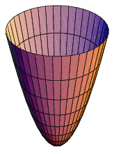

- The general equation for this type of paraboloid is $$ \dfrac{x2}{a2} + \dfrac{y2}{b2} = z $$.
- Use this tool to find volume and geometric centroid of paraboloid

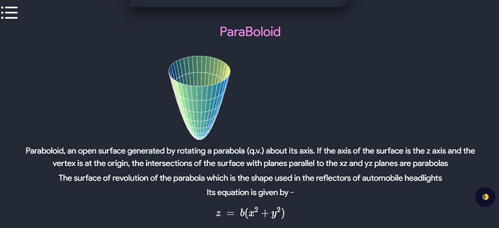

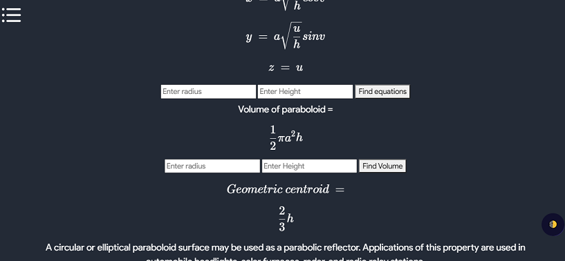

