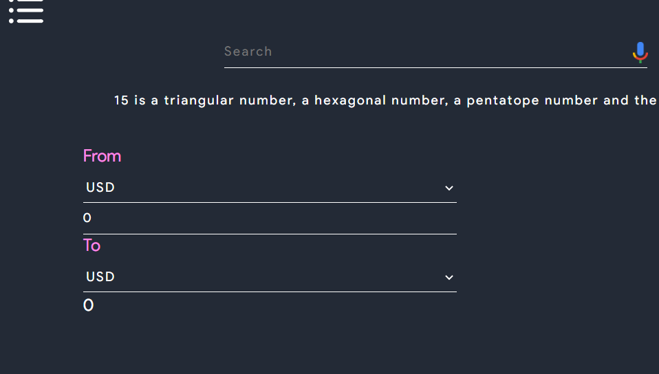
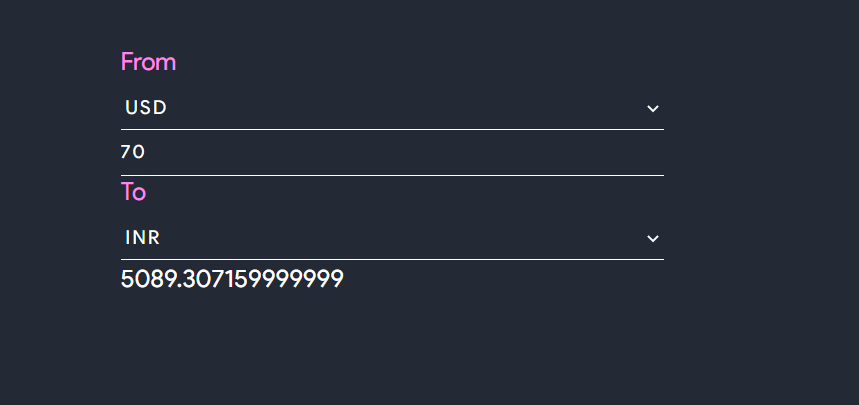
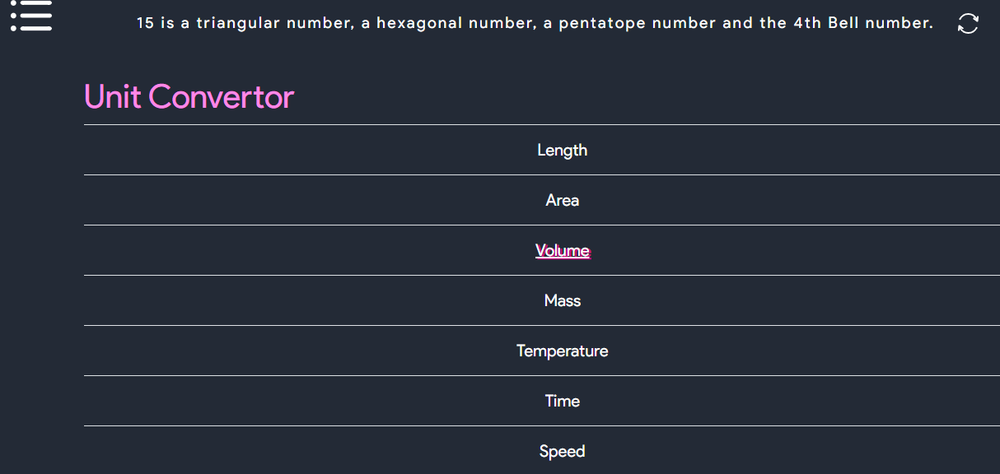
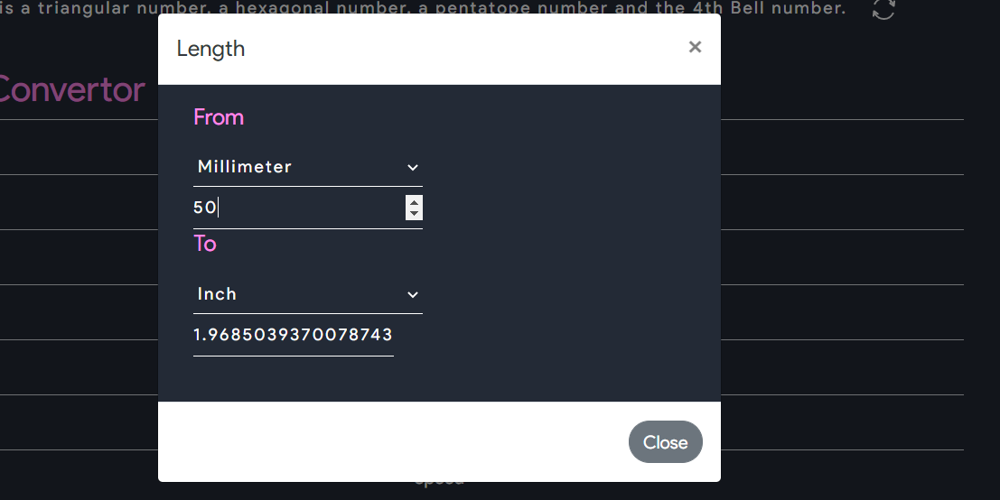
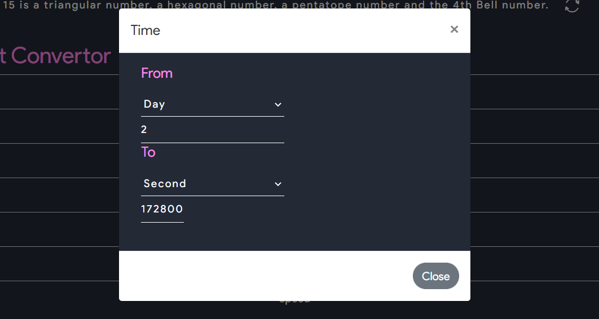
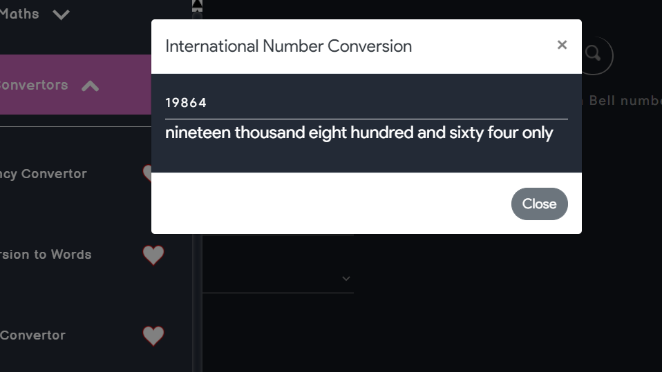
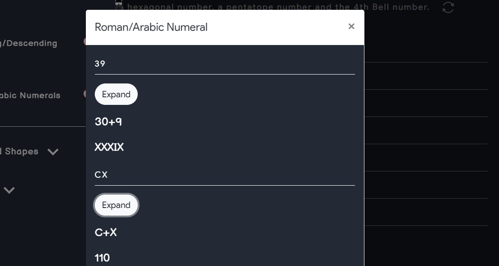
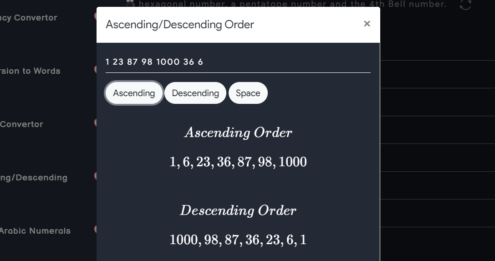

In this Section there are total 5 tools, and they are the following : 
- Currency Converter  

- Unit Converter : A Simple unit converter which can be used to convert any unit from the following:
  - Time
  - Temeprature
  - Length
  - Area
  - Volume
  - Speed

- Conversion to Words : Used to convert the number into words

- Roman Arabic Conversion : Used to convert any number from Arabic to Roman and vice-versa

- Asscending/Descending : As the name says, it can be used to sort many numbers in there asscending and descending order.

