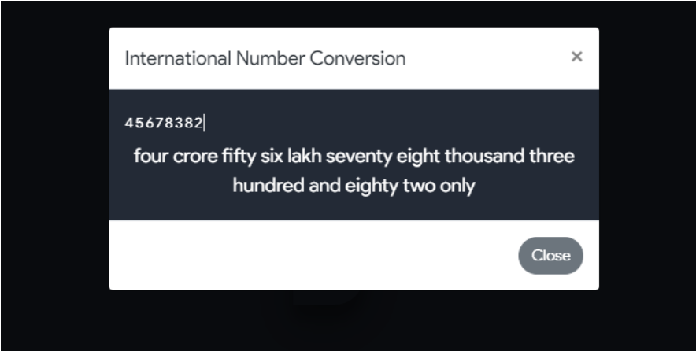
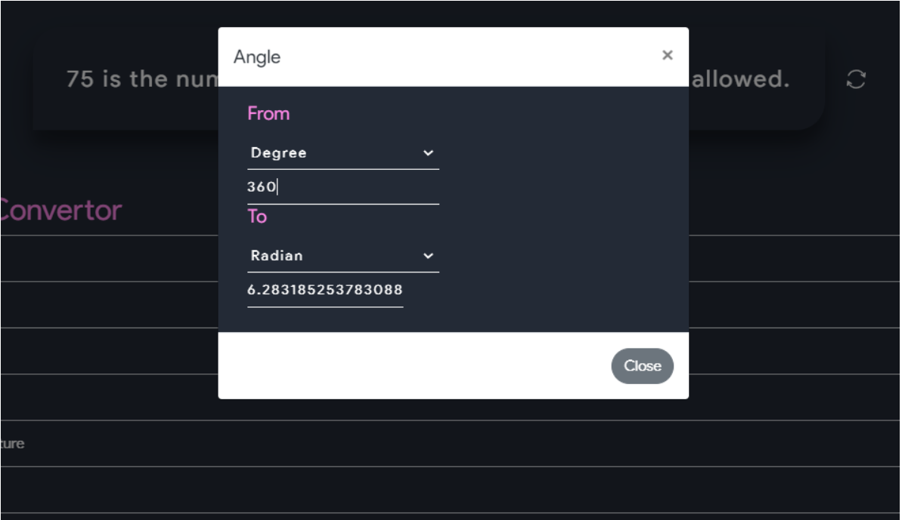
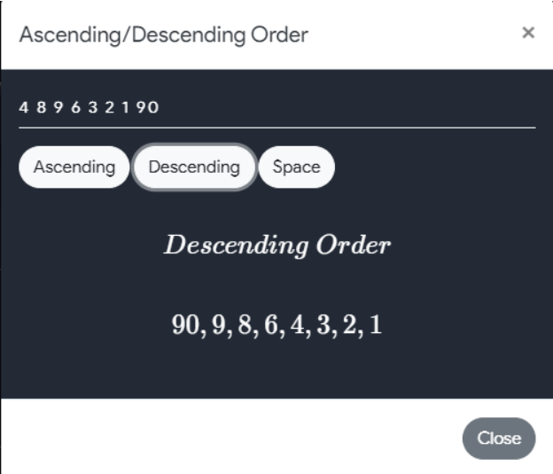

## Currency Convertor

Here are the following currencies that can be convertor using this tool :
- USD
- AED
- ARS
- AUD 
- BGN
- BRL
- BSD
- CAD
- CHF
- CLP
- CNY
- COP
- CZK
- DKK
- DOP
- EGP
- EUR
- FJD
- GBP
- GTQ
- HKD
- HRK
- HUF
- IDR
- ILS
- INR
- ISK
- JPY
- KRW
- KZT
- MVR
- MXN
- MYR
- NOK
- NZD
- PAB
- PEN
- PHP
- PKR
- PLN
- PYG
- RON
- RUB
- SAR
- SEK
- SGD
- THB
- TRY
- TWD
- UAH
- UYU
- ZAR

  

## Conversion to words

The is a International Number Conversion tool which converts any number upto eight digits into word:

  

## Unit Convertor

This is a useful tool used to convert any unit to other:

  

## Improper to Mixed Fraction

This tool is used to convert any Improper fraction into its corresponding Mixed fraction:

  

## SPI/CGPA Convertor

This tool is used to convert SPI/CGPA into percentage and vice-versa:

  

## Ascending/Descending

This tool is used to arrange numbers into its ascending and descending form:

  

## Date 

This tool finds out the difference form one particular date to other:

  

## Romal/Arabic Numerals

This tool converts any Roman number into Arabic number and vice-versa:

  
