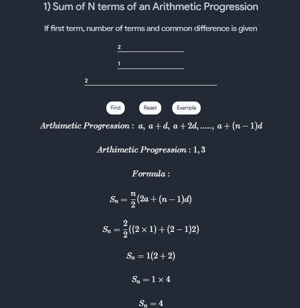
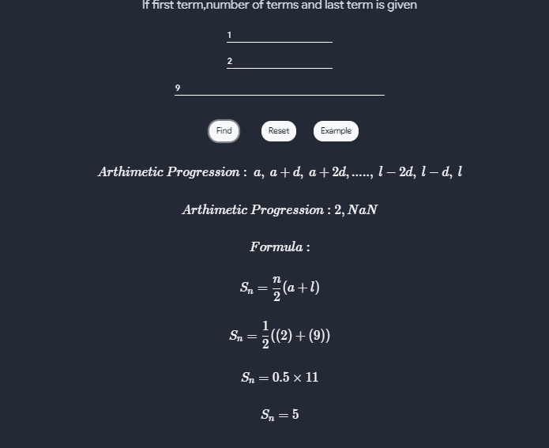
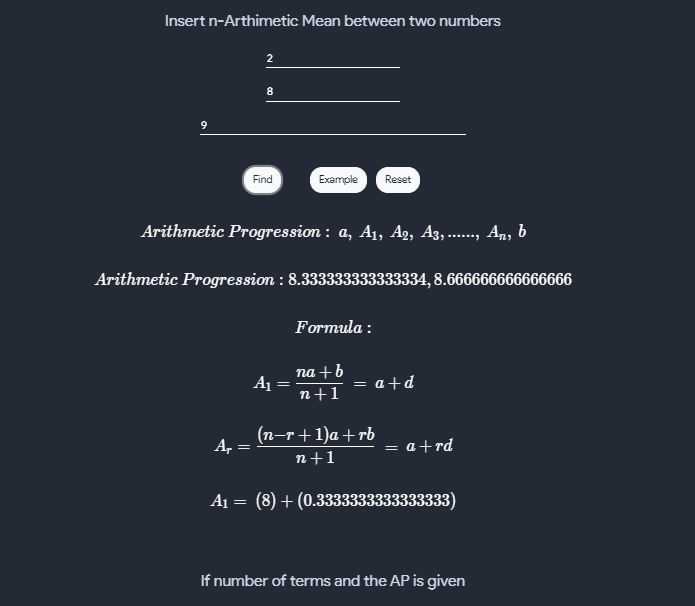
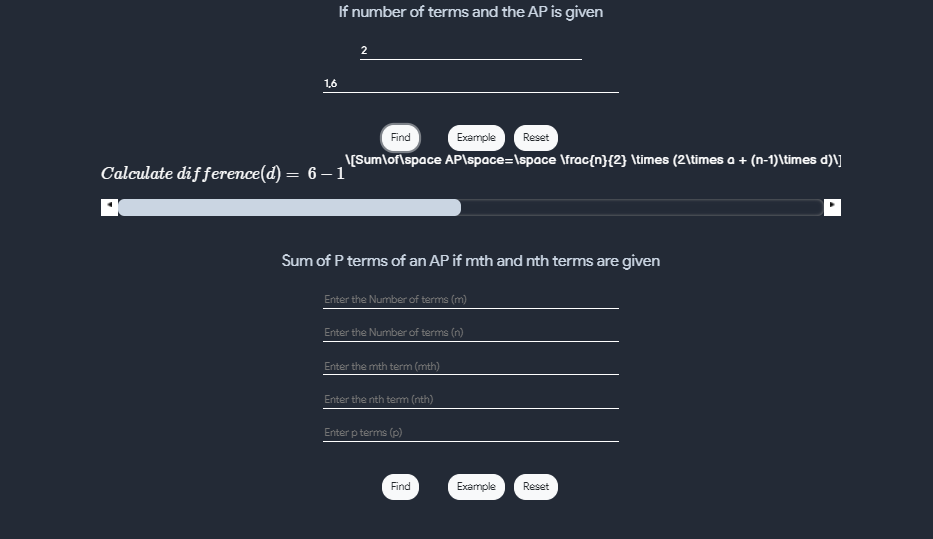
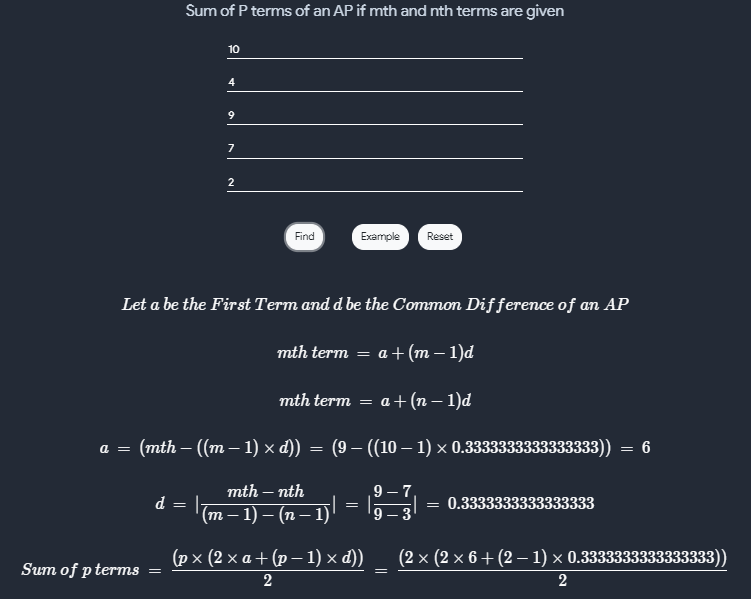
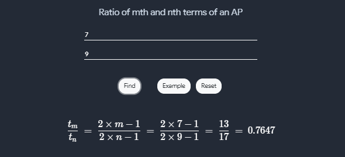
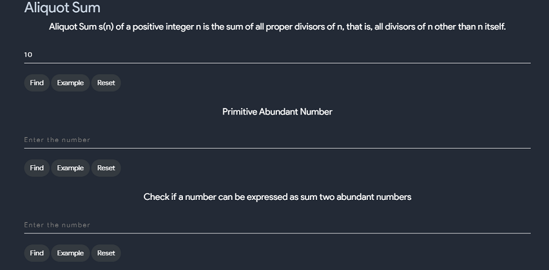
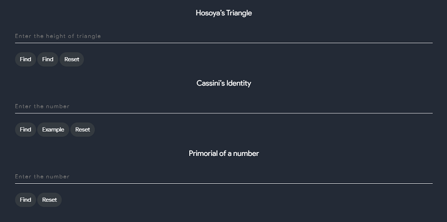
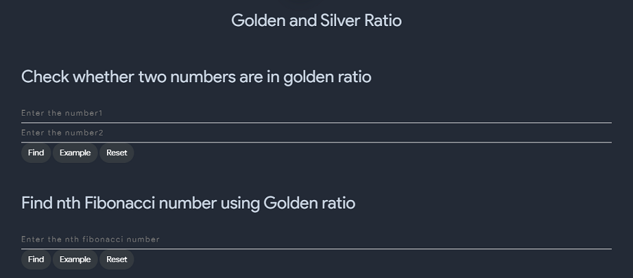
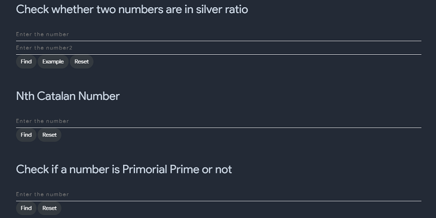

# Matrices
## What is a Matrix?

A matrix is a rectangular array of elements, usually numbers,In general, an matrix looks like:

$$
\begin{equation}
A_{m,n} = 
\begin{bmatrix}
a_{1,1} & a_{1,2} & \cdots & a_{1,n} \\
a_{2,1} & a_{2,2} & \cdots & a_{2,n} \\
\vdots  & \vdots  & \ddots & \vdots  \\
a_{m,1} & a_{m,2} & \cdots & a_{m,n} 
\end{bmatrix}
\end{equation}
$$

matrix is enclosed by [ ] or ( ) or | | | | Compact form the above matrix is represented by [aij]m x n or A = [aij]
- Element of a Matrix The numbers a11, a12 … etc., in the above matrix are known as the element of the matrix, generally represented as aij , which denotes element in ith row and jth column.
- Order of a Matrix In above matrix has m rows and n columns, then A is of order m x n.

## Why use Matrices?
With Matrix we can represent data, we can use matrices to work on multiple linear equations and mathematical equations, In many time-sensitive engineering applications, we can add, subtract or even multipy to get good approximations of much more complicated calculations.
We use matrices in mathematics because often we need to deal with several variables at once—eg the coordinates of a point in the plane are written (x, y) or in space as (x, y, z) and these are often written as column matrices in the following form:

$$
\begin{equation} 
\begin{pmatrix}
x \\
y
\end{pmatrix}
and
\begin{pmatrix}
x \\
y \\
z
\end{pmatrix}
\end{equation}
$$

## Types of matrix

- Column Matrix: A Matrix with one column, where order is Mx1

$$
\begin{equation}eg: 
\begin{bmatrix}
0 \\
-6 \\
4
\end{bmatrix} _{m,1}
\end{equation}
$$

- Row Matrix: A Matrix with one row, where order is 1xN

$$
\begin{equation}eg: 
\begin{bmatrix}
0 & 19 &-2
\end{bmatrix} _{1,n}
\end{equation}
$$

- Square Matrix: A Matrix with equal row and column, where order is NxN

$$
\begin{equation}eg: 
\begin{bmatrix}
0 & 19 & -2 \\
5 & -1 & 12 \\
4 & 8 & 0 
\end{bmatrix} _{n,n}
\end{equation}
$$

- Diagonal Matrix: A square matrix whose all the elements except the diagonal elements are zeroes, is called a diagonal matrix where  if aij = 0, when i ≠ j.

$$
\begin{equation}eg: 
\begin{bmatrix}
3 & 0 & 0 \\
0 & 1 & 0 \\
0 & 0 & 5 
\end{bmatrix} _{m,m}
\end{equation}
$$

- Scalar Matrix: A diagonal matrix whose all diagonal elements are same (non-zero), is called a scalar matrix.

> **Note**: A scalar matrix is a diagonal matrix but a diagonal matrix may or may not be a scalar matrix

$$
\begin{equation}eg: 
\begin{bmatrix}
3 & 0 & 0 \\
0 & 3 & 0 \\
0 & 0 & 3 
\end{bmatrix} _{m,m}
\end{equation}
$$

- Unit or Identity Matrix: A diagonal matrix in which all diagonal elements are ‘1’ and all non-diagonal elements are zero, is called an identity matrix. It is denoted by I, where aij = 1, when i = j and aij = 0, when i ≠ j.

$$
\begin{equation}I = 
\begin{bmatrix}
1 & 0 & 0 \\
0 & 1 & 0 \\
0 & 0 & 1 
\end{bmatrix} _{m,m}
\end{equation}
$$

- Zero or Null Matrix: A matrix is said to be a zero or null matrix, if its all elements are 0

$$
\begin{equation}Eg 
\begin{bmatrix}
0 & 0 & 0 \\
0 & 0 & 0 \\
0 & 0 & 0 
\end{bmatrix} _{m,m}
\end{equation}
$$

- Equality of Matrices: Two matrices A and B are said to be equal, if
    - order of A and B are same.
    - corresponding elements of A and B are same i.e. aij = bij, ∀ i and j.

$$
\begin{equation}eg: 
\begin{bmatrix}
1 & 2 \\
0 & 3
\end{bmatrix} and 
\begin{bmatrix}
1 & 2 \\
0 & 3 
\end{bmatrix} are \enspace equal \enspace ,but 
\begin{bmatrix}
1 & 2 \\
0 & 3 
\end{bmatrix} and
\begin{bmatrix}
1 & 7 \\
4 & 3 
\end{bmatrix} are \enspace not  \enspace equal
\end{equation}
$$

## Opeartions on a single matrix

- Transpose of a matrix
  - The transpose of a matrix is a new matrix whose rows are the columns of the original matrix. Below is a matrix and its transpose:
  - The superscript "T" means "transpose".

$$
\begin{equation}A = 
\begin{bmatrix}
5 & 4 & 3 \\
4 & 0 & 4 \\
7 & 10 & 3 
\end{bmatrix}^T \enspace = 
\begin{bmatrix}
5 & 4 & 7 \\
4 & 0 & 10 \\
3 & 4 & 3 
\end{bmatrix}
\end{equation}
$$

  
- Determinant of a matrix
- 
  - The determinant of a matrix is a special number that can be calculated from a square matrix which helps us find the inverse of a matrix, tells us things about the matrix that are useful in systems of linear equations, calculus and many more.
  - To calculate the determinant first of all the matrix must be square (i.e. have the same number of rows as columns). Then it is just basic arithmetic.
  - The symbol for determinant is two vertical lines either side:
  - Formula to caluclate determinant is : |A| = a(ei − fh) − b(di − fg) + c(dh − eg)

$$
\begin{equation}A = 
\begin{vmatrix}
a & b & c \\
d & e & f \\
g & g & i 
\end{vmatrix}
\end{equation}
$$

$$
\begin{equation}
\begin{vmatrix}
A \\
\end{vmatrix} = \enspace a
\begin{vmatrix}
e & f \\
h & i \\
\end{vmatrix} - \enspace b 
\begin{vmatrix}
d & f \\
g & i \\
\end{vmatrix} + \enspace c  
\begin{vmatrix}
d & e \\
g & h \\
\end{vmatrix} 
\end{equation}
$$

$$
\begin{equation}Example = 
\begin{vmatrix}
6 & 1 & 1 \\
4 & -2 & 5 \\
2 & 8 & 7 \\
\end{vmatrix} 
\end{equation}
$$

$$ |A|	= 6×(−2×7 − 5×8) − 1×(4×7 − 5×2) + 1×(4×8 − (−2×2)) $$
$$  6×(−54) − 1×(18) + 1×(36) $$
$$  −306 $$

## How to use this tool for single matrix 

- This tool can be used for any order of single matrix where we can perform different operations such as Transpose of a matrix, determinant of matrix, minors and co-factors of a matrix, plus this tool  gives you the step by step notes at the same time, below is a demo
  

{:#md-edit}

## Operations on multiple matrices
- Addition and Subtraction
  - Two matrices may be added or subtracted only if they have the same dimension; that is, they must have the same number of rows and columns.
  - Addition or subtraction is accomplished by adding or subtracting corresponding elements. For example, consider matrix A and matrix B.

$$
\begin{equation}A = 
\begin{bmatrix}
1 & 2 & 3 \\
7 & 8 & 9 \\
\end{bmatrix} B\enspace =
\begin{bmatrix}  
5 & 6 & 7 \\
3 & 4 & 5 \\
\end{bmatrix} 
\end{equation}
$$

$$
\begin{equation}A + B = 
\begin{bmatrix}
1+5 & 2+6 & 3+7 \\
7+3 & 8+4 & 9+5 \\
\end{bmatrix} =  
\begin{bmatrix}
6 & 8 & 10 \\
10 & 12 & 14 \\
\end{bmatrix} 
\end{equation}
$$

.

  - Similary you can subtract two or may be more matrices like this
  - To understand matrix addition, subtraction and multiplication better,input any example and examine the solution.
  

## How to use this tool for Multiple matrix 
- This tool can only be used for two matrices for any order  where we can perform different operations such as addition, subtraction and multiplication, plus this tool  gives you the step by step notes at the same time, below is a demo
  
{:#md-edit}

# Sum of N terms of AP,GP and HP
- This section of AP,GP and HP contains many calculators and they are
  - Sum of N terms of an AP

    - {:#md-edit}

  - if first term,number of terms and last term is given
  
    - {:#md-edit}
  
  - Insert n-arithmetic mean between two numbers
  
    - {:#md-edit}

  - If number of terms and the AP is given
  
    - {:#md-edit}

  - Sum of p terms of an AP if mth and nth term are given

    - {:#md-edit}

  - Ratio of mth and nth terms of an AP
  

    - {:#md-edit}

  - Constant/Increasing/Decreasing AP
  - Three Consecutive Term (AP,GP or HP)
  - Sum of N terms of a geometric progression
  - Sum of infinite of a geometric progression with common ration less than 1
  - Sum of P terms of an GP if mth and nth terms are giveb
  - Sum of N terms of a harmonic progression
  - harmonic progression
  - Harmonic Progression nth term from end and etc many more

# Aliquot Sum
- In number theory, the aliquot sum s(n) of a positive integer n is the sum of all proper divisors of n, that is, all divisors of n other than n itself.
- this tool includes various calculators and they are:
  - Aliquot sum s(n) of a positive integer n is the sum of all peoper divisors of n, that is all divisors of n other than itself
  - Primitive Abundant Number
  - Check if a number can be expressed as sum of two abundant number
  - Hosoya's Triangle
  - Cassini's Identity
  
{:#md-edit}

{:#md-edit}

# Golden And Silver Ratio
- Golden Ratio : In mathematics, two quantities are in the golden ratio if their ratio is the same as the ratio of their sum to the larger of the two quantities.
- Silver Ratio : In mathematics, two quantities are in the silver ratio if the ratio of the smaller of those two quantities to the larger quantity is the same as the ratio of the larger quantity to the sum of the smaller quantity and twice the larger quantity.
- This tool includes various calculators
  - Check wheter two numbers are in golden ratio
  - Find nth fibonacci number using Golden ratio
  - Check whether two numbers are in silver ratio

{:#md-edit}

{:#md-edit}

