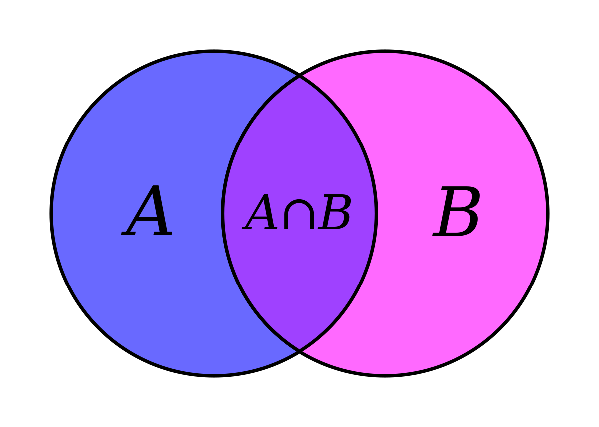
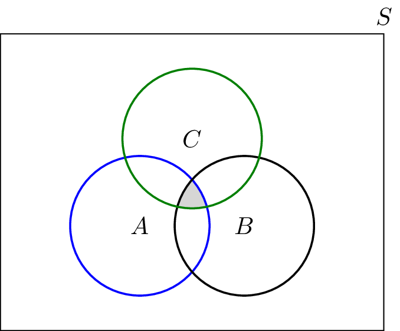

# Matrices
## What is a Matrix?

A matrix is a rectangular array of elements, usually numbers,In general, an matrix looks like:

$$
\begin{equation}
A_{m,n} = 
\begin{bmatrix}
a_{1,1} & a_{1,2} & \cdots & a_{1,n} \\
a_{2,1} & a_{2,2} & \cdots & a_{2,n} \\
\vdots  & \vdots  & \ddots & \vdots  \\
a_{m,1} & a_{m,2} & \cdots & a_{m,n} 
\end{bmatrix}
\end{equation}
$$

matrix is enclosed by [ ] or ( ) or | | | | Compact form the above matrix is represented by [aij]m x n or A = [aij]
- Element of a Matrix The numbers a11, a12 … etc., in the above matrix are known as the element of the matrix, generally represented as aij , which denotes element in ith row and jth column.
- Order of a Matrix In above matrix has m rows and n columns, then A is of order m x n.

## Why use Matrices?
With Matrix we can represent data, we can use matrices to work on multiple linear equations and mathematical equations, In many time-sensitive engineering applications, we can add, subtract or even multipy to get good approximations of much more complicated calculations.
We use matrices in mathematics because often we need to deal with several variables at once—eg the coordinates of a point in the plane are written (x, y) or in space as (x, y, z) and these are often written as column matrices in the following form:

$$
\begin{equation} 
\begin{pmatrix}
x \\
y
\end{pmatrix}
and
\begin{pmatrix}
x \\
y \\
z
\end{pmatrix}
\end{equation}
$$

## Types of matrix

- Column Matrix: A Matrix with one column, where order is Mx1

$$
\begin{equation}eg: 
\begin{bmatrix}
0 \\
-6 \\
4
\end{bmatrix} _{m,1}
\end{equation}
$$

- Row Matrix: A Matrix with one row, where order is 1xN

$$
\begin{equation}eg: 
\begin{bmatrix}
0 & 19 &-2
\end{bmatrix} _{1,n}
\end{equation}
$$

- Square Matrix: A Matrix with equal row and column, where order is NxN

$$
\begin{equation}eg: 
\begin{bmatrix}
0 & 19 & -2 \\
5 & -1 & 12 \\
4 & 8 & 0 
\end{bmatrix} _{n,n}
\end{equation}
$$

- Diagonal Matrix: A square matrix whose all the elements except the diagonal elements are zeroes, is called a diagonal matrix where  if aij = 0, when i ≠ j.

$$
\begin{equation}eg: 
\begin{bmatrix}
3 & 0 & 0 \\
0 & 1 & 0 \\
0 & 0 & 5 
\end{bmatrix} _{m,m}
\end{equation}
$$

- Scalar Matrix: A diagonal matrix whose all diagonal elements are same (non-zero), is called a scalar matrix.

> **Note**: A scalar matrix is a diagonal matrix but a diagonal matrix may or may not be a scalar matrix

$$
\begin{equation}eg: 
\begin{bmatrix}
3 & 0 & 0 \\
0 & 3 & 0 \\
0 & 0 & 3 
\end{bmatrix} _{m,m}
\end{equation}
$$

- Unit or Identity Matrix: A diagonal matrix in which all diagonal elements are ‘1’ and all non-diagonal elements are zero, is called an identity matrix. It is denoted by I, where aij = 1, when i = j and aij = 0, when i ≠ j.

$$
\begin{equation}I = 
\begin{bmatrix}
1 & 0 & 0 \\
0 & 1 & 0 \\
0 & 0 & 1 
\end{bmatrix} _{m,m}
\end{equation}
$$

- Zero or Null Matrix: A matrix is said to be a zero or null matrix, if its all elements are 0

$$
\begin{equation}Eg 
\begin{bmatrix}
0 & 0 & 0 \\
0 & 0 & 0 \\
0 & 0 & 0 
\end{bmatrix} _{m,m}
\end{equation}
$$

- Equality of Matrices: Two matrices A and B are said to be equal, if
    - order of A and B are same.
    - corresponding elements of A and B are same i.e. aij = bij, ∀ i and j.

$$
\begin{equation}eg: 
\begin{bmatrix}
1 & 2 \\
0 & 3
\end{bmatrix} and 
\begin{bmatrix}
1 & 2 \\
0 & 3 
\end{bmatrix} are \enspace equal \enspace ,but 
\begin{bmatrix}
1 & 2 \\
0 & 3 
\end{bmatrix} and
\begin{bmatrix}
1 & 7 \\
4 & 3 
\end{bmatrix} are \enspace not  \enspace equal
\end{equation}
$$

## Opeartions on a single matrix

- Transpose of a matrix
  - The transpose of a matrix is a new matrix whose rows are the columns of the original matrix. Below is a matrix and its transpose:
  - The superscript "T" means "transpose".

$$
\begin{equation}A = 
\begin{bmatrix}
5 & 4 & 3 \\
4 & 0 & 4 \\
7 & 10 & 3 
\end{bmatrix}^T \enspace = 
\begin{bmatrix}
5 & 4 & 7 \\
4 & 0 & 10 \\
3 & 4 & 3 
\end{bmatrix}
\end{equation}
$$

  
- Determinant of a matrix
  - The determinant of a matrix is a special number that can be calculated from a square matrix which helps us find the inverse of a matrix, tells us things about the matrix that are useful in systems of linear equations, calculus and many more.
  - To calculate the determinant first of all the matrix must be square (i.e. have the same number of rows as columns). Then it is just basic arithmetic.
  - The symbol for determinant is two vertical lines either side:
  - Formula to caluclate determinant is : |A| = a(ei − fh) − b(di − fg) + c(dh − eg)

$$
\begin{equation}A = 
\begin{vmatrix}
a & b & c \\
d & e & f \\
g & g & i 
\end{vmatrix}
\end{equation}
$$

$$
\begin{equation}
\begin{vmatrix}
A \\
\end{vmatrix} = \enspace a
\begin{vmatrix}
e & f \\
h & i \\
\end{vmatrix} - \enspace b 
\begin{vmatrix}
d & f \\
g & i \\
\end{vmatrix} + \enspace c  
\begin{vmatrix}
d & e \\
g & h \\
\end{vmatrix} 
\end{equation}
$$

$$
\begin{equation}Example = 
\begin{vmatrix}
6 & 1 & 1 \\
4 & -2 & 5 \\
2 & 8 & 7 \\
\end{vmatrix} 
\end{equation}
$$

$$ |A|	= 6×(−2×7 − 5×8) − 1×(4×7 − 5×2) + 1×(4×8 − (−2×2)) $$
$$  6×(−54) − 1×(18) + 1×(36) $$
$$  −306 $$

## How to use this tool for single matrix 
- This tool can be used for any order of single matrix where we can perform different operations such as Transpose of a matrix, determinant of matrix, minors and co-factors of a matrix, plus this tool  gives you the step by step notes at the same time, below is a demo
  
{:#md-edit}

## Operations on multiple matrices
- Addition and Subtraction
  - Two matrices may be added or subtracted only if they have the same dimension; that is, they must have the same number of rows and columns.
  - Addition or subtraction is accomplished by adding or subtracting corresponding elements. For example, consider matrix A and matrix B.

$$
\begin{equation}A = 
\begin{bmatrix}
1 & 2 & 3 \\
7 & 8 & 9 \\
\end{bmatrix} B\enspace =
\begin{bmatrix}  
5 & 6 & 7 \\
3 & 4 & 5 \\
\end{bmatrix} 
\end{equation}
$$

$$
\begin{equation}A + B = 
\begin{bmatrix}
1+5 & 2+6 & 3+7 \\
7+3 & 8+4 & 9+5 \\
\end{bmatrix} =  
\begin{bmatrix}
6 & 8 & 10 \\
10 & 12 & 14 \\
\end{bmatrix} 
\end{equation}
$$

.

  - Similary you can subtract two or may be more matrices like this
  - To understand matrix addition, subtraction and multiplication better,input any example and examine the solution.
  

## How to use this tool for Multiple matrix 
- This tool can only be used for two matrices for any order  where we can perform different operations such as addition, subtraction and multiplication, plus this tool  gives you the step by step notes at the same time, below is a demo
  
{:#md-edit}

# Mathematical Reasoning
- Difference between statement and sentence in logic
  - A statement is a sentence which is either true or false but not true and false simultaneously
  - A sentence will not be considered to be a statement if  : it is an exclamation, order, request, depicts time, places , pronouns

- Simple Statement
  - If a statement cannot be further broken down into various statements, or in simpler words if it is concrete by itself, it is called a simple statement

- Compound Statement
  - If a statement can further be broken down into simpler statements os that from a main statement, we can yeild more than one statement, then it is called a compound statement

- Conjuction, Disjunction and Negation
  - CONJUNCTION
    - The statement $$ p^q $$ has the truth value T(true) if both p and q have the truth value T.
    - similarly, the statement $$ p^q $$ has the truth value F(flase) if either p or q have the truth value F or both have the truth value F.
  - DISJUNCTION
    - The statement pvq has the truth value F(value) if bothh p and q have truth value F.
    - Similarly, the statement pvq has the truth value T(true) if either p or q have the truth value T or both have the truth value T
  - NEGATION
    - p has truth value T whenever p has truth value F.
    - p has truth value F whenever p has truth value T.

- AND OPERATION:

<table style="width:100%" border="2"  bordercolor="white" class="small-2">

  <tr>
    <th>P</th>
    <th>Q</th>
    <th>P^Q</th>
  </tr>
  <tr>
    <th>T</th>
    <th>T</th>
    <th>T</th>
  </tr>
  <tr>
    <th>T</th>
    <th>F</th>
    <th>F</th>
  </tr>
  <tr>
    <th>F</th>
    <th>T</th>
    <th>F</th>
  </tr>
  <tr>
    <th>F</th>
    <th>F</th>
    <th>F</th>
  </tr>
 
</table>

- OR OPERATION:

<table style="width:100%" border="2"  bordercolor="white" class="small-2">

  <tr>
    <th>P</th>
    <th>Q</th>
    <th>PvQ</th>
  </tr>
  <tr>
    <th>T</th>
    <th>T</th>
    <th>T</th>
  </tr>
  <tr>
    <th>T</th>
    <th>F</th>
    <th>T</th>
  </tr>
  <tr>
    <th>F</th>
    <th>T</th>
    <th>T</th>
  </tr>
  <tr>
    <th>F</th>
    <th>F</th>
    <th>F</th>
  </tr>
 
</table>

- NEGATION:

<table style="width:100%" border="2"  bordercolor="white" class="small-2">

  <tr>
    <th>P</th>
    <th>~P</th>
    
  </tr>
  <tr>
    <th>T</th>
    <th>F</th>

  </tr>
  <tr>
    <th>F</th>
    <th>T</th>

  </tr>
  
 
</table>

# Euclid Geometry
- Euclid Axioms
  - There are 7 axioms in euclid geometry
    - thing which are equal to the same thing are equal to one another
    - if equal are added to equals, the wholes are equal
    - if equal are subtracted from equals, the remaiunde are equal
    - things which coincide with one another are equal to one another
    - the whole is than the part
    - things which are double of the same things are equal to another
    - Things which are halves of the same things are equal to one another
  - Euclid's Postulates
    1. A straight line can be drawn from anyone point to another point
    2. A terminated line can e further produced inside finitely
    3. A circle can be drawn with any center and any radius.
    4. all right angles are equal to one another 
    5. if a straight line falling on two other stright lines makes the interior angles on the same side of it taken together less than two right angles, then the two straight lines, if produced inde finitely, meet on the side on which the sum of angles is less that two right angles.

# Sets , Relations and Functions

## What are sets
- A set is the representation of a collection of objects; distinct objects with one or more common properties.

- Types of sets
  - Empty Set - A set with no elements. Empty sets are also called null sets or void sets and are denoted by { } or Φ.
  - Singleton Set - A set with a single element. For example, {9}.
  - Power Set - A set qualifies asthe subset of another set if all of its elements are also the elements of that another set. A collection of all the subsets of a given set is a power set.
  - Super Set - A super-set can be thought of as the parent set that at least contains all the elements of the subset and may or may not contain some extra elements.
- What are relations and functions
  - Relations and functions are the set operations that help to trace the relationship between the elements of two or more distinct sets or between the elements of the same set.
  - The relation is the subset of the Cartesian product which contains only some of the ordered pair based on the relationships defined between the first and second elements. The relation is usually denoted by R.
  - If every element of a set A is related with one and only one element of another set then this kind of relation qualifies as a function. A function is a special case of relation where no two ordered pairs can have the same first element.
- Conditions to be a function
  
  - A relation from a set X to a set Y is called a function if each element of X is related to exactly one element in Y. That is, given an element x in X, thereis only one element in Y that x is related to. 
  - 

- Operations on Sets
- Union
  - The union of two sets is a set containing all the elements that are in A or in B (Possibly Both). For example $$  {1,2} \cup {2,3} = {1,2,3} $$

- Intersection
  - The intersectionof two sets A and B, denoted by $$ A \cap B $$ consists of all elements that are both in A and B, for example $$ {1,2} \cap {2,3} = {2} $$
  
  

  - the intersection of A and B is the middle part

  

- Disjoint
  - Set A and Set B are called disjoint sets if no elements is common to A and B i.e A and B are joint sets then $$ a \cap B = \theta $$
  - $$ A = {1,3,5} , B = {2,4,6} and C = {a,b,c} , A \cap B \cap C = \theta $$

  

- Complement
  - The complement of set A , denoted by A is elements in universal Set which are not in A
  
  

- Difference
  - The set A - B consists of elements that are in A but not in B, for example if $$ A = {1,2,3} and B = {3,5} then , A - B = {1,2} $$

  

  - Types of Functions
    - One to one function(Injective): For each element in the domain there is one and only one element in the  range.
    - Many to one function: When two or more elements from the domain are mapped to the same single elements in the range.
    - Onto function(Surjective): When every element of the range has been mapped to an element in the domain.
    - One-one and onto function(Bijective): A function which is both one to one and onto function.

                    
                    
                
                    
                
                    
                    
                
                   
                    
                  
                
                
            
                
                
                
                
                
                
                    
                    
                
                    
                    
                    
                
                    
                
                    
                
