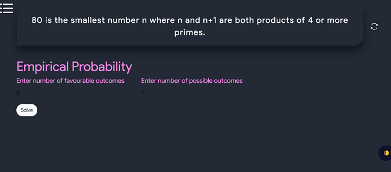
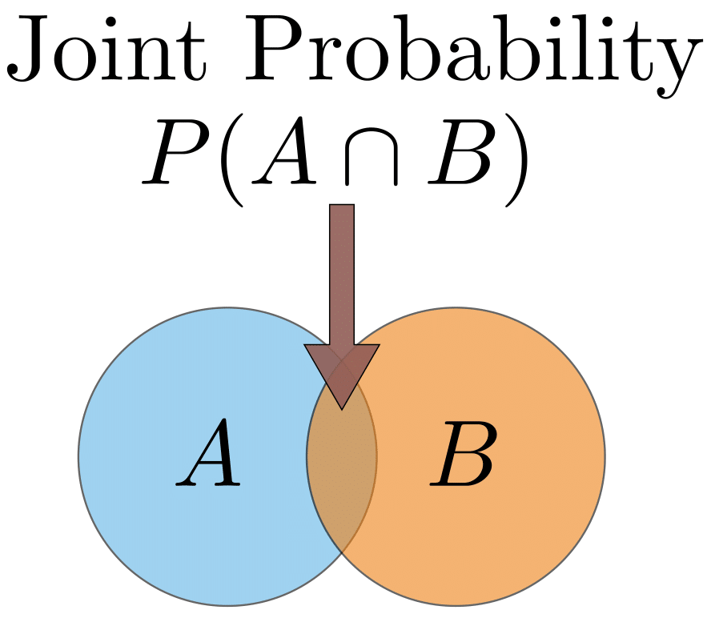
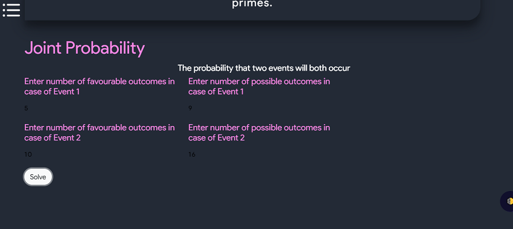
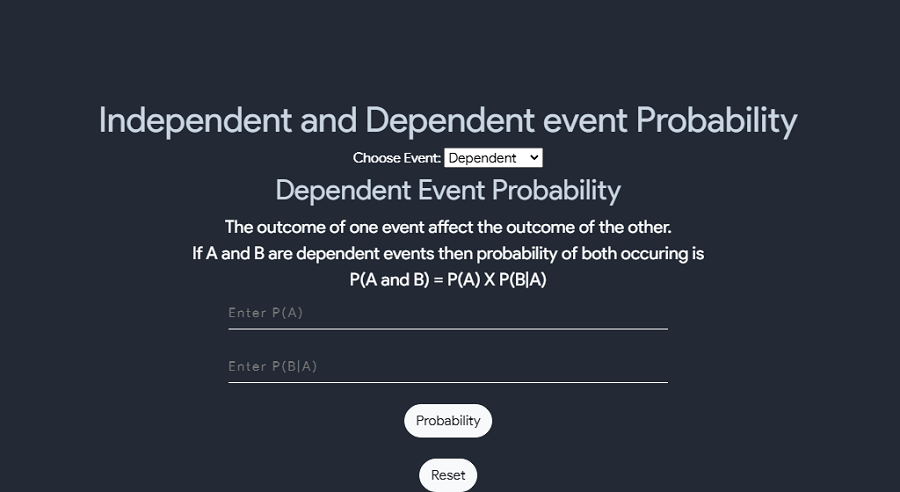
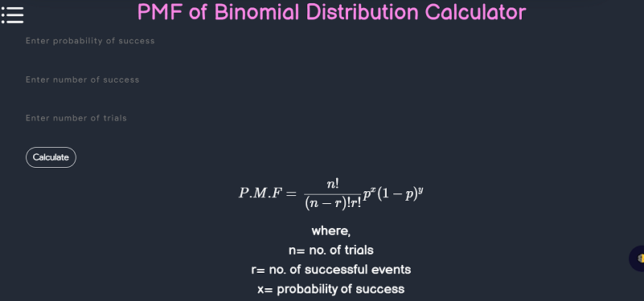
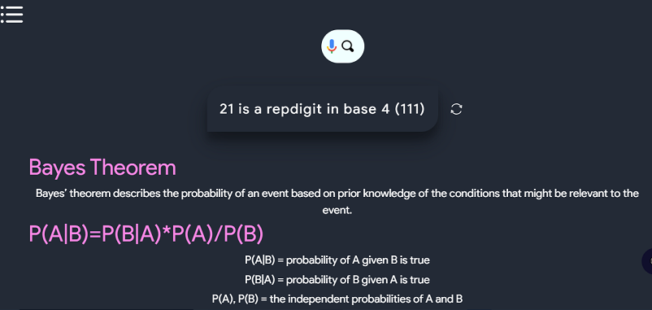
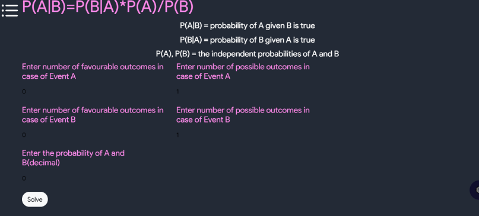

# Usefull Properties
## Genral Formula:

$$  P(E) = \dfrac{Number \enspace of \enspace favourable \enspace outcomes}{Total \enspace number \enspace of \enspace outcomes} $$

## Genral Form of Addition Theorem of probability

$$  P(A1 \cup A2 \cup ... \cup An) = \sum_{i-1}^{n} P(A_{i}) - \sum_{i<j} P(A_{i} \cap A_{j}) + \sum P(A_{i} \cap A_{j} \cap A_{k}) - ... + (-1)^{n-1}  P(A_{1} \cap A_{2} \cap ... \cap A_{n})  $$

## Conditional Probablity
- The probability of occurrence of an event E1, given that E2 has already occured is called the conditional probablity, it is denoted by $$ P \dfrac{E_{1}}{E_{2}} $$
  

$$ P(\dfrac{E_{1}}{E_{2}}) = \dfrac{P(E_{1} \cap E_{2})}{P(E_{2})} = \dfrac{n (E_{1} \cap E_{2})}{n(E_{2})} $$

# Empirical Probablity
- An objective probability is empirical probability. It's also known as an experimental chance or a relative frequency.
- Empirical Probability is defined as the ratio of the number of outcomes in which a specific event occurs to the total number of trials.
- On a few key points, empirical probability differs from theoretical probability. That is, in theoretical probability, the likelihood of an outcome is used to calculate the probability. In Empirical Probability, on the other hand, the probability is dependent on how the occurrence actually happened during trials. The Empirical Probability Formula differs from the theoretical Probability Formula.
- If n trials are carried out in a random experiment and the favourable outcome for the event appears f times, the ratio $$ \dfrac{f}{n} $$ approaches a specific value p and n becomes very large. The empirical probability is denoted by the number p.
- Allow a coin to be tossed a few times. The number of times the head appears in each of the 20 trials is listed cumulatively in the table below:
  
    <table style="width:100%" border="2"  bordercolor="white" >
        <tr>
            <th>Number Of Trials (n)</th>
            <th>Total Number of Heads (f)</th>
            <th> $$ \dfrac{f}{n} $$ </th>
        </tr>
        <tr>
            <td>20</td>
            <td>13</td>
            <td>0.65</td>
        </tr>
        <tr>
            <td>40</td>
            <td>24</td>
            <td>0.60</td>
        </tr>
        <tr>
            <td>60</td>
            <td>35</td>
            <td>0.58</td>
        </tr>
        <tr>
            <td>80</td>
            <td>44</td>
            <td>0.55</td>
        </tr>
        <tr>
            <td>100</td>
            <td>51</td>
            <td>0.51</td>
        </tr>
    </table>

- As a result, as the number of trials increases, the value of the fraction f/n, also known as relative frequency, approaches 0.5, i.e., 1/2. Similarly, we find that as the number of trials increases, the relative frequency of the appearance of a particular score approaches the fraction 1/6.
- As a result of the preceding experimental results, empirical probability can be defined as follows:
- Probability of an event E, denoted symbolically by P (E)

$$ P(E) = \dfrac{Number \enspace of \enspace time \enspace event \enspace occurs}{Total \enspace number \enspace of \enspace times \enspace experiments \enspace performed} $$
$$ P(E) = \dfrac{f}{n} $$

 - Use MakesMathEasy tool for solving empirical probablity questions.You can find this tool under probablity section

# Joint Probablity
- Probability is a mathematical branch that deals with the occurrence of a random event. In layman's terms, it is the likelihood of a specific event occurring. Joint probability is a statistical measure that calculates the likelihood of two events occurring simultaneously and at the same point in time.
- Let A and B be the two events, and the joint probability is the likelihood of event B occurring at the same time as event A.
- The notation used to represent the joint probability can take several forms. The joint probability of events with intersection is represented by the formula below.

$$ P (A⋂B) $$

- in which, A, B denotes two events.
- P(A and B), P(AB)=the combined probability of A and B
- An intersection is the symbol "" in a joint probability. The probability of events A and B occurring is the same as the point at which A and B intersect. As a result, the joint probability is also referred to as the intersection of two or more events. This relationship can be represented using a Venn diagram, as shown below.

- Use MakesMathEasy tool for solving joint probablity questions.You can find this tool under probablity section

# Independent And Dependent Probablity
## Dependent Probablity
- When two events are dependent events, one event influences the probability of another event. 
- A dependent event is an event that relies on another event to happen first. 
- Dependent events in probability are no different from dependent events in real life: If you want to attend a concert, it might depend on whether you get overtime at work; if you want to visit family out of the country next month, it depends on whether or not you can get a passport in time. More formally, we say that when two events are dependent, the occurrence of one event influences the probability of another event.

- Simple examples of dependent events:

  - Robbing a bank and going to jail.
  - Not paying your power bill on time and having your power cut off.
  - Boarding a plane first and finding a good seat.
  - Parking illegally and getting a parking ticket. Parking illegally increases your odds of getting a ticket.
  - Buying ten lottery tickets and winning the lottery. The more tickets you buy, the greater your odds of winning.
  - Driving a car and getting in a traffic accident
- Formula

$$ P(A \enspace and \enspace B) = P(A) X P(\dfrac{B}{A}) $$

## Independent Probablity
- An independent event is an event that has no connection to another event’s chances of happening (or not happening). 
- In other words, the event has no effect on the probability of another event occurring. 
- Independent events in probability are no different from independent events in real life. 
- Where you work has no effect on what color car you drive. Buying a lottery ticket has no effect on having a child with blue eyes.
- When two events are independent, one event does not influence the probability of another event.

- Simple examples of independent events:

  - Owning a dog and growing your own herb garden.
  - Paying off your mortgage early and owning a Chevy Cavalier.
  - Winning the lottery and running out of milk.
  - Buying a lottery ticket and finding a penny on the floor (your odds of finding a penny does not depend on you buying a lottery ticket).
  - Taking a cab home and finding your favorite movie on cable.
  - Getting a parking ticket and playing craps at the casino.
- Formula

$$ P(A \enspace and \enspace B) = P(A) X P(B) $$

- Use the following calculator to solve the problem on Independent and Dependent probability

# Binomial Distribution 

- A binomial distribution can be thought of as simply the probability of a SUCCESS or FAILURE outcome in an experiment or survey that is repeated multiple times. 
- The binomial is a type of distribution that has two possible outcomes (the prefix “bi” means two, or twice). 
- For example, a coin toss has only two possible outcomes: heads or tails and taking a test could have two possible outcomes: pass or fail.
- Binomial distributions must also meet the following three criteria:
  - The number of observations or trials is fixed. In other words, you can only figure out the probability of something happening if you do it a certain number of times. This is common sense—if you toss a coin once, your probability of getting a tails is 50%. If you toss a coin a 20 times, your probability of getting a tails is very, very close to 100%.
  - Each observation or trial is independent. In other words, none of your trials have an effect on the probability of the next trial.
  - The probability of success (tails, heads, fail or pass) is exactly the same from one trial to another.

i

# Independent And Dependent Probablity
## Dependent Probablity
- When two events are dependent events, one event influences the probability of another event. 
- A dependent event is an event that relies on another event to happen first. 
- Dependent events in probability are no different from dependent events in real life: If you want to attend a concert, it might depend on whether you get overtime at work; if you want to visit family out of the country next month, it depends on whether or not you can get a passport in time. More formally, we say that when two events are dependent, the occurrence of one event influences the probability of another event.

- Simple examples of dependent events:

  - Robbing a bank and going to jail.
  - Not paying your power bill on time and having your power cut off.
  - Boarding a plane first and finding a good seat.
  - Parking illegally and getting a parking ticket. Parking illegally increases your odds of getting a ticket.
  - Buying ten lottery tickets and winning the lottery. The more tickets you buy, the greater your odds of winning.
  - Driving a car and getting in a traffic accident
- Formula

$$ P(A \enspace and \enspace B) = P(A) X P(\dfrac{B}{A}) $$

## Independent Probablity
- An independent event is an event that has no connection to another event’s chances of happening (or not happening). 
- In other words, the event has no effect on the probability of another event occurring. 
- Independent events in probability are no different from independent events in real life. 
- Where you work has no effect on what color car you drive. Buying a lottery ticket has no effect on having a child with blue eyes.
- When two events are independent, one event does not influence the probability of another event.

- Simple examples of independent events:

  - Owning a dog and growing your own herb garden.
  - Paying off your mortgage early and owning a Chevy Cavalier.
  - Winning the lottery and running out of milk.
  - Buying a lottery ticket and finding a penny on the floor (your odds of finding a penny does not depend on you buying a lottery ticket).
  - Taking a cab home and finding your favorite movie on cable.
  - Getting a parking ticket and playing craps at the casino.
- Formula

$$ P(A \enspace and \enspace B) = P(A) X P(B) $$

- Use the following calculator to solve the problem on Independent and Dependent probability

# Binomial Distribution 

- A binomial distribution can be thought of as simply the probability of a SUCCESS or FAILURE outcome in an experiment or survey that is repeated multiple times. 
- The binomial is a type of distribution that has two possible outcomes (the prefix “bi” means two, or twice). 
- For example, a coin toss has only two possible outcomes: heads or tails and taking a test could have two possible outcomes: pass or fail.
- Binomial distributions must also meet the following three criteria:
  - The number of observations or trials is fixed. In other words, you can only figure out the probability of something happening if you do it a certain number of times. This is common sense—if you toss a coin once, your probability of getting a tails is 50%. If you toss a coin a 20 times, your probability of getting a tails is very, very close to 100%.
  - Each observation or trial is independent. In other words, none of your trials have an effect on the probability of the next trial.
  - The probability of success (tails, heads, fail or pass) is exactly the same from one trial to another.

## PMF of Binomial Distribution Calculator
- Full form of PMF is Probablity Mass Function
- The Probability Mass Function (PMF), also known as a probability function or frequency function, is a statistical function that describes the distribution of a discrete random variable. If X is a discrete random variable of a function, then the probability mass function of X is given by
- $$ Px (x) = P( X=x ) $$, where x belongs to the X range.
- It should be noted that the probability function should fall under the condition:

$$ P_x (X) \gtreqqless 0 $$
$$ \sum_{xe \enspace range (x) } P_x (X) = 1 $$

- The PMF has several applications in the case of the binomial distribution, including:
  - To calculate the number of successful sales calls
  - To determine the number of defective products in a production run
  - Counting the number of heads and tails in a coin flip
  - Counting the number of male and female employees in a business
  - determining the vote totals for two different candidates in an election
- Consider the following scenario: an exam contains ten multiple-choice questions, each with four possible answers, one of which is the correct answer. The probability mass function is used to calculate the likelihood of receiving correct or incorrect answers.
- PMF formula is given by : 

$$ \dfrac{n!}{(n-r)! * r!} * p^x (1-p)^y $$
$$ Where $$
$$ n = number \enspace of \enspace trails $$
$$ r = number \enspace of \enspace succesful \enspace events $$
$$ x = probablity \enspace of \enspace sucess $$
$$ y = probablity of not being sucessfull $$

- Use MakesMathEasy tool for PMF questions.You can find this tool under probablity section

# PMF Of Poisson Distribution 
- The poisson distribution is a discrete probablity distribution which results from poisson experiment.
- It classifies the experiment into two different categories, such as sucess and failure.
- Generally, the poisson random variable " X " defines the probablity of the sucess of the experiment. from the average rate of sucess, the poisson distribution probability can be easily calculated
- Formula: 

$$ P.M.F =  P(X=k) = \dfrac{\lambda^k  e^{-\lambda}}{k!} $$ 
$$  Where \enspace e = is \enspace euler's \enspace number (e = 2.71828...)  $$
$$  k = the \enspace number \enspace of \enspace occurrences (k=0,1,2...) $$
$$  \lambda = parameter \enspace such \enspace that \lambda > 0 $$

- Use the following tool to find PMF of Poisson Distribution

# Hypergeometric Distribution
- The hypergeometric distribution is a probability distribution that’s very similar to the binomial distribution. 
- In fact, the binomial distribution is a very good approximation of the hypergeometric distribution as long as you are sampling 5% or less of the population.
- Therefore, in order to understand the hypergeometric distribution, you should be very familiar with the binomial distribution. Plus, you should be fairly comfortable with the combinations formula.
- Binomial Formula:

$$  C(n,r) = \dfrac{n!}{r! (n-r)!}  $$

##  Hypergeometric Distribution PMF 

- Formula 
  

$$  P.M.F = P(X = k) = \dfrac{ (^K_k) (^{N-K}_{n-k}) }{ ^N_n}  $$

- Use the following tool to calculate PMF of geometric Distribution
  

# Exponential Distribution
- The exponential distribution (also called the negative exponential distribution) is a probability distribution that describes time between events in a Poisson process.
- There is a strong relationship between the Poisson distribution and the Exponential distribution. For example, let’s say a Poisson distribution models the number of births in a given time period. 
- The exponential distribution is one of the widely used continuous distributions. It is often used to model the time elapsed between events.
  
## What is the Exponential Distribution used for
- The exponential distribution is mostly used for testing product reliability. 
- It’s also an important distribution for building continuous-time Markov chains. 
- The exponential often models waiting times and can help you to answer questions like:
  - “How much time will go by before a major hurricane hits the Atlantic Seaboard?” or
  - “How long will the transmission in my car last before it breaks?”.
- If you assume that the answer to these questions is unknown, you can think of the elapsed time as a random variable with an exponential distribution as long as the events occur continuously and independently at a constant rate
- Formula : 

$$  P.M.F = f(x;\lambda) = {\lambda e^{\lambda x}.... where x \gvertneqq 0 }  $$
$$  P.M.F = f(x;\lambda) = {0.... where x < 0 }  $$
$$  Where \enspace \lambda = rate \enspace parameter \enspace x = random \enspace variable  $$

# Gamma Distribution
- The gamma distribution term is mostly used as a distribution which is defined as two parameters – shape parameter and inverse scale parameter, having continuous probability distributions. 
- It is related to the normal distribution,  exponential distribution, chi-squared distribution and Erlang distribution. ‘Γ’ denotes the gamma function.
- Gamma distributions have two free parameters, named as alpha (α) and beta (β), where;
  - α = Shape parameter
  - β = Rate parameter (the reciprocal of the scale parameter)
- It is characterized by mean µ=αβ and variance σ2=αβ2
- The scale parameter β is used only to scale the distribution. This can be understood by remarking that wherever the random variable x appears in the probability density, then it is divided by β. 
- Since the scale parameter provides the dimensional data, it is seldom useful to work with the “standard” gamma distribution, i.e., with β = 1.

## Gamma Distribution Function 
- The gamma function is represented by $$ Γ(y) $$ which is an extended form of factorial function to complex numbers(real). So, if $$ n∈{1,2,3,…}, $$ then $$ Γ(y)=(n-1)! $$

- If $$ α  $$ is a positive real number, then $$ Γ(α) $$ is defined as

  - If $$ Γ(α) = 0∫∞ ( ya-1e-y dy) , for α > 0. $$
  - If $$ α = 1, Γ(1) =0∫∞ (e-y dy) = 1 $$
  - If we change the variable to $$ y = λz $$ , we can use this definition for gamma distribution: $$  Γ(α) = 0∫∞ ya-1 eλy dy where α, λ >0. $$
- Formula:

$$  P.M.F = f(x; \alpha, \beta ) = \dfrac{\beta ^{\alpha} x^{\alpha -1} e^{- \beta x} }{ \gamma(\alpha) }  $$ 
$$  where \enspace \alpha = shape \enspace parameter  $$ 
$$  x = random \alpha variable  $$ 
$$  \beta = scale \enspace parameter  $$ 
$$  \gamma (x) = gamma \enspace function  $$ 

- Use the following tool to calculate the gamma distribution
  

# Bayes Theorem
- The probability of an event occurring in relation to any condition is described by Bayes' theorem. It is also taken into account in the case of conditional probability. The Bayes theorem is also known as the probability formula for "causes." For example, suppose we need to calculate the probability of selecting a blue ball from the second bag of three different bags of balls, each of which contains three different colour balls, namely red, blue, and black. The probability of an event occurring based on other conditions is known as conditional probability in this case.
- Conditional probablity 

$$ P(\dfrac{A}{B}) = \dfrac{P(A∩B)}{P(B)}) $$
$$ Where \enspace P(A|B) \enspace is \enspace the \enspace probability \enspace of \enspace condition \enspace when \enspace event \enspace A \enspace is \enspace occurring \enspace while \enspace event \enspace B \enspace has \enspace already \enspace occurred. $$
$$ P(A ∩ B) \enspace is \enspace the \enspace probability \enspace of \enspace event \enspace A \enspace and \enspace event \enspace B $$
$$ P(B) \enspace  is \enspace  the \enspace probability \enspace of \enspace event \enspace B $$
- Use MakesMathEasy tool to solve Bayes Theorem questions.You can find this tool under probablity section

