# Skewness Calculator
- Skewness refers to a distortion or asymmetry that deviates from the symmetrical bell curve, or normal distribution, in a set of data. If the curve is shifted to the left or to the right, it is said to be skewed. 
- Skewness can be quantified as a representation of the extent to which a given distribution varies from a normal distribution. 
- A normal distribution has a skew of zero, while a lognormal distribution, for example, would exhibit some degree of right-skew.
- Skewness, in statistics, is the degree of asymmetry observed in a probability distribution.
- Distributions can exhibit right (positive) skewness or left (negative) skewness to varying degrees. 
- A normal distribution (bell curve) exhibits zero skewness.
- Investors note right-skewness when judging a return distribution because it, like excess kurtosis, better represents the extremes of the data set rather than focusing solely on the average.

- How to calculate Skewness:
  - calculate the mean and standard deviation 
  - subtract the mean from each rraw score 
  - raise each of thses deviations from the mean of the third power and sum
  - calculate skewness , which is the sum of the deviations from the mean, raise to the third power, divided by numbers of cases minus 1, times the standard deviation raised to the third power.
- this tool is used to find skewness

# Odds Calculator
- This calculator is used to convert odds to a probability of winning or losing

# Confidence Interval 
- A confidence interval is how much uncertainty there is with any particular statistic. Confidence intervals are often used with a margin of error. 
- It tells you how confident you can be that the results from a poll or survey reflect what you would expect to find if it were possible to survey the entire population. 
- Confidence intervals are intrinsically connected to confidence levels.
- 
- this calculator calculets the confidence interval

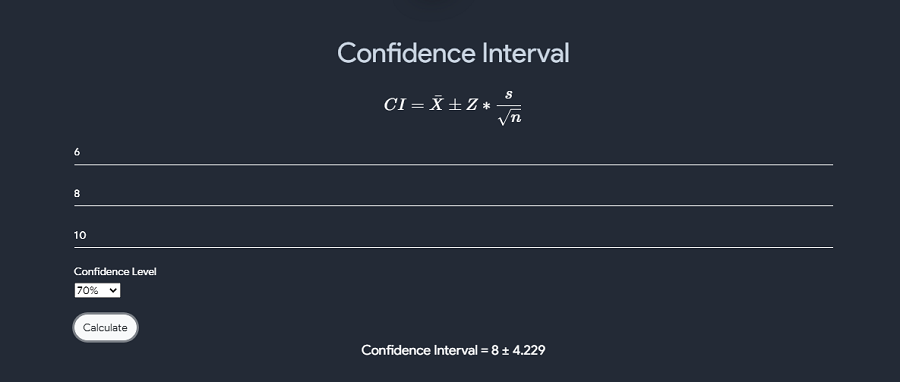

# NP Chart

- NP charts are used to monitor the number of non conforming units of a process based on samples taken from the process at goiven times (hours, shofts, days, weeks , months, etc) . We plot a graph of No defective item vs Sample No. If All the points of the graph lie within the control limits, then the process is under statistical conrtol

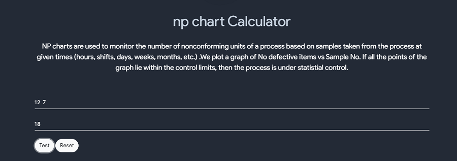

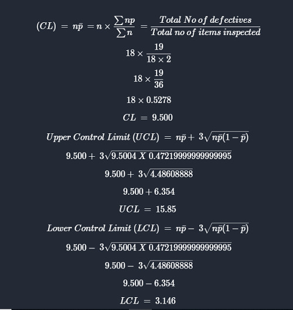

# P Chart

- A p- chart is an attribute control chart used with data collected in subgroups of varying sizes.
- Because the subgroups size can vary, it shows a proportion on non conforming items rather than the actual count of items
- Control limits of p - chart determines whether the process is in control or not

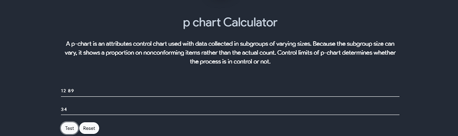

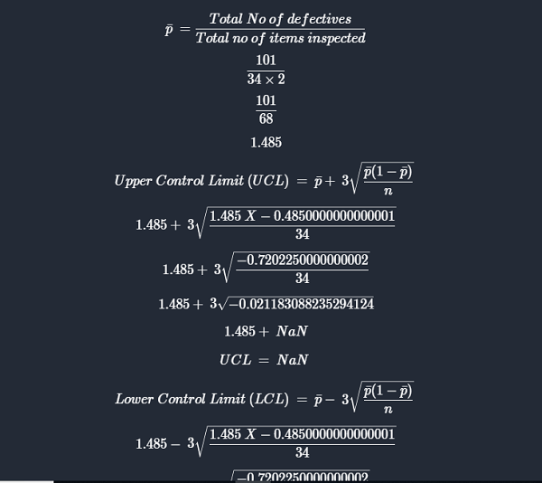

## AB Test

- An AB test is a statistical significance test in which two populations are compared to see if they differ significantly on a single characteristic. A sample size of 30 or more is recommended

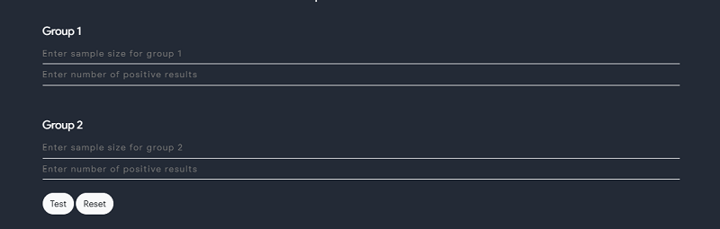{:#calc-edit}

 

## T Test

- The t-test is any statistical hypothesis test in which th etest statistic foloows a students t-distribution under the null hyptothesis
- it canbe used to determine if two sets of data are significantly different from each other , and is most commonly when the test statistic would follow a normal distribution if the value of a scaling term in the test statistic were known.
- Also number of values in each set should not exceed 30.
- T - test uses means and standard deviations of two samples to make a comparison. 

$$ t = \dfrac{m - \mu}{\dfrac{s}{\sqrt n}} $$

## F test

- A astatistical F test uses an F statistic to compare two variance s1, and s2 by dividing them.
- the Result is always a positive number (becuase variances are always positive).
- the equation for comparing two variances with the f-test is : $$ F = \dfrac{s1^2}{s2^2} $$ (if $$ s1^2 > s2^2  $$ )
- Any Statistical test taht uses F - distribution can be called an F - test 
- It is used when the samples size is small i.e n < 30
- Formula : 

$$ \dfrac{Larger \enspace Sample }{Smaller \enspace Sample \enspace Variance} $$

## Some Usefull Formulas

<table style="width:100%" border="2"  bordercolor="white" class="small-2">

  <tr>
    <th>$$ Mean $$</th>
    <th>$$ \bar x = \dfrac{\sum x}{n} $$</th>
    <th>$$ x = observation \enspace given \\ n = total \enspace number \enspace of \enspace observations $$</th>
  </tr>
  <tr>
    <th>$$ Median $$</th>
    <th>$$ if n \enspace is \enspace odd, \enspace then \\ M = \dfrac{n+1}{2}term \\ if n \enspace is \enspace even, \enspace then \\ M = \dfrac{\dfrac{n}{2}^{th} term + (\dfrac{n}{2}+1)^{th} term}{2} $$</th>
    <th>$$ n = total \enspace number \enspace of \enspace observations $$</th>
  </tr>
  <tr>
    <th>$$ Mode $$</th>
    <th>$$ the \enspace value \enspace which \enspace occurs \enspace most \enspace frequently $$</th>
    <th>$$ - $$</th>
  </tr>
  <tr>
    <th>$$ Variance $$</th>
    <th>$$ \sigma^2 = \dfrac{\sum(x-\bar x)^2}{n} $$</th>
    <th>$$ x = observations \enspace given \\ \bar x = mean \\ n = total \enspace number \enspace of \enspace observations $$</th>
  </tr>
  <tr>
    <th>$$ Standard \enspace Deviation $$</th>
    <th>$$ S = \sigma = \sqrt \dfrac{\sum(x-\bar x)^2}{n} $$</th>
    <th>$$ x = observations \enspace given \\ \bar x = mean \\ n = total \enspace number \enspace of \enspace observations $$</th>
  </tr>
  <tr>
    <th>$$ Range $$</th>
    <th>$$ L - S $$</th>
    <th>$$ L = Largest \enspace value \\ S = Smallest \enspace value $$</th>
  </tr>
  <tr>
    <th>$$ Coeff \enspace Of \enspace Range $$</th>
    <th>$$ \dfrac{L - S}{L + S} $$</th>
    <th>$$ L = Largest \enspace value \\ S = Smallest \enspace value $$</th>
  </tr>
  <tr>
    <th>$$ Coeff \enspace Of \enspace Variance $$</th>
    <th>$$ \dfrac{\sigma}{\bar x} * 100 $$</th>
    <th>$$ \sigma = S.D \\ \bar x  = Mean $$</th>
  </tr>
  <tr>
    <th>$$ Combined \enspace Mean $$</th>
    <th>$$ \dfrac{m \bar x + n \bar y}{m + n}  $$</th>
    <th>$$ \dfrac{\bar x}{\bar y} = mean \enspace of \enspace two \enspace distributions \\ \dfrac{m}{n} = no \enspace of  \enspace elements \enspace in \enspace each \enspace ditributions $$</th>
  </tr>
  <tr>
    <th>$$ Weighted \enspace Mean $$</th>
    <th>$$ \dfrac{\sum Wi xi}{\sum Wi}  $$</th>
    <th>$$ Wi = Weight \enspace of \enspace each \enspace distributions \\ xi = ith \enspace observation $$</th>
  </tr>
  <tr>
    <th>$$ Mean \enspace Deviation \enspace about \enspace mean \enspace \bar x $$</th>
    <th>$$ \dfrac{\sum |xi -bar x|}{n}  $$</th>
    <th>$$ n = Total \enspace number \enspace of \enspace observations \\ \bar x = mean \\ xi = ith \enspace observations $$</th>
  </tr>
  <tr>
    <th>$$ Mean \enspace Deviation \enspace about \enspace Median \enspace M $$</th>
    <th>$$ \dfrac{\sum |xi - M|}{n}  $$</th>
    <th>$$ n = Total \enspace number \enspace of \enspace observations \\ \bar M = Median \\ xi = ith \enspace observations $$</th>
  </tr>
  <tr>
    <th>$$ Mean \enspace Deviation \enspace about \enspace Mode \enspace Z $$</th>
    <th>$$ \dfrac{\sum |xi - Z|}{n}  $$</th>
    <th>$$ n = Total \enspace number \enspace of \enspace observations \\ \bar Z = Mode \\ xi = ith \enspace observations $$</th>
  </tr>
  <tr>
    <th>$$ Mean \enspace Deviation \enspace about \enspace any no  \enspace 'a' $$</th>
    <th>$$ \dfrac{\sum |xi - a|}{n}  $$</th>
    <th>$$ n = Total \enspace number \enspace of \enspace observations \\  xi = ith \enspace observations $$</th>
  </tr>
  
</table>

 

## Weighted Mean Calculator
- Weighted Mean is an average computed by giving different weights to some of the individual values. If all the weights are equal, then the weighted mean is the same as the arithmetic mean.
- It represents the average of a given data. 
- The Weighted mean is similar to the arithmetic mean or sample mean. 
- The Weighted mean is calculated when data is given in a different way compared to the arithmetic mean or sample mean.
- Weighted means generally behave in a similar approach to arithmetic means, they do have a few counter-instinctive properties. 
- Data elements with a high weight contribute more to the weighted mean than the elements with a low weight.
- The weights cannot be negative. 
- Some may be zero, but not all of them; since division by zero is not allowed. 
- Weighted means play an important role in the systems of data analysis, weighted differential and integral calculus.
- The Weighted mean for given set of non-negative data x1,x2,x3,….xn with non-negative weights w1,w2,w3,….wn can be derived from the formula given below.
  

$$ \bar x = \dfrac{W_{1} X_{1} + W_{2} X_{2} + ... + W_{n} X_{n} }{W_{1} + W_{2} + ... + W_{n}} $$
$$ where \enspace \\ x \enspace is \enspace repeating \enspace value \\ w \enspace is \enspace the \enspace number \enspace of \enspace occurrences \enspace of \enspace x (weight) \\ \bar x \enspace is \enspace the \enspace weighted \enspace mean $$

- Use Following calculator to calculate weighted mean 

# Mean Median and Mode
- MEAN : The mean is the average of a data set.

$$ \bar x = \dfrac{\sum x}{n} $$

- MODE : The mode is the most common number in a data set.

$$ the \enspace value \enspace which \enspace occurs \enspace most \enspace frequently $$

- MEDIAN :The median is the middle of the set of numbers.

$$ if n \enspace is \enspace odd, \enspace then \\ M = \dfrac{n+1}{2}term \\ if n \enspace is \enspace even, \enspace then \\ M = \dfrac{\dfrac{n}{2}^{th} term + (\dfrac{n}{2}+1)^{th} term}{2} $$

- VARIANCE : 
  - Variance is the numerical values that describe the variability of the observations from its arithmetic mean and denoted by sigma-squared(σ2 )
  - Variance measure how far individuals in the group are spread out, in the set of data from the mean.

$$ \sigma^2 = \dfrac{\sum(x-\bar x)^2}{n} $$

- Standar Deviation 
  - It is a measure of dispersion of observation within dataset relative to their mean.It is square root of the variance and denoted by Sigma (σ) .
  - Standard deviation is expressed in the same unit as the values in the dataset so it measure how much observations of the data set differs from its mean.

$$ S = \sigma = \sqrt \dfrac{\sum(x-\bar x)^2}{n} $$

- Use following calculator to calculate mean, median , mode , varinace and standard deviation on provided give data set

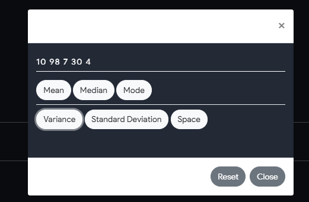

 

##  Sensitivity and Specificity

- Sensitivity 
  - The sensitivity of a test is also called the true positive rate (TPR) and is the proportion of samples that are genuinely positive that give a positive result using the test in question. For example, a test that correctly identifies all positive samples in a panel is very sensitive. Another test that only detects 60 % of the positive samples in the panel would be deemed to have lower sensitivity as it is missing positives and giving higher a false negative rate (FNR). Also referred to as type II errors, false negatives are the failure to reject a false null hypothesis (the null hypothesis being that the sample is negative).
- Specificity 
  -  The specificity of a test, also referred to as the true negative rate (TNR), is the proportion of samples that test negative using the test in question that are genuinely negative. For example, a test that identifies all healthy people as being negative for a particular illness is very specific. Another test that incorrectly identifies 30 % of healthy people as having the condition would be deemed to be less specific, having a higher false positive rate (FPR). Also referred to as type I errors, false positives are the rejection of a true null hypothesis (the null hypothesis being that the sample is negative).

- use follwoing tool to find sensitivity and specificity

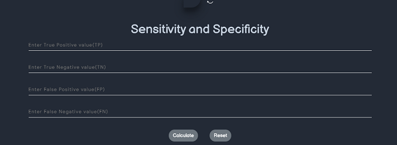

 

# Standard Deviation
- What Is Standard Deviation?
  - A standard deviation is a statistic that measures the dispersion of a dataset relative to its mean. The standard deviation is calculated as the square root of variance by determining each data point's deviation relative to the mean. If the data points are further from the mean, there is a higher deviation within the data set; thus, the more spread out the data, the higher the standard deviation.
  - Standard deviation is an especially useful tool in investing and trading strategies as it helps measure market and security volatility—and predict performance trends. As it relates to investing, for example, an index fund is likely to have a low standard deviation versus its benchmark index, as the fund's goal is to replicate the index.
- S.D is given by
 

$$ S = \sigma = \sqrt \dfrac{\sum(x-\bar x)^2}{n} $$
$$ x = observations \enspace given \\ \bar x = mean \\ n = total \enspace number \enspace of \enspace observations $$

- Use following tool to calculate S.D
  

## Z test
- A z-test is a statistical test used to determine whether two population means are different when the variances are known and the sample size is large.
- The test statistic is assumed to have a normal distribution, and nuisance parameters such as standard deviation should be known in order for an accurate z-test to be performed.
- Z-test is a statistical test to determine whether two population means are different when the variances are known and the sample size is large.
- Z-test is a hypothesis test in which the z-statistic follows a normal distribution. 
- A z-statistic, or z-score, is a number representing the result from the z-test.
- Z-tests are closely related to t-tests, but t-tests are best performed when an experiment has a small sample size.
- Z-tests assume the standard deviation is known, while t-tests assume it is unknown.

## Z Score Calculator
- A Z-score is a numerical measurement that describes a value's relationship to the mean of a group of values. 
- Z-score is measured in terms of standard deviations from the mean. 
- If a Z-score is 0, it indicates that the data point's score is identical to the mean score. 
- A Z-score of 1.0 would indicate a value that is one standard deviation from the mean. 
- Z-scores may be positive or negative, with a positive value indicating the score is above the mean and a negative score indicating it is below the mean.

- In finance, Z-scores are measures of an observation's variability and can be used by traders to help determine market volatility. 
- The Z-score is also sometimes known as the Altman Z-score.
- 
- A Z-Score is a statistical measurement of a score's relationship to the mean in a group of scores.
- A Z-score can reveal to a trader if a value is typical for a specified data set or if it is atypical.
- In general, a Z-score below 1.8 suggests a company might be headed for bankruptcy, while a score closer to 3 suggests a company is in solid financial positioning.

## Negative Binomial Distribution 
- A negative binomial distribution (also called the Pascal Distribution) is a discrete probability distribution for random variables in a negative binomial experiment.

- The random variable is the number of repeated trials, X, that produce a certain number of successes, r. 
- In other words, it’s the number of failures before a success. This is the main difference from the binomial distribution: with a regular binomial distribution, you’re looking at the number of successes. With a negative binomial distribution, it’s the number of failures that counts.

$$  P(Y=n) = C_{r-1}^{n-1}*pr*(1-p)(n-r) $$
$$  Where \\ n \enspace is \enspace the \enspace total \enspace number \enspace of \enspace trials \\ r \enspace is \enspace the \enspace number \enspace of \enspace successes \\ p \enspace is \enspace the \enspace probablity \enspace of \enspace one \enspace success \\ C_{r-1}^{n-1} is \enspace the \enspace number  \enspace of \enspace combinations \\ P(Y = n) \enspace is \enspace the \enspace probablity \enspace of \enspace the \enspace exact  \enspace number \enspace of \enspace trials \enspace n \enspace needed \enspace to \enspace achieve \enspace r \enspace successes. $$

# Linear Regression
- Linear Regression is a model of the relationship between a dependent variable y and independent variable x by linear prediction function y = a + box
- Linear functions are used to model in linear regression and the unknown model parameters are estimated from thee data.
- Such method of modeling data is known as kinear models. TheFor more two or more variables, this modeling is called multiple linear regression
- Linear regression models are often fitted using the least square regression linear.
- Types of Linear Regression
  - Simple linear regression
    - 1 dependent variable (interval or ratio), 1 independent variable (interval or ratio or dichotomous)

  - Multiple linear regression
    - 1 dependent variable (interval or ratio) , 2+ independent variables (interval or ratio or dichotomous)

  - Logistic regression
    - 1 dependent variable (dichotomous), 2+ independent variable(s) (interval or ratio or dichotomous)

  - Ordinal regression
    - 1 dependent variable (ordinal), 1+ independent variable(s) (nominal or dichotomous)

  - Multinomial regression
    - 1 dependent variable (nominal), 1+ independent variable(s) (interval or ratio or dichotomous)

  - Discriminant analysis
    - 1 dependent variable (nominal), 1+ independent variable(s) (interval or ratio)
- Formula for linear regression is given by $$ y = a + bx $$

$$ where \enspace a(intercept) = \dfrac{\sum y \sum x^2 - \sum x \sum xy}{(\sum x^2) - (\sum x )^2}  $$
$$ where \enspace b (slope) = \dfrac{n \sum xy - (\sum x ) (\sum y))} {n \sum x^2 - (\sum x)^2}  $$
$$ where \enspace x \enspace and \enspace y \enspace are \enspace two \enspace variables \enspace on \enspace the \enspace regression \enspace line. $$
$$ b = Slope \enspace of \enspace the \enspace line. $$
$$ a = y-intercept \enspace of \enspace the \enspace line. $$
$$ x = Values \enspace of \enspace the \enspace first \enspace data \enspace set. $$
$$ y = Values \enspace of \enspace the \enspace second \enspace data \enspace set.  $$

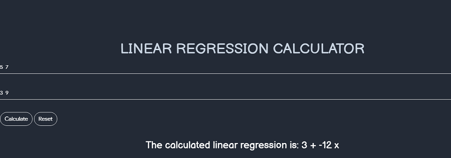

# Chi- Square Test
- A chi-square $$ (x^2) $$ statistic is a test that measures how a model compares to actual observed data.
- The data used in calculating a chi-square statistic must be random, raw,mutually exclusive, drawn from independent variable and drawn from a large enough sample
- There are two types of chi-square tests. Both use the chi-square statistic and distribution for different purposes:

  - A chi-square goodness of fit test determines if sample data matches a population. For more details on this type, see: Goodness of Fit Test.
  - A chi-square test for independence compares two variables in a contingency table to see if they are related. In a more general sense, it tests to see whether distributions of categorical variables differ from each another.

- Formula for chi-square test:

$$ x_{c}^{2} = \sum \dfrac{(O_{i} - E_{i})^2}{E_{i}} $$

- Use following Tool to calculate the chi-square test

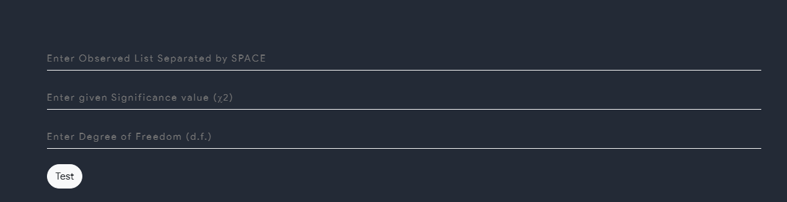

# Margin of Error
- A margin of error tells you how many percentage points your results will differ from the real population value. 
- For example, a 95% confidence interval with a 4 percent margin of error means that your statistic will be within 4 percentage points of the real population value 95% of the time.
- More technically, the margin of error is the range of values below and above the sample statistic in a confidence interval. 
- The confidence interval is a way to show what the uncertainty is with a certain statistic (i.e. from a poll or survey).
- For example, a poll might state that there is a 98% confidence interval of 4.88 and 5.26. 
- That means if the poll is repeated using the same techniques, 98% of the time the true population parameter (parameter vs. statistic) will fall within the interval estimates (i.e. between 4.88 and 5.26) 98% of the time.
- Formula :

$$ the \enspace margin \enspace of \enspace error \enspace (MOE) \enspace calculator \enspace uses \enspace the \enspacefollowing \enspace formulas: $$
$$ MOE = z * \dfrac{sqrt{(p!(1-p))}}{\sqrt{n}} $$
$$ Where \enspace MOE \enspace is \enspace the \enspace margin \enspace of \enspace error $$
$$ z \enspace is \enspace the \enspace score \enspace associated \enspace with \enspace a \enspace level \enspace of \enspace confidence $$
$$ p \enspace is \enspace the \enspace proportion \enspace , \enspace expressed \enspace as \enspace a \enspace decimal $$
$$ n \enspace is \enspace the \enspace sample \enspace size $$

- Use the following tool to calculate Margin of Error:

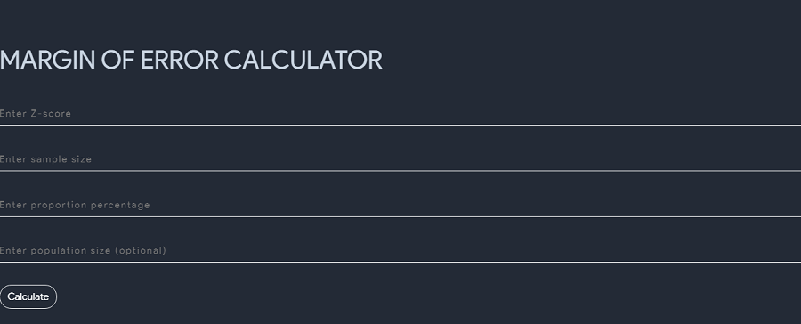

# Correlation Coefficient 
- Correlation coefficient is used to find how strong a relationship is between data
- The formulas return a value between -1 and 1,where
  - 1 indicates a strong positive relationship
  - -1 indicates a strong negative relationship
  - A result of zero indicates no relationship at all.
- Formula :

$$  r_{x,y} = \dfrac{\sum_{i=1}^n (X_{i} - M_{x}( Y_{i} - M_{y}))}{ \sqrt{  \sum_{i=1}^{n} (X_{i} - M_{y})^2  \sum_{i=1}^{n} (Y_{i} - M_{y})^2}}  $$

- Use following tool to solve correlation coefficient problems

# Covariance 
- Covariance indicates whether two variable X and Y are related by measuring how the variables change in relation to each other.
- It tells us if there is a relationship between two variables and which direction that relationship is in.
- A positive covariance means that the two variables are positively related  and they have the same direction.
- A negative covariance means that the variables are negatively related and they have the opposite directions.
- Formula

$$ Cov(X,Y) =  \dfrac{ \sum E ((X - \mu ) E(Y-v) ) }{n-1}  $$
$$ X \enspace is \enspace a \enspace random \enspace variable $$
$$ E(X) = μ \enspace is \enspace the \enspace expected \enspace value \enspace (the mean) \enspace of \enspace the \enspace random \enspace variable \enspace X \enspace and $$
$$ E(Y) = ν \enspace is \enspace the \enspace expected \enspace value \enspace (the mean) \enspace of \enspace the \enspace random \enspace variable \enspace Y $$
$$ n = the \enspace number \enspace of \enspace items \enspace in \enspace the \enspace data \enspace set $$

- Use the following tool to calculate covariance

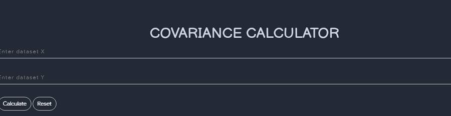

