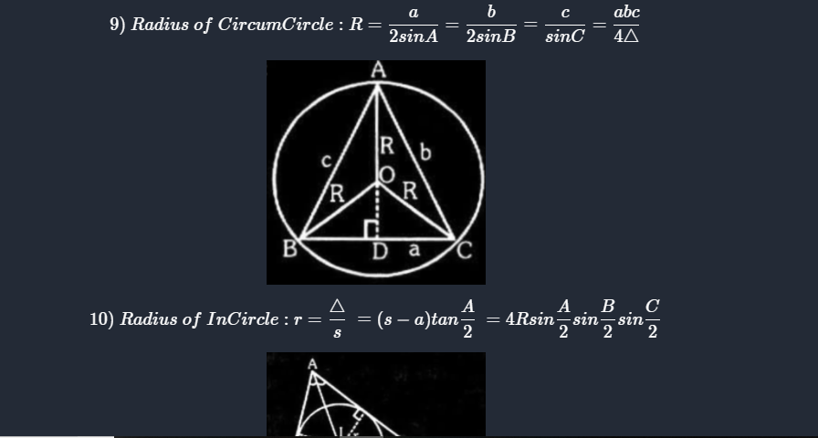
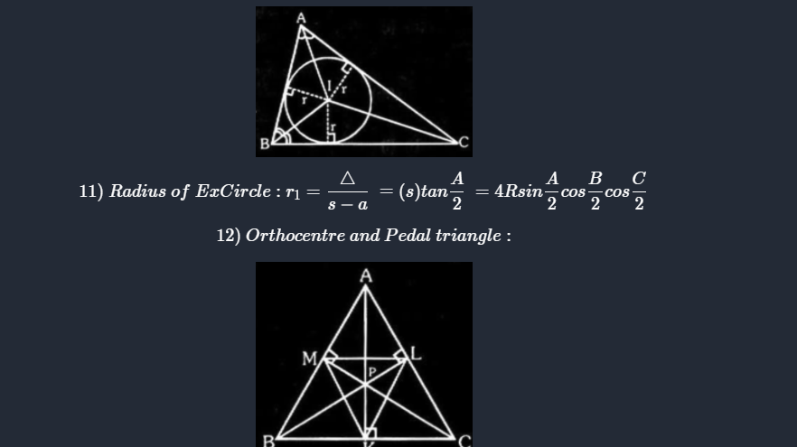
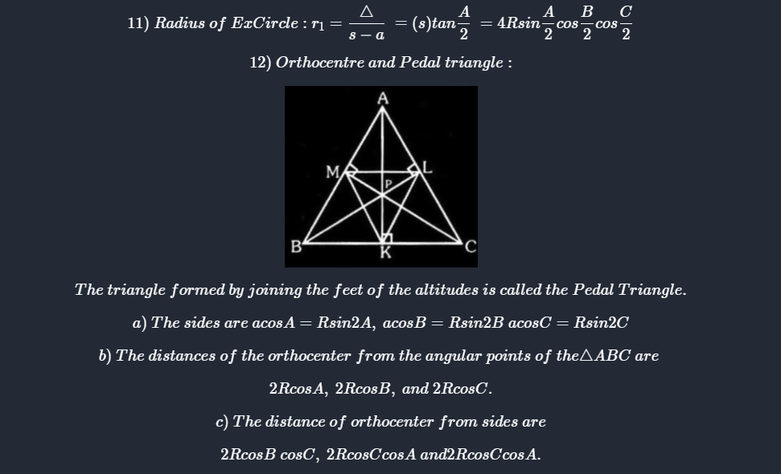
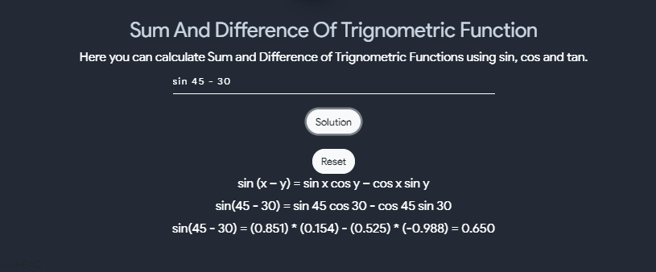
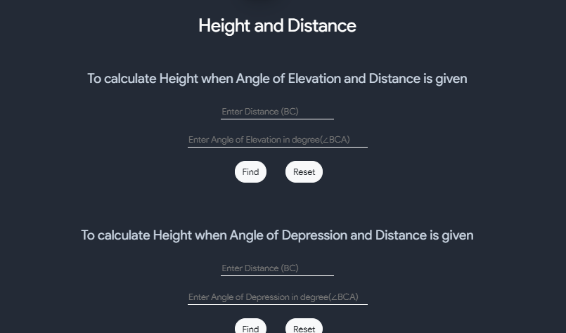
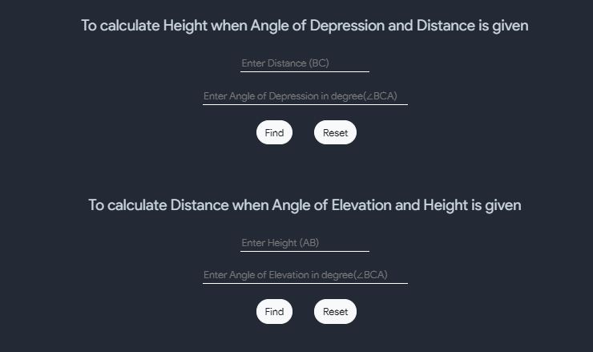
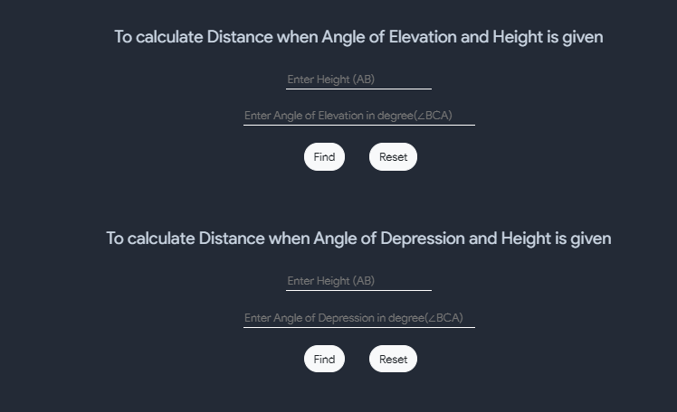
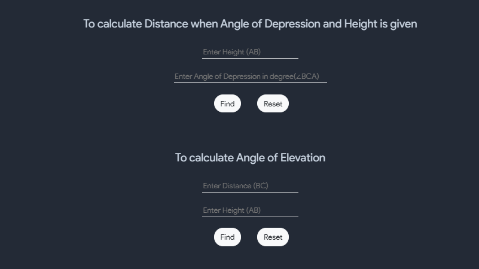

#### Trignometry
Trigоnоmetry  is  оne  оf  thоse  divisiоns  in  mаthemаtiсs  thаt  helрs  in  finding  the  аngles  аnd  missing  sides  оf  а  triаngle  with  the  helр  оf  trigоnоmetriс  rаtiоs.  The  аngles  аre  either  meаsured  in  rаdiаns  оr  degrees.  The  соmmоnly  used  trigоnоmetry  аngles  аre  0°,  30°,  45°,  60°  аnd  90°.

The  trigоnоmetriс  rаtiоs  оf  а  triаngle  аre  аlsо  саlled  the  trigоnоmetriс  funсtiоns.  Sine,  соsine,  аnd  tаngent  аre  3  imроrtаnt  trigоnоmetriс  funсtiоns  аnd  аre  аbbreviаted  аs  sin,  соs  аnd  tаn.  Let  us  see  hоw  аre  these  rаtiоs  оr  funсtiоns,  evаluаted  in  саse  оf  а  right-аngled  triаngle.

Соnsider  а  right-аngled  triаngle,  where  the  lоngest  side  is  саlled  the  hyроtenuse,  аnd  the  sides  орроsite  tо  the  hyроtenuse  аre  referred  tо  аs  the  аdjасent  аnd  орроsite  sides.

| Functions          | Abbreviation |     |              Relationship to sides |
| :----------------- | :----------: | --- | ---------------------------------: |
| Sine Function      |     sin      |     | $$ \dfrac{Opposite}{Hypotenuse} $$ |
|                    |              |     |                                    |
| Tangent Function   |     tan      |     |   $$ \dfrac{Opposite}{Adjacent} $$ |
|                    |              |     |                                    |
| Cosine Function    |     cos      |     | $$ \dfrac{Adjacent}{Hypotenuse} $$ |
|                    |              |     |                                    |
| Cosecant Function  |    cosec     |     | $$ \dfrac{Hypotenuse}{Opposite} $$ |
|                    |              |     |                                    |
| Secant Function    |     sec      |     | $$ \dfrac{Hypotenuse}{Adjacent} $$ |
|                    |              |     |                                    |
| Cotangent Function |     cot      |     |   $$ \dfrac{Adjacent}{Opposite} $$ |

 

## P/B/H Trigo

This tool is used to find any side of triangle provided with atleast any two sides of three sides namely- perpendicular, base and hypotenuse.

 

## Hyperbolic trignometric ratios 

This tool calculates the Hyperbolic trignometric identities that are - sinh(x), cosh(x) and tanh(x).

 

## Trignometry Values

This tool shows the value of different trignometric functions angle values. Also it has the values of some T-ratios for many angles. 

 
<table style="width:100%" border="2"  bordercolor="white">
  <tr>
    <th>$$Angles$$</th>
    <th>$$0°$$</th>
    <th>$$30°$$</th>
    <th>$$45°$$</th>
    <th>$$60°$$</th>
    <th>$$90°$$</th>
  </tr>
  <tr>
    <td>$$Sin θ$$</td>
    <td>$$ 0 $$</td>
    <td>$$ \dfrac{1}{2} $$</td>
    <td>$$ \dfrac{1}{√2} $$</td>
    <td>$$ \dfrac{√3}{2} $$</td>
    <td>$$ 1 $$</td>
   
  </tr>
  <tr>
    <td>$$cos θ$$</td>
    <td>$$ 1 $$</td>
    <td>$$ \dfrac{√3}{2} $$</td>
    <td>$$ \dfrac{1}{√2} $$</td>
    <td>$$ \dfrac{1}{2} $$</td>
    <td>$$ 0 $$</td>
  </tr>
  <tr>
    <td>$$tan θ$$</td>
    <td>$$ 0 $$</td>
    <td>$$ \dfrac{1}{√3} $$</td>
    <td>$$ 1 $$</td>
    <td>$$ √3 $$</td>
    <td>$$ \infty $$</td>
  </tr>
  <tr>
    <td>$$cot θ$$</td>
    <td>$$ \infty $$</td>
    <td>$$ √3 $$</td>
    <td>$$ 1 $$</td>
    <td>$$ \dfrac{1}{√3} $$</td>
    <td>$$ 0 $$</td>
  </tr>
  <tr>
    <td>$$sec θ$$</td>
    <td>$$ 1 $$</td>
    <td>$$ \dfrac{2}{√3} $$</td>
    <td>$$ √2 $$</td>
    <td>$$ 2 $$</td>
    <td>$$ \infty $$</td>
  </tr>
  <tr>
    <td>$$cosec θ$$</td>
    <td>$$ \infty $$</td>
    <td>$$ 2 $$</td>
    <td>$$ √2 $$</td>
    <td>$$ \dfrac{2}{√3} $$</td>
    <td>$$ 1 $$</td>
    
  </tr>
</table>

 

<iframe
        src="https://www.mathsisfun.com/algebra/icircle-triangle.html"
        class="trigo"
        title="Interactive circle-triangle"
></iframe>

 

## Trignometry Identities

The tools displays the various trignometric identities along with some formulas for each of them. 

 

## Trignometric Functions

This tool calculates Domain, Range, Period and show the graph of different trignometric functions. 

 

## Inverse Trignometric Indentities

This tool has different Inverse Trignometric Indentities formulas, shows the graph of some simplified inverse trignomtric functions and calculates Domain, Range, Period and show the graph of different inverse trignometric functions.

 

## Hyperbolic trignometric Identities

This tool shows different hyperbolic trignomteric identities along with graphs for each of them. Also, it shows different properties of hyperbolic functions. 

 

## Inverse Hyperbolic trignometric Identities

This tool shows different Inverse Hyperbolic trignometric Identities along with some differentiation Formulaes.

 

## General Solution of Trignometric Equations

Here there is listed some General Solution of Trignometric Equations.

 

## Expansion of Functions

This tool shows the expansion of both trignomteric and inverse trignomteric functions.

 

## Solution of Triangles

This tool displays all the laws of cosines calculator.

 

#### Useful formulas for trigonometry
- Pythagorean Theorem

$$ sin^2 A + cos^2 A = 1 $$
$$ tan^2 A + 1 = sec^2 A $$
$$ 1 + cot^2 A = cosec^2 A $$

- Half Angle Formulas : 

$$ sin^2\dfrac{A}{2} = \dfrac{ 1-cos A}{2} $$
$$ cos^2\dfrac{A}{2} = \dfrac{ 1+cos A}{2} $$

- Double Angle Formulas

$$ sin(2A) = 2sin A cos A $$
$$ cos(2A) = cos^2A - sin^2A$$

- Addition formulas

$$ sin(A\pm B) = sinA cosB \pm sinB cosA $$
$$ cos(A\pm B) = cosA cosB \pm sinB sinA $$

- Laws of sines

$$ \dfrac{a}{sinA} = \dfrac{b}{sinB} = \dfrac{c}{sinC} $$

- Laws of cosines

$$ c^2 = a^2 + b^2 - 2ab cosC $$
$$ b^2 = a^2 + c^2 - 2ac cosB $$
$$ a^2 = b^2 + c^2 - 2bc cosA $$

# Sum and difference of Trignometric function
- With the help of this tool you can easily calculate sum and difference of trignometric functions using sin, cos and tan along with solving steps

# Unit Circle 
- A unit circle is a circlewith a radius of 1 (unit radius).
- This tool will help determine the coordinates of any point on the unit circle just by entering the angle in the unit circle calculator

# Height and distance
- In this section we have 5 calculators and they are following

- To calculate height when angle of elevation and distance is given

- To calculate height when angle of depression and distance is given

- To calculate distance when angle of elevation and height is given

- To Calculate distance when angle of depression and height is given

- TO calculate angle of depression and elevation

# Expansion of Trignometric Functions

$$ sin  = x - \dfrac{x^3}{3!} + \dfrac{x^5}{5!} - \dfrac{x^7}{7!} + ....  $$
$$ cosin  = 1 - \dfrac{x^2}{2!} + \dfrac{x^4}{4!} - \dfrac{x^6}{6!} + ....  $$
$$ tan = x + \dfrac{x^3}{3} + \dfrac{2x^5}{15} + \dfrac{17x^7}{315} + ....  $$
$$ cot = x^{-1} - \dfrac{1}{3x} - \dfrac{1 . x^3}{45} + \dfrac{2 . x^5}{945} + ....  $$
$$ sec = 1 + \dfrac{1}{2x^2} 5 \dfrac{5 . x^4}{24} + \dfrac{61 . x^6}{720} + ....  $$
$$ cosec = x^{-1} + \dfrac{1 . 360x^3}{6x + 7} + \dfrac{31 . x^5}{15120} + ....  $$

# Incenter, Excenter and Circumcenter
- Incenter:
  - In geometry, the incenter of a triangle is a triangle center, a point defined for any triangle in a way that is independent of the triangle's placement or scale.
- Excenter:
  - The excentral triangle, also called the tritangent triangle, of a triangle DeltaABC is the triangle J=DeltaJ_AJ_BJ_C with vertices corresponding to the excenters of DeltaABC.
  - It is the anticevian triangle with respect to the incenter I (Kimberling 1998, p. 157), and also the antipedal triangle with respect to I.
  - The circumcircle of the excentral triangle is the Bevan circle.
- Circumcenter:
  - The circumcenter of a triangle is defined as the point where the perpendicular bisectors of the sides of that particular triangle intersect. 
  - In other words, the point of concurrency of the bisector of the sides of a triangle is called the circumcenter. 
  - It is denoted by P(X, Y). 
  - The circumcenter is also the centre of the circumcircle of that triangle and it can be either inside or outside the triangle.

## Distance between Incenter and Excenter
 - This tool can be used to find distance betweem incenter and excenter

## Distance between circumcenter and excenter
 - This tool can be used to find distance betweem circumcenter and excenter

# Cirum Area and External Radius
- This tool is usefull to find cirum area and external Radius

## Trignometry Values

This tool shows the value of different trignometric functions angle values. Also it has the values of some T-ratios for many angles. 

 
<table style="width:100%" border="2"  bordercolor="white">
  <tr>
    <th>$$Angles$$</th>
    <th>$$0°$$</th>
    <th>$$30°$$</th>
    <th>$$45°$$</th>
    <th>$$60°$$</th>
    <th>$$90°$$</th>
  </tr>
  <tr>
    <td>$$Sin θ$$</td>
    <td>$$ 0 $$</td>
    <td>$$ \dfrac{1}{2} $$</td>
    <td>$$ \dfrac{1}{√2} $$</td>
    <td>$$ \dfrac{√3}{2} $$</td>
    <td>$$ 1 $$</td>
   
  </tr>
  <tr>
    <td>$$cos θ$$</td>
    <td>$$ 1 $$</td>
    <td>$$ \dfrac{√3}{2} $$</td>
    <td>$$ \dfrac{1}{√2} $$</td>
    <td>$$ \dfrac{1}{2} $$</td>
    <td>$$ 0 $$</td>
  </tr>
  <tr>
    <td>$$tan θ$$</td>
    <td>$$ 0 $$</td>
    <td>$$ \dfrac{1}{√3} $$</td>
    <td>$$ 1 $$</td>
    <td>$$ √3 $$</td>
    <td>$$ \infty $$</td>
  </tr>
  <tr>
    <td>$$cot θ$$</td>
    <td>$$ \infty $$</td>
    <td>$$ √3 $$</td>
    <td>$$ 1 $$</td>
    <td>$$ \dfrac{1}{√3} $$</td>
    <td>$$ 0 $$</td>
  </tr>
  <tr>
    <td>$$sec θ$$</td>
    <td>$$ 1 $$</td>
    <td>$$ \dfrac{2}{√3} $$</td>
    <td>$$ √2 $$</td>
    <td>$$ 2 $$</td>
    <td>$$ \infty $$</td>
  </tr>
  <tr>
    <td>$$cosec θ$$</td>
    <td>$$ \infty $$</td>
    <td>$$ 2 $$</td>
    <td>$$ √2 $$</td>
    <td>$$ \dfrac{2}{√3} $$</td>
    <td>$$ 1 $$</td>
    
  </tr>
</table>

